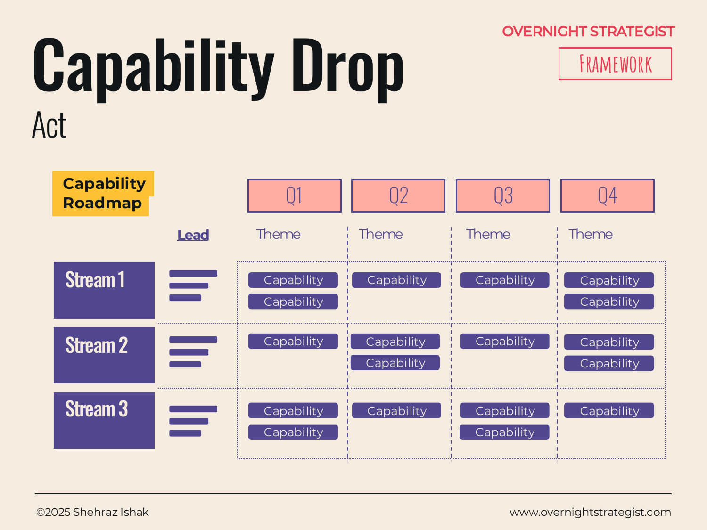

# Capability Drop

> A capability roadmap that shows which features or capabilities land in each time period, organised by workstream and theme — an alternative to the Gantt that answers "what will users be able to do, and when?" rather than "what tasks are being worked on?"

## What It Is

Capability Drop is an Act-stage planning framework that maps capabilities (features, products, services, or organisational abilities) across a time horizon, grouped by workstream and theme. Where a Gantt chart or Execution Plan tracks activities and tasks, the Capability Drop tracks outcomes: discrete things that users, customers, or the business will be able to do once each capability has been delivered. Time periods run across the top (typically quarters); workstreams run down the side; and within each cell, individual capabilities are listed under a theme that names the focus of that workstream in that period.

## Why It Works

Gantt charts and activity roadmaps answer the wrong question for most strategic stakeholders. Leadership, customers, and partner teams don't need to know that "Sprint 4 includes ticket #347." They need to know: "In Q2, the platform will support live video sessions; in Q3, instructors will have a self-service upload portal." That is what a Capability Drop communicates.

The shift from activity-tracking to capability-stating changes how the roadmap is read and used. Stakeholders can evaluate whether the sequence of capabilities makes sense — whether the right things are landing in the right order. They can identify dependencies ("we can't launch the affiliate programme until the referral tracking capability drops in Q2"). And they can hold the programme accountable to outcomes rather than effort: it doesn't matter how much work was done; what matters is whether the capability landed.

The theme layer adds a further structure: by grouping capabilities under a named theme per time block, it gives each period a coherent story rather than an undifferentiated list of features.

## How To Use It

1. **Define the workstreams.** Identify the two to four major workstreams for the programme. These are usually the same workstreams used in the Execution Plan.
2. **Assign a lead.** Name the person responsible for each workstream's capability delivery.
3. **Set the time horizon.** Lay out the columns as quarters (or months). Typically covers 6–18 months.
4. **Name the themes.** For each workstream per time block, name the overarching theme — what this workstream is focused on delivering in this period. The theme is a short phrase, not a task.
5. **List the capabilities.** Under each theme, list the specific capabilities that will be available to users (or the business) by the end of that period. Write them as outcomes: "students can book into a cohort," not "booking module development."
6. **Check the sequence.** Read across workstreams within a time period to verify that the capability combinations make sense. Read down a workstream to verify that earlier capabilities are genuine prerequisites for later ones.

## Worked Example

Acme Design is building a cohort product over four quarters. The Capability Drop uses three workstreams: Platform, Curriculum, and Market.

**Stream 1 — Platform. Lead: CTO.**

Q1 Theme: *Core Cohort Infrastructure.*
Capabilities: students can browse and book into a cohort; payments processed at booking; live session runs via integrated video tool; student confirmation and calendar invite sent automatically.

Q2 Theme: *Instructor Tooling.*
Capabilities: instructors can upload pre-work materials via self-service portal; instructors can view their enrolled cohort roster; in-cohort messaging available between instructor and students.

Q3 Theme: *Scale and Analytics.*
Capabilities: platform supports 20 concurrent cohorts without performance degradation; admin dashboard shows enrolment, completion, and NPS by cohort; automated waitlist and re-enrolment flow active.

Q4 Theme: *Community Layer.*
Capabilities: students can access alumni community post-cohort; peer discussion forum available during cohort; certificates auto-generated on completion.

**Stream 2 — Curriculum. Lead: Head of Content.**

Q1 Theme: *Launch Cohorts.*
Capabilities: UX Fundamentals and Brand Identity cohorts available; two trained instructors contracted and onboarded; pre-work video assets ready for both cohorts.

Q2 Theme: *Expanded Subject Range.*
Capabilities: four additional cohort subjects available (Motion Design, Typography, Product Design, Creative Strategy); partner instructor programme open for applications.

Q3 Theme: *Instructor Quality.*
Capabilities: instructor NPS review process active; cohort curriculum iteration cycle running (each cohort revised after first delivery); advanced-level cohort available in at least one subject.

Q4 Theme: *Corporate Cohorts.*
Capabilities: private cohort product available for corporate clients; custom curriculum brief service available; bulk enrolment invoicing supported.

**Stream 3 — Market. Lead: Head of Marketing.**

Q1 Theme: *Launch.*
Capabilities: launch landing page live; early-access email campaign sent; founder webinar run; paid social campaign active.

Q2 Theme: *Re-Enrolment & Referral.*
Capabilities: post-cohort re-enrolment email sequence active; referral programme live (students earn one month free per referral who enrols); affiliate partner programme launched.

Q3 Theme: *B2B Outreach.*
Capabilities: corporate landing page live; outbound sales sequence for design teams at companies with 50+ employees active; first corporate case study published.

Q4 Theme: *Brand.*
Capabilities: annual Acme Design cohort report published; instructor-as-brand content programme running; award submission for best online design education submitted.

## When To Use It

Use Capability Drop when your primary audience for the roadmap is stakeholders who care about what will be available — customers, leadership, partner teams — rather than programme managers who need to track task completion. It is particularly well-suited to product programmes, platform builds, and any initiative where the sequence of capabilities has strategic significance.

When you need to communicate at the task and activity level for programme management purposes, use the **Execution Plan** alongside it. The two are complementary: the Execution Plan tells the team what to do; the Capability Drop tells stakeholders what will exist when the work is done.

## Things To Watch Out For

- Capabilities that are described as tasks in disguise ("build booking module") defeat the purpose. Every item in the grid should describe something a user or the business can *do*, not something the team is *doing*.
- Themes that change every quarter without a coherent logic make the roadmap hard to follow. Each theme should build on the one before it, or represent a deliberate strategic pivot with a clear rationale.
- The roadmap tends to be optimistic. Capabilities listed in Q2 frequently slip to Q3. Treat the outer quarters as directional rather than committed, and be explicit with stakeholders about which quarters are firm and which are indicative.
- A Capability Drop that is never updated is worse than not having one — it creates false certainty. The roadmap should be reviewed and revised at the start of each time block.

## Related Frameworks

- [Execution Plan](./execution-plan.md) — the activity-level roadmap that sits beneath the Capability Drop; tracks what the team is doing to deliver each capability.
- [Zero To One](./zero-to-one.md) — the phased launch framework; the Capability Drop maps what drops in each phase of the Zero To One arc.
- [GTM Stack](./gtm-stack.md) — identifies the channels and systems that capabilities need to support; Capability Drop shows when those capabilities will be ready.
- [Gantt](../insight/gantt.md) — the Insight-stage Gantt shows scheduled activity over time; Capability Drop adapts the same temporal logic but replaces task bars with landed outcomes.
- [Capability Map](../insight/capability-map.md) — the Insight-stage tool for mapping the current state of capabilities; the Capability Drop shows how those capabilities evolve over time.
