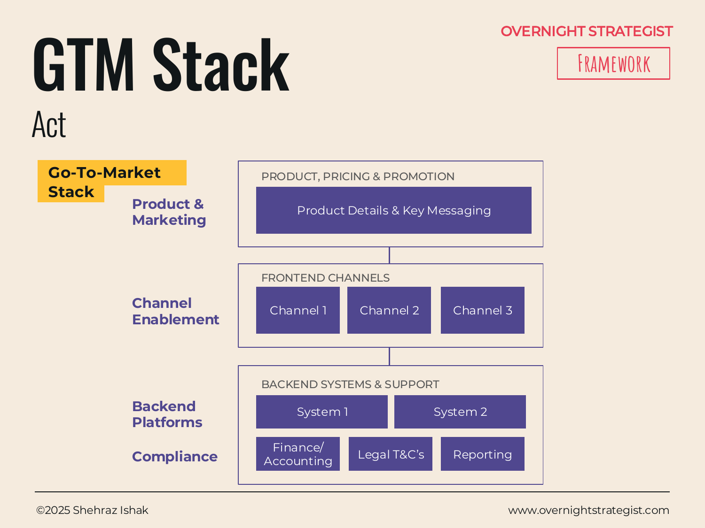

# GTM Stack

> A three-layer visual that maps every component of a go-to-market — product and messaging, customer-facing channels, and backend systems — so nothing is missed and the dependencies between layers are visible.

## What It Is

The GTM Stack is a structured inventory of the moving parts required to bring a product or initiative to market. It organises them into three horizontal layers stacked from top to bottom:

- **Product, Pricing & Promotion** — the core product details, pricing model, and key messages or marketing collateral.
- **Frontend Channels** — the customer-facing touchpoints through which the product will be sold or accessed: retail, digital, inbound/outbound sales, call centre, self-service, and so on. Each channel requires specific enablement work before launch.
- **Backend Systems & Support** — the platforms, processes, and compliance requirements that underpin the customer-facing activity: billing and finance, reporting and analytics, legal terms and conditions, compliance sign-offs, and operational support systems.

The framework is designed as a high-level visual overview — a single diagram that shows all the components before the team zooms into the detail of each block.

## Why It Works

Go-to-market failures are almost never caused by a bad product. They are caused by a launch team that focused all its energy on one layer — usually the visible, exciting channel layer — and left the others underbaked. The payment system wasn't tested under load. The legal terms weren't ready. The sales channel had no enablement materials. The reporting tool wasn't configured, so no one knew whether the launch was working.

The GTM Stack works because it insists on completeness across all three layers before launch. By making the backend layer as explicit as the frontend channel layer, it surfaces the operational and compliance work that teams routinely discover too late. The stacked visual also makes dependencies legible: a channel cannot go live if the backend system that supports it isn't ready. Seeing both in the same diagram makes it natural to ask "is the system for this channel actually ready?"

## How To Use It

1. **Fill the top layer.** Define the product (features, positioning) and the pricing model. Write out the key messages and promotional materials required.
2. **List the frontend channels.** Identify every channel through which the product will reach customers: digital (website, app), paid social, email, retail, sales reps, call centre, third-party marketplaces. For each channel, flag the enablement work needed — training, collateral, system configuration — before it can go live.
3. **List the backend systems.** Identify every system, platform, or process that needs to be ready to support the channels: payments/finance systems, CRM and data pipelines, reporting dashboards, legal and compliance sign-offs (terms and conditions, privacy, regulatory approvals), and customer support capacity.
4. **Check for gaps.** Walk each channel in layer 2 and ask: what backend component in layer 3 does this channel depend on? Flag anything that is not yet confirmed as ready.
5. **Use it as a launch readiness checklist.** In the week before launch, the GTM Stack becomes a completion audit. Each block in the visual should have a named owner who can confirm readiness.

## Worked Example

Acme Design is launching its cohort product. The GTM Stack for the launch:

**Layer 1 — Product, Pricing & Promotion.**
Product: instructor-led eight-week cohorts; first two subjects are UX Fundamentals and Brand Identity. Pricing: $499 per cohort, or included for Acme's Pro tier subscribers (at $79/month). Key messages: "Learn live with industry professionals. Small cohort, real feedback." Marketing: launch email, founder webinar, hero landing page, paid social creative (three variants).

**Layer 2 — Frontend Channels.**
- *Email (primary launch channel):* enablement work = copywriting complete, list segmented, send schedule confirmed.
- *Website / landing page:* enablement work = cohort landing page built, booking flow QA'd, countdown timer live.
- *Paid social (Meta and LinkedIn):* enablement work = creative assets approved, audience targeting set, budget authorised ($8k for launch fortnight).
- *Founder webinar:* enablement work = registration page live, slide deck final, reminder sequence set.

**Layer 3 — Backend Systems & Support.**
- *Payments:* Stripe configured for one-off cohort payments; Pro-tier inclusion logic tested.
- *Finance/Accounting:* cohort revenue coded as a separate SKU in accounting system for clean reporting.
- *Reporting:* GA4 event tracking added for cohort page views, sign-ups, and completions; weekly dashboard built.
- *Legal T&Cs:* cohort-specific terms (refund policy, attendance requirements) reviewed by legal and live on the booking page.
- *Compliance:* GDPR review completed for new enrolment data fields.
- *Customer Support:* CS team briefed; FAQ document published; support ticket category created for cohort queries.

By review day (one week before launch), every backend block is signed off. Paid social is the only channel with a flag: creative has one round of approval still outstanding. Launch is delayed by 48 hours to clear it.

## When To Use It

Use the GTM Stack during the Launch planning phase of any new product, feature, or market entry. It is most useful when the launch involves multiple channels and multiple teams — the framework gives everyone a shared picture of the whole before they go deep on their own lane.

For simple, single-channel launches, it may be more overhead than it's worth. But for anything involving more than two channels, or any backend system that hasn't been used before, the completeness discipline the GTM Stack provides is worth the 30 minutes it takes to fill in.

Pair it with **Comms Deploy** to plan the communication cadence across the launch, and with the **Execution Plan** to track the enablement work for each channel as dated, owned tasks.

## Things To Watch Out For

- Teams fill the frontend channel layer enthusiastically and leave the backend layer thin. Force equal attention on Layer 3 — that is where launches break.
- "Channel Enablement" is easy to mark as done prematurely. A channel is enabled when its systems are tested, its staff are trained, and its materials are approved — not when any one of those is done.
- The GTM Stack is a high-level overview, not a detailed project plan. Each block in the visual should link to a more detailed plan (a brief, a spec, a task list) that the owner manages separately.
- Channels that are added late in the planning process are the riskiest. If a new channel appears in the week before launch, treat its readiness as suspect until all three layers for that channel are confirmed.

## Related Frameworks

- [Zero To One](./zero-to-one.md) — the phased launch framework; the GTM Stack designs the content of the Launch phase.
- [Comms Deploy](./comms-deploy.md) — plans the communications cadence across channels identified in the GTM Stack.
- [Execution Plan](./execution-plan.md) — tracks the enablement work for each GTM component as dated, owned activities.
- [Capability Drop](./capability-drop.md) — useful when the GTM involves releasing capabilities in phases rather than a single launch.
