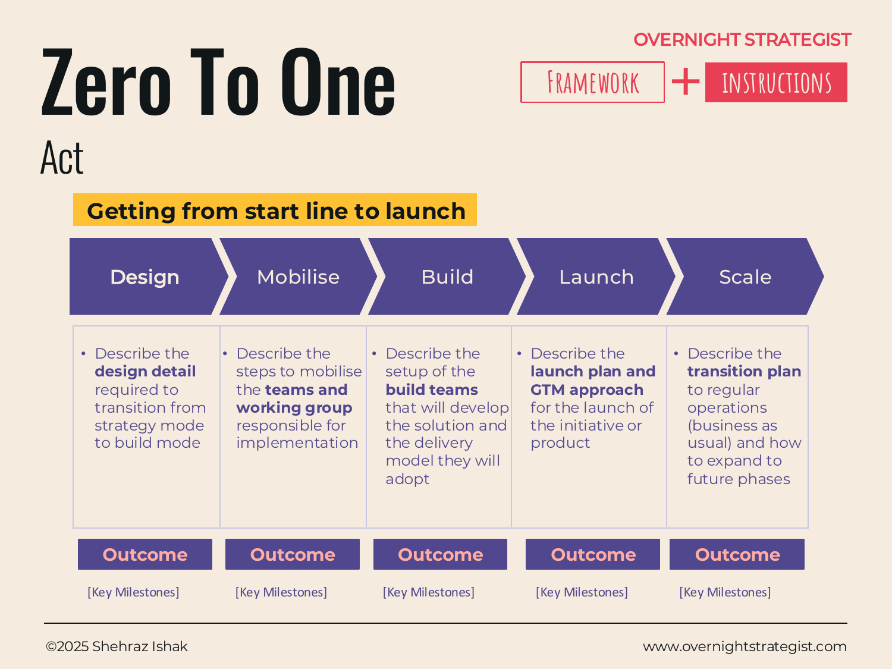

# Zero To One

> A five-phase launch framework — Mobilise, Design, Build, Launch, Scale — that sequences the full journey from strategy sign-off to running operations.

## What It Is

Zero To One is a phased execution map for taking something new from concept to live operation. It divides the journey into five sequential phases: **Mobilise** (assemble the team and activate the programme), **Design** (detail the solution design to bridge strategy and build), **Build** (develop the solution with delivery teams), **Launch** (ship it to market with a GTM plan), and **Scale** (transition from launch mode to business-as-usual and expand to future phases). Each phase has its own outcomes and key milestones, making the overall arc visible before the detailed work begins.

## Why It Works

The most dangerous moment in any strategic initiative is the handoff from strategy to execution. Teams that skip a formal transition end up either building the wrong thing (because design was never detailed) or running without a launch plan (because operations was assumed, not designed). Zero To One works because it makes the hand-offs explicit: each phase boundary is a discrete milestone, not a blurred transition, and the outputs of one phase are the inputs to the next.

The Mobilise phase in particular is often treated as overhead and rushed. But getting the right people activated and the governance model agreed before design work starts prevents weeks of rework. Ending with Scale — rather than Launch — also matters: it forces the team to think about steady-state operations from the beginning, not as an afterthought when the launch team disbands.

## How To Use It

1. **Mobilise.** Stand up the working group. Assign owners across workstreams, agree governance, confirm budget, and lock the scope and success criteria.
2. **Design.** Translate the strategy into a detailed design spec — enough fidelity that build teams know exactly what they are building and can estimate effort accurately.
3. **Build.** Establish the delivery model (sprints, pods, or a programme structure), build and test the solution, and track progress against the design spec.
4. **Launch.** Execute the GTM plan: soft launch or pilot if appropriate, then full launch. Communicate to all affected stakeholders.
5. **Scale.** Hand off to BAU operations. Define what "success at scale" looks like, remove the training wheels, and plan the next phase of expansion.
6. **Track milestones throughout.** For each phase, name the two or three key milestones that signal the phase is genuinely complete before the next begins.

## Worked Example

Acme Design has decided to add a live cohort product — instructor-led, eight-week courses — to its existing self-paced subscription library. The Zero To One map looks like this:

- **Mobilise (Weeks 1–2).** Head of Product owns the programme. A cross-functional working group is formed: Product, Content, Engineering, Marketing, Customer Success. Scope is confirmed: two pilot cohorts, 30 students each, in Q2. *Key milestone: working group kickoff, scope agreed.*
- **Design (Weeks 3–6).** The team maps the full learner journey, writes the curriculum brief, and specs the platform changes needed to support live sessions (calendar, video, cohort messaging). Engineering signs off effort. *Key milestone: design spec approved by Head of Product and CTO.*
- **Build (Weeks 7–16).** Engineering builds the cohort booking and live-session module. Content team recruits instructors and finalises the first two course curricula. QA cycles run in weeks 14–15. *Key milestone: platform QA passed; first instructor onboarded.*
- **Launch (Weeks 17–18).** Early-access offer sent to existing subscribers. Cohort 1 (UX Fundamentals) and Cohort 2 (Brand Identity) open for enrolment. Launch email, social posts, and a founder webinar are coordinated. *Key milestone: both cohorts at 80% capacity within 48 hours of launch.*
- **Scale (Q3 onward).** Cohort model transferred to a dedicated Cohort Operations manager. Q3 plan: six cohorts across three subjects; partner instructor programme launched to expand supply. *Key milestone: first cohort NPS score received and reviewed for Q3 curriculum decisions.*

## When To Use It

Use Zero To One at the start of the Act stage when you are standing up something new — a product, a capability, a market entry — where the team has never done this before and the path from "strategy approved" to "in market" is not obvious. It is most useful when multiple teams need to be sequenced against the same timeline.

For programmes where the content of each phase is well-understood but the work needs to be tracked week-by-week, move to an **Execution Plan** which maps activities and owners at finer granularity. Use the **GTM Stack** to design what specifically happens inside the Launch phase.

## Things To Watch Out For

- Phases can stall at the Mobilise-to-Design boundary when ownership is unclear. Name a single programme owner before Mobilise begins — a working group without a lead is a committee.
- Design is frequently compressed under schedule pressure. Underbaked design specs produce rework in Build, and rework in Build delays Launch. The time spent in Design is almost always recovered in Build.
- Launch and Scale are distinct phases, but teams often dissolve at Launch and assume Scale will manage itself. Build the Scale plan — owner, metrics, review cadence — before Launch, not after.
- Zero To One is a phasing framework, not a project plan. It does not replace a detailed Execution Plan with dates and owners; it sits above it and gives the overall shape of the journey.

## Related Frameworks

- [GTM Stack](./gtm-stack.md) — designs the go-to-market layer that sits inside the Launch phase.
- [Execution Plan](./execution-plan.md) — the detailed activity-level roadmap across workstreams, sitting within the phases Zero To One defines.
- [Comms Deploy](./comms-deploy.md) — plans the communications cadence across the phases of deployment.
- [Capability Drop](./capability-drop.md) — maps capability releases across time, useful for the Build-to-Scale arc.
