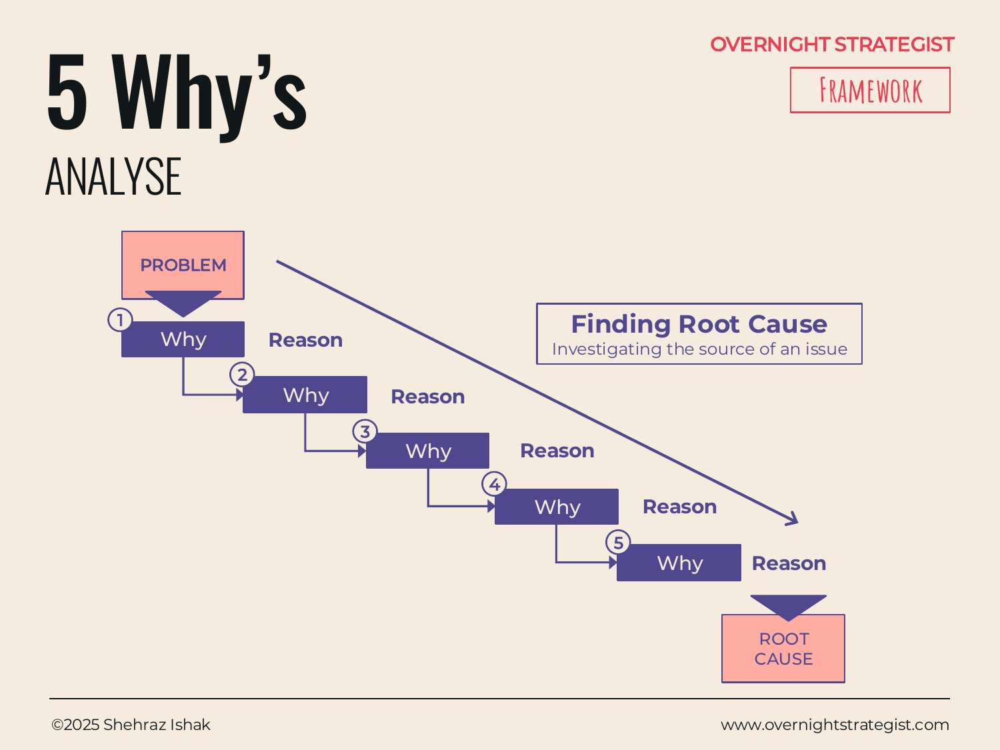

# 5 Why's

> A root-cause technique that finds the underlying cause of a problem by asking "why" repeatedly — each answer becoming the input to the next question — until the chain bottoms out at something actionable.

## What It Is

The 5 Why's is a structured root-cause method. You start with a clearly stated problem, then ask "why does this happen?" The answer to that becomes the new subject: why does *that* happen? You repeat this until you reach an answer that is genuinely root-level — a cause that does not itself have a simpler prior cause, or where the chain has arrived at something you can actually fix. The name says five iterations, but the right number is however many it takes to reach a root cause rather than a symptom.

## Why It Works

Most problem-solving stalls because it attacks symptoms rather than causes. A symptom is the thing you observe; a cause is why it happened; a root cause is the systemic or upstream reason that cause was possible. The gap matters because fixing symptoms is temporary — the problem reappears — while fixing root causes prevents recurrence.

The 5 Why's works by refusing to accept the first plausible explanation. "Sales are down" is a symptom. "Our conversion rate dropped" is a closer cause. "Leads are arriving at the wrong qualification stage" is closer still. "The marketing campaign changed its targeting criteria without coordinating with sales" is a root cause — and a fixable one. The chain technique guards against the natural human tendency to stop at the most obvious or recent explanation and mistake it for the real one.

The discipline of the method is also its constraint: it insists you descend vertically through a single chain of causation rather than branching. This keeps the analysis fast and focused, which is a feature when you want a working diagnosis within a session — but it means you may miss parallel causes without a deliberate effort to explore multiple branches.

## How To Use It

1. **State the problem precisely.** Write it as a specific, observable fact, not a vague complaint. "New subscriber sign-ups fell 22% in the past six weeks" is a problem. "Growth is bad" is not.
2. **Ask the first why.** Why is this problem occurring? Write down the single most plausible cause.
3. **Treat the answer as the new problem.** Ask why *that* is occurring. Write down the answer.
4. **Repeat** until you reach a root cause — typically when the answer is either a systemic condition, a human decision, or a process gap that can be directly addressed.
5. **Validate the chain.** Read the chain in reverse: "Because of X, which caused Y, which caused Z, which produced our problem." If the chain holds logically, you have your root cause. If a step feels implausible, revisit that link.
6. **Identify the fix.** The root cause should point to a specific, actionable change. If it doesn't, you may not be at the root yet.

## Worked Example

**Problem:** Acme Design's trial-to-paid conversion rate dropped from 32% to 19% over six weeks — a loss of roughly $28,000 in monthly recurring revenue.

- **Why 1:** Why did the conversion rate drop?
  Because fewer trial users are completing the first course module during their trial period.

- **Why 2:** Why are fewer users completing the first module?
  Because the average time-to-first-lesson has increased from 1.2 days after sign-up to 4.7 days.

- **Why 3:** Why has time-to-first-lesson increased?
  Because the onboarding email sequence that used to send a direct lesson link on Day 1 stopped sending after a template migration.

- **Why 4:** Why did the template migration break the email sequence?
  Because the migration was handled by the marketing team in isolation, and the existing automation triggers were not documented or transferred to the new platform.

- **Why 5:** Why were the automation triggers not transferred?
  Because there is no handover checklist for platform migrations that requires auditing live automation workflows.

**Root cause:** No migration checklist. **Fix:** Create a migration checklist that includes mandatory audit of all live automations before a platform change goes live. Restore the Day 1 email immediately.

Notice that the presenting problem (low conversion) looked like a product or pricing issue. The root cause was a process gap in cross-team migrations — something that would never have surfaced by analysing the conversion funnel alone.

## When To Use It

Use the 5 Why's in the Analyse stage when a problem is clearly defined and you need to understand its cause before designing a solution. It works best for operational problems — a metric that has declined, a process that has failed, a quality issue — where there is a traceable causal chain. It is less suited to emergent or systemic problems with multiple interacting causes, where a broader diagnostic framework like **5W+H** or a **Driver Tree** may be more appropriate.

Pair with **5W+H** when you want to enrich the diagnosis with context (who is affected, where is it occurring, when did it start) before drilling into causation. Pair with **Waterfall** to quantify the impact of the root cause once it is identified.

## Things To Watch Out For

- The method can lead you to blame individuals rather than systems. When a "why" chain arrives at "because someone made an error," ask one more why: what about the system allowed that error to occur and go uncorrected? Root causes are almost always process or structural gaps, not people failures.
- Stopping too early is the most common mistake. If the answer to a "why" is still something that could itself have a prior cause, keep going.
- The chain is only as good as the answers. If a step is speculative — "we think it might be because..." — that link is fragile. Verify each step with data or direct observation before treating the chain as settled.
- In complex systems, the causal structure may be a web rather than a chain. The 5 Why's gives you one path through that web. For high-stakes problems, explore multiple chains from the same starting problem before committing to a root cause.

## Related Frameworks

- [5W+H](./5w-h.md) — frames the problem from six angles (who, what, when, where, why, how) before drilling into causation; useful as a pre-step to 5 Why's.
- [Yes/No](./yes-no.md) — a binary-branching logic tree; use when the diagnostic path involves conditional decisions rather than a simple causal chain.
- [Waterfall](./waterfall.md) — quantifies the contribution of each factor to a net change; useful after 5 Why's to measure the scale of the root cause's impact.
- [Driver Tree](../split/driver-tree.md) — decomposes a metric into its component drivers across multiple branches simultaneously; a broader alternative when there may be many concurrent causes.
