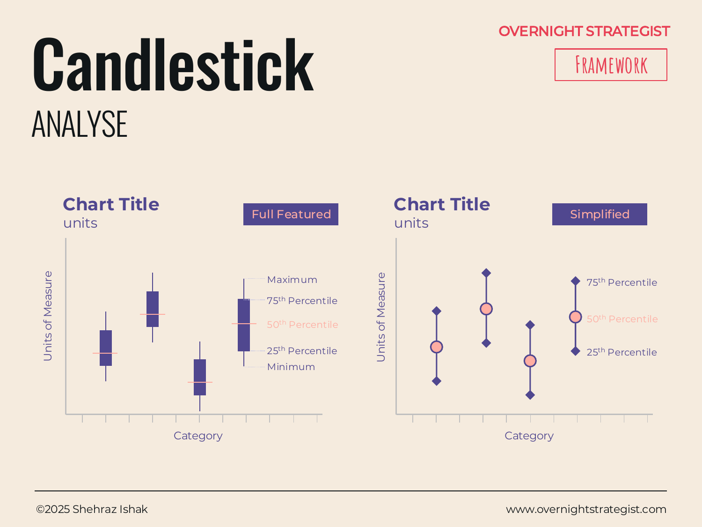

# Candlestick

> A chart that shows the spread of a data set — minimum, maximum, and middle percentiles — as a single visual shape per category, so you can compare not just typical values but the range and variability of each.

## What It Is

A Candlestick chart is an Analyse-stage visual that compresses a dataset's spread into a single compact shape for each category. Each "candlestick" shows:

- **Minimum** — the lowest observed value (bottom whisker or tail)
- **25th percentile** — the lower edge of the central box (the first quartile: 25% of values fall below here)
- **50th percentile (median)** — a line or mark in the middle of the box
- **75th percentile** — the upper edge of the central box (the third quartile: 75% of values fall below here)
- **Maximum** — the highest observed value (top whisker or tail)

The **interquartile range (IQR)** — the height of the central box, spanning the 25th to 75th percentile — represents the middle 50% of the data. A tall box means high variability among typical observations; a short box means most values cluster closely.

The toolkit presents two variants: a **Full Featured** version with all five elements (min, 25th, 50th, 75th, max), and a **Simplified** version showing only the 25th, 50th, and 75th percentile box without the whiskers.

## Why It Works

When you need to compare multiple groups or categories on a single variable, the obvious choice is a bar chart showing averages. But averages hide something critical: the consistency of the result. A channel partner that averages $200k in deals might consistently close in the $180k–$220k range, or might swing between $40k and $600k depending on the deal. Those are completely different partners from a planning and forecasting standpoint, and an average bar treats them identically.

A Candlestick chart works because it makes **variability visible alongside the central tendency**. The box and whiskers let you see both *where the typical value lands* (the median line) and *how spread out the results are* (the height of the box and the length of the whiskers). Comparing boxes across categories answers questions that averages cannot: Is this group more consistent than that one? Does one category have a wider range of outcomes? Are there outlier values pulling the summary statistics in one direction?

## How To Use It

1. **Choose the categories and the variable.** What are you comparing across? (Channels, product types, customer segments, time periods.) What is the variable being measured? (Deal size, resolution time, NPS score, revenue.)
2. **Gather the underlying data.** Unlike a bar chart, a candlestick requires the full dataset for each category — not just the mean. You need enough observations per category to make percentiles meaningful (typically 10 or more per group).
3. **Calculate the five values.** For each category: minimum, 25th percentile, median (50th), 75th percentile, maximum. Use standard quartile functions in Excel, Python, or any data tool.
4. **Plot the shapes.** For each category on the x-axis, draw the central box from 25th to 75th percentile, mark the median inside the box, and extend whiskers to the minimum and maximum. For the simplified version, draw only the central box.
5. **Align on a common y-axis.** All categories share the same y-axis so ranges can be compared directly.
6. **Annotate outliers separately.** In the full-featured version, extreme outliers (values well beyond the min/max whiskers) are sometimes plotted as individual dots rather than extending the whisker to their position, so they don't distort the visual scale.

## Worked Example

Acme Design runs a freelance instructor marketplace alongside its subscription platform. Instructors earn a revenue share based on student enrollment in their courses. At the end of the year, the product team wanted to understand how course revenue varied across five course categories: Design Fundamentals, Typography, Illustration, Motion, and Brand Strategy.

A candlestick chart of annual per-course revenue across the five categories revealed this:

| Category | Min | 25th | Median | 75th | Max |
|----------|-----|------|--------|------|-----|
| Design Fundamentals | $1,200 | $4,800 | $8,400 | $14,200 | $62,000 |
| Typography | $900 | $2,100 | $3,800 | $6,400 | $19,200 |
| Illustration | $1,100 | $5,200 | $9,100 | $18,400 | $88,000 |
| Motion | $400 | $1,800 | $4,200 | $9,600 | $41,000 |
| Brand Strategy | $2,400 | $7,100 | $11,800 | $16,200 | $24,500 |

Two findings stood out. First, Illustration had the highest median and also the widest box (IQR of $13,200), meaning it was both high-performing and highly variable — a few breakout courses were doing most of the work. Second, Brand Strategy had the narrowest box (IQR of $9,100) and no extreme outliers, meaning its revenue was consistently distributed — a more predictable, lower-ceiling category. Motion had the lowest median and a wide tail, suggesting occasional surprise hits but mostly thin performers.

The average revenue per course across all five categories masked these structural differences entirely. The candlestick chart surfaced them in a single view.

## When To Use It

Use a Candlestick chart when you need to compare the **spread and variability** of a variable across two or more groups — not just their typical or average value. It is especially useful when:

- You have enough underlying observations per category to make percentiles meaningful.
- Consistency or predictability is as important as the central value.
- You suspect that outliers or high variability in one category are distorting summary statistics.

For showing how values spread across a *continuous range* without grouping by category, use a **Distribution** (histogram). For a simpler ranking by single-value (e.g. median only), use a **Rank** or **Comparison** chart. For exploring the relationship between two variables, use a **Scatter** chart.

## Things To Watch Out For

- **Small samples make percentiles unreliable.** A candlestick built on five observations per group is not meaningful — the 25th percentile of a group of five is just one data point. Aim for at least 10 observations per group, and more if the data is skewed.
- **The simplified version loses the extremes.** The box-only version (25th–75th percentile) is cleaner but hides minimum and maximum values, which are sometimes the most strategically relevant points (the one $88k course in Illustration, for instance).
- **Averages and medians diverge in skewed data.** If the whiskers are much longer on one side than the other, the mean will be pulled away from the median. A candlestick chart always shows the median; don't assume the midpoint of the box is the mean.
- **Comparing groups of unequal sample size.** The candlestick shape looks the same whether it was built from 12 observations or 1,200. Label the sample size per group or the chart can imply false equivalence.
- **Finance versus statistics usage.** In financial markets, "candlestick" typically refers to OHLC (open-high-low-close) charts used in trading, which show price movement across a time period. That is a distinct use case from the statistical box-plot form described here. Context determines which form is meant.

## Related Frameworks

- [Distribution](./distribution.md) — shows the spread across a continuous range within one variable; use when you have one dataset, not multiple groups to compare.
- [Comparison](./comparison.md) — compares single values (averages or totals) across categories; use when variability is not the story.
- [Scatter](./scatter.md) — plots individual observations across two variables; use when the relationship between dimensions is the question.
- [Rank](./rank.md) — shows ordered position on a single value; use when ranking is the story rather than spread.
