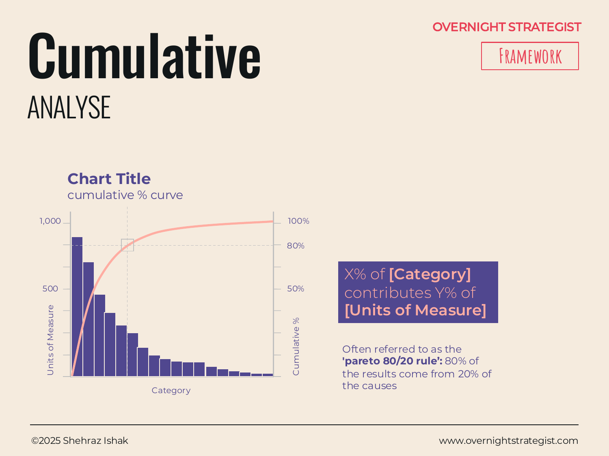

# Cumulative

> A chart that shows both the individual size of each category and the running total they build toward — making it immediately visible that a small number of categories accounts for most of the result.

## What It Is

A Cumulative chart is an Analyse-stage visual that combines two layers: **bars** showing the individual value of each category (sorted from largest to smallest), and a **line** tracking the running cumulative percentage of the total as each category is added. The result is a chart that answers two questions simultaneously: how big is each category on its own, and how quickly does a small subset of categories account for most of the total?

The chart is closely associated with the **Pareto principle** (commonly called the 80/20 rule), which observes that in many real-world systems, roughly 80% of results come from 20% of causes. The cumulative line makes this pattern — or any departure from it — visible at a glance.

The x-axis shows categories (products, customers, channels, failure modes) sorted from largest to smallest. The left y-axis shows individual values (revenue, units, incidents). The right y-axis tracks the cumulative percentage, from 0% at the left edge to 100% at the right edge, as the line climbs across the bars.

## Why It Works

When a business has dozens of products, customers, or markets, prioritization is genuinely hard. Everything feels important. A list sorted by revenue tells you the order, but it doesn't tell you *where the cut-off is* — at what point have you covered enough of the total that the rest are diminishing returns?

The cumulative line answers exactly that question. It reveals the **inflection point**: the moment in the sorted list where the line flattens and the remaining categories add very little to the total. Everything to the left of the inflection is your 20% (or 10%, or 30%) that drives the bulk of the outcome. Everything to the right is the long tail.

This makes the Cumulative chart a precision prioritization tool. It transforms a judgment call ("how many customers should we focus on?") into a data-driven observation ("these 8 customers represent 74% of revenue; the next 22 represent 20%; the remaining 140 represent 6%"). The line draws the boundary that a simple ranked list leaves implicit.

## How To Use It

1. **Choose the category and the value.** What are you analyzing? (Customers by revenue, products by units sold, complaint types by frequency, markets by contribution margin.)
2. **Sort from largest to smallest.** Arrange categories in descending order of value. This is non-negotiable — the chart only works if the bars are sorted, because the cumulative line must climb monotonically.
3. **Draw the bars.** Plot each category as a bar to its individual value on the left y-axis.
4. **Compute the running cumulative percentage.** After each bar, calculate what percentage of the grand total has been accumulated so far. Plot this as a point and connect the points into a line using the right y-axis.
5. **Mark the 80% threshold.** Draw a horizontal reference line at 80% on the right y-axis. Drop a vertical line from where the cumulative line crosses 80% to the x-axis. The categories to the left of that line are your vital few.
6. **Annotate the insight.** Label the callout directly: "X% of [category] contributes Y% of [total]."

## Worked Example

Acme Design has 180 active subscribers on its Team and Studio plans. Annual recurring revenue is $1.8M across all accounts. The revenue operations team built a cumulative chart to understand account concentration, using annual contract value on the left y-axis and cumulative % of revenue on the right.

Sorted from largest to smallest, the cumulative line crossed 80% of total revenue at just 22 accounts. The chart broke down like this:

- **Top 22 accounts (12% of customer base):** $1.44M, or 80% of ARR
- **Next 38 accounts (21%):** $252k, or 14% of ARR
- **Remaining 120 accounts (67%):** $108k, or 6% of ARR

The shape of the cumulative line was steep at first, then flattened sharply after account 22. Visually, the top 12% looked like a cliff followed by a plateau.

The implication was stark: if Acme lost even three of the top 22 accounts, it would lose more revenue than the entire bottom 120 accounts could generate in a year. Customer success had been spread evenly across all 180 accounts. The cumulative chart made the reallocation case instantly — 80% of CS time toward 12% of the account base. No amount of reading the sorted revenue table had produced that clarity, because the cumulative percentage was never visible there.

## When To Use It

Use a Cumulative chart whenever the question is *which subset of this list is doing most of the work — and where does the tail begin?* It is especially valuable for:

- Revenue concentration analysis (which customers, products, or markets account for 80% of revenue)
- Quality and defect analysis (which failure types account for 80% of complaints or incidents)
- Channel prioritization (which channels account for 80% of conversions)
- Procurement and cost analysis (which suppliers or categories account for 80% of spend)

When you want to see the *absolute* ranking without the cumulative dimension, use a **Rank** chart or a sorted **Comparison** chart. When the goal is to understand how values spread across a continuous range (not sorted discrete categories), use a **Distribution** chart.

## Things To Watch Out For

- **The 80/20 ratio is a heuristic, not a law.** Some systems are more concentrated (a few items do 95% of the work); others are more even. Don't force the insight to match the heuristic — read the actual inflection point in the data.
- **Sort order is mandatory.** A cumulative chart with unsorted bars is meaningless. The line only reveals concentration because the bars are ranked. If categories are plotted in a different order (alphabetical, chronological), the chart cannot be read.
- **Two y-axes can confuse.** Make the scale of both y-axes clear and label them explicitly. The left axis (individual values) and right axis (cumulative %) operate on entirely different scales.
- **The long tail is still real.** The 80% cut-off is an analytical focus tool, not a disposal recommendation. The bottom 20% of contributors are not always negligible — in some cases, the tail contains early signals of high-growth items that will become core later.
- **Static snapshots can mislead.** A cumulative chart shows one point in time. If concentration is shifting (the top accounts churning, new accounts entering), run the chart across multiple periods to see whether the vital few are the same ones each time.

## Related Frameworks

- [Rank](./rank.md) — shows the ordering and position changes of items over time; use when movement in the ranking is the story.
- [Comparison](./comparison.md) — shows absolute values side by side without the cumulative dimension.
- [Waterfall](./waterfall.md) — decomposes a total into its contributing increments; use when the order is causal rather than ranked-by-size.
- [Distribution](./distribution.md) — shows how values spread across a continuous range; use when categories are bucketed rather than named.
- [Trend](./trend.md) — shows how totals change over time; pair with Cumulative to see whether concentration is increasing or decreasing.
