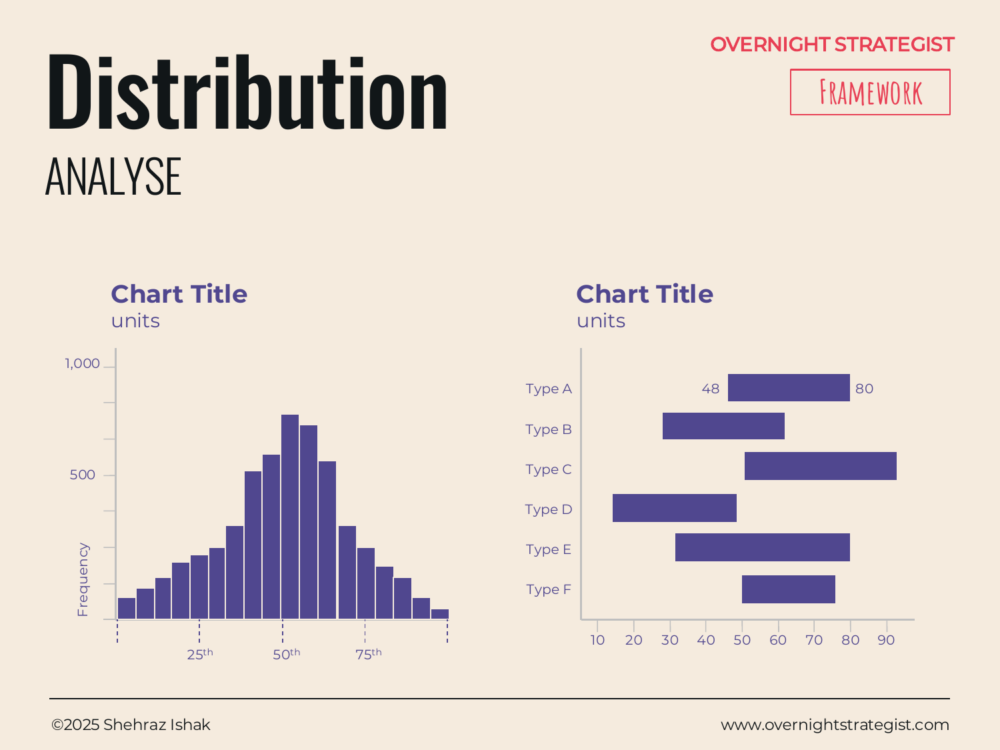

# Distribution

> A chart that shows how a set of values spreads across a range — revealing whether the data clusters tightly in the middle, skews to one end, or splits into distinct groups.

## What It Is

A Distribution chart is an Analyse-stage visual that answers the question: *where do most values land, and how spread out is the rest?* It comes in two main forms:

- **Distribution bar chart (histogram):** Values are grouped into buckets (ranges), and each bar shows how many data points fall within that bucket. The shape of the bars together reveals the underlying distribution — normal (bell curve), skewed left or right, bimodal (two humps), or uniform.
- **Football field chart:** A specialized form that shows the high and low range for several different methodologies or scenarios side by side. Each category appears as a horizontal bar spanning from its minimum to maximum, with a midpoint marked. Used in valuation and scenario analysis to compare the spread of estimates across different approaches.

Both forms share the same core function: showing **spread**, not just a central number.

## Why It Works

Averages are one of the most misleading numbers in business analysis. A team with an average sales rep productivity of $500k per quota sounds healthy — until a Distribution chart reveals that one rep is doing $2.1M and everyone else is clustered below $200k. The average was real; the picture it implied was false.

Distribution charts work because they make the **shape of the data** visible, which is what a summary statistic (mean, median, total) cannot do. The shape tells you things that no single number can:

- A tight bell curve around the middle means the phenomenon is predictable and consistent.
- A right-skewed distribution (most values low, a long tail of high values) means a few cases are doing disproportionate work.
- A bimodal distribution (two distinct humps) suggests two separate populations in what you thought was one.
- A flat, spread-out distribution means high variability with no dominant pattern.

Each shape implies a different diagnosis and a different strategic response. Without the distribution view, all four patterns could produce the same average.

## How To Use It

To **build a histogram:**
1. **Define the variable.** What is being measured? (Revenue per customer, support-ticket resolution time, NPS scores.)
2. **Set the bucket size.** Group values into equal-width ranges (e.g. 0–$50, $50–$100, etc.). Too many buckets make the chart noisy; too few hide the shape. Aim for 5–15 buckets.
3. **Count and plot.** For each bucket, count how many observations fall within it and draw a bar to that height. Bars should be adjacent (no gaps) to signal a continuous range.
4. **Mark key percentiles.** Add vertical lines or annotations for the 25th, 50th (median), and 75th percentiles so readers can locate where the middle of the distribution falls.
5. **Describe the shape.** Is it normal, skewed, bimodal? Name it in the callout — the shape is usually the insight.

To **build a football field chart:**
1. **Define the methodologies or scenarios.** Each becomes a row (e.g. valuation by revenue multiple, by DCF, by comparable transactions).
2. **Plot the range for each.** Draw a horizontal bar from the low end to the high end of each estimate, with a dot or tick at the central estimate (median or mid-point).
3. **Align on a common axis.** All rows share the same x-axis (e.g. valuation in $M) so ranges can be compared directly.

## Worked Example

Acme Design has 3,200 subscribers paying between $19 and $149 per month. Finance reports the average monthly revenue per user (ARPU) as $38 — a number that has been used in financial models for two years. A histogram of individual subscription values tells a starkly different story:

| Revenue bucket | Subscriber count |
|---------------|-----------------|
| $0–$25 | 1,680 (53%) |
| $25–$50 | 820 (26%) |
| $50–$75 | 290 (9%) |
| $75–$100 | 220 (7%) |
| $100–$149 | 190 (6%) |

The distribution is heavily right-skewed. More than half of Acme's subscriber base pays below $25, most of them on the discounted Individual tier at $19. The $38 average is real, but it is pulled upward by the 190 Studio subscribers paying $149 and is not representative of what a typical subscriber pays. Every financial model built on $38 ARPU was overestimating unit revenue for the majority of the base. The distribution chart exposed this in one view; no amount of summary statistics had.

## When To Use It

Use a Distribution chart when the question is *how spread out is this data and where does it concentrate?* It is particularly valuable when:

- An average or total has been the working assumption and you want to check whether it accurately represents the data.
- You suspect there are distinct sub-populations hiding inside an aggregate (high-value vs. low-value customers, high-performing vs. struggling markets).
- You're comparing the spread of estimates across different scenarios or methodologies (football field form).

For visualizing the range of a single category's data across groups, consider a **Candlestick** chart instead (it shows median and percentile spread per group without requiring you to bin the data). For comparing two variables together and seeing whether they relate, use a **Scatter** chart.

## Things To Watch Out For

- **Bucket size changes the story.** Very wide buckets smooth out real variation; very narrow buckets produce a jagged chart that looks like noise. Choose bucket width deliberately and label it.
- **The average as a substitute.** A distribution with a long tail has a mean that few observations actually approximate. Report the median alongside the mean and let the distribution chart show why they differ.
- **Sample size sensitivity.** Histograms with fewer than 30 observations can look like meaningful shapes when they're just noise. State the n and be cautious about interpreting shape from small samples.
- **The football field chart's false precision.** Ranges in a football field chart look objective but are only as reliable as the methodology behind each one. Label each row with its methodology and be explicit about the assumptions driving the spread.
- **Ignoring outliers.** An outlier in a histogram can be a single bucket that looks small as a bar but represents the most important segment of the business (as in the Acme example above). Don't let small bars be invisible.

## Related Frameworks

- [Scatter](./scatter.md) — plots the relationship between two variables; use when you have two dimensions and want to see if they correlate.
- [Comparison](./comparison.md) — compares absolute values of discrete categories; use when you have named categories, not a continuous range.
- [Rank](./rank.md) — shows ordered position of items; use when ranking matters more than the shape of the spread.
- [Candlestick](./candlestick.md) — shows the spread (min, max, percentiles) of a metric across groups without requiring binning.
