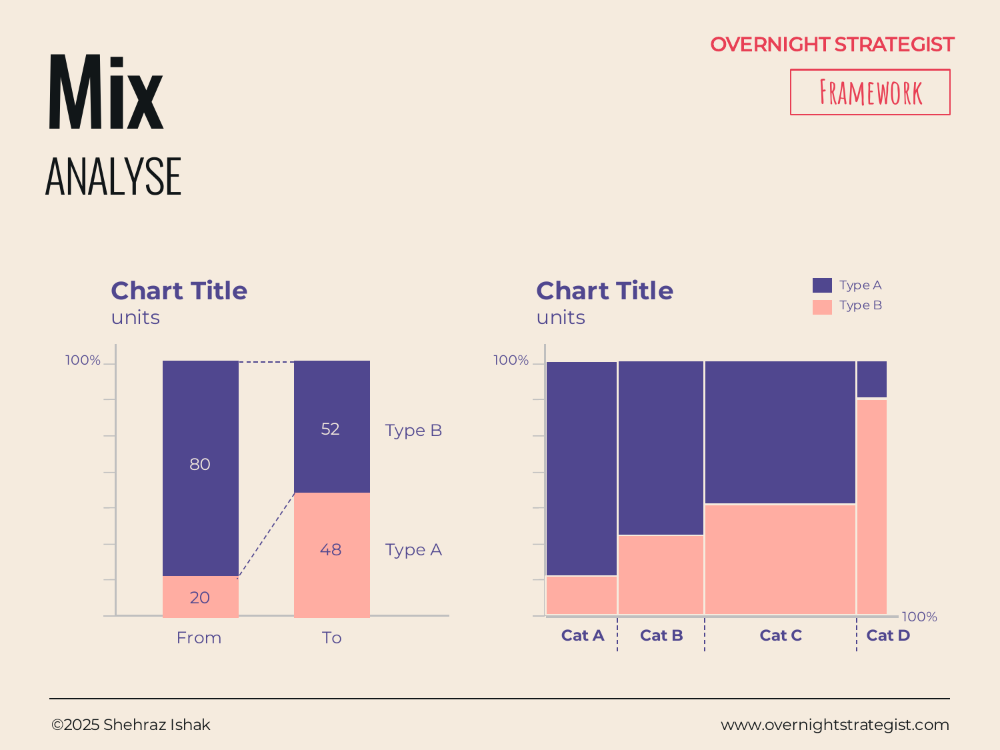

# Mix

> A chart that shows how the proportional composition of a whole shifts between two points in time or across categories — so you can see not just totals, but who is winning share within them.

## What It Is

A Mix chart is an Analyse-stage visual that shows the internal composition of a total. It comes in two main forms:

- **100% stacked bar chart:** Each bar is scaled to 100%, with segments representing each sub-category's share of the whole. This is the purest mix view — absolute values disappear and proportions are everything. Best for comparing how composition differs between two or more points in time or two or more groups.
- **Area chart (market share variant):** A more complex form where each band represents a participant's share of a market, positioned so that width on the x-axis represents total market size and height represents share. Used sparingly for market-landscape analysis.

The defining insight a Mix chart provides is **share shift** — not whether the total went up or down, but whether the composition inside it changed.

## Why It Works

A Comparison or Trend chart shows totals moving. But total growth can mask a significant problem: a market can grow while your slice of it shrinks, and the absolute revenue line will still go up right up until the moment it doesn't. Mix charts work because they **collapse the total to 100% and make the structure visible**, which means structural shifts that are invisible in absolute numbers become obvious.

A company whose revenue grew from $40M to $70M might feel healthy until a Mix chart reveals that the profitable enterprise segment shrank from 80% of revenue to 52%, while the lower-margin SMB segment expanded to fill the gap. The business grew; the quality of the mix deteriorated. Without the Mix view, that shift is a footnote in a table. With it, it's the central fact.

The 100% stacked form also makes comparisons across groups that differ in size genuinely fair: because everything is normalized to 100%, a small business and a large business can be placed side by side without the big one dwarfing the small one.

## How To Use It

1. **Identify the whole and its parts.** What is the total being divided? (Revenue, customers, headcount, market volume.) What are the sub-categories? (Product type, channel, geography, customer segment.)
2. **Choose your comparison axis.** Are you comparing two time points (From/To)? Or multiple categories at the same time (Cat A, B, C, D)?
3. **Build as 100% stacked bars.** Scale each bar to 100% and fill with segments in a consistent order. Maintain the same color for each sub-category across all bars.
4. **Sort sub-categories deliberately.** Put the most strategically important segment at the bottom (adjacent to the baseline) so its change is easiest to read. Volatile or residual categories go in the middle.
5. **Annotate the delta.** For a From/To comparison, call out the percentage-point change for each key segment explicitly — the eye can estimate but rarely measures precisely from stacked bars.
6. **Pair with a Trend or Waterfall if the total matters.** A 100% stacked bar shows proportion but hides whether the total grew or shrank. Add a separate chart showing total volume when both dimensions matter.

## Worked Example

Acme Design sells three subscription tiers: Individual ($19/month), Team ($49/month per seat), and Studio ($149/month). At the start of the year, Individual represented 20% of revenue and Studio represented 80%. By Q4, that had shifted to Individual at 52% and Studio at 48%.

A 100% stacked bar chart with two columns — "Q1" and "Q4" — makes the shift unmistakable: the Studio segment, shown in dark at the bottom of each bar, has contracted from a wide band to barely half. In absolute numbers, total revenue actually grew slightly, from $2.1M to $2.4M per quarter — which masked the problem entirely in the Trend view. The Mix chart revealed that Acme's highest-margin tier was losing ground while low-margin Individual subscriptions flooded in via a discount campaign. Gross margin per subscriber had dropped 34% even as top-line revenue rose. The decision the business actually needed to make — whether to protect margin by raising Individual prices or invest to convert Individual users into Teams — was invisible until the mix was charted.

## When To Use It

Use a Mix chart when the proportion of a whole is the story, not just the absolute size. It is especially valuable when:

- A total is growing but you suspect the quality or profitability of the mix is deteriorating.
- You're comparing the composition of multiple groups (regions, cohorts, competitors) that differ in absolute size.
- You want to show how share shifted between two time periods without getting distracted by the change in the total.

If the total volume also matters, always pair the Mix chart with a **Trend** or **Comparison** chart showing absolute numbers — the Mix view alone can mislead by hiding a shrinking denominator. When the question shifts to *why* the mix shifted, reach for a **Waterfall** to decompose the drivers.

## Things To Watch Out For

- **The hidden denominator.** A 100% stacked chart says nothing about whether the underlying total grew, shrank, or stayed flat. A segment that holds 50% of a collapsing market is not the same as 50% of a growing one. Always show total volume alongside the mix.
- **Too many segments.** More than four or five segments make a stacked bar chart unreadable — the thin middle slivers can't be compared across bars. Group minor segments into "Other."
- **Inconsistent color assignment.** If the color for a segment changes between bars (or between slides), the reader loses the visual thread. Lock one color to one category and never change it.
- **Implying causation.** A mix shift is an observation, not an explanation. The chart tells you that the share of Studio subscriptions fell; it does not tell you why. Resist the temptation to label the chart as if the cause is established.
- **The area chart trap.** The area chart variant (market size × share) is analytically powerful but difficult to read correctly. Use it only with audiences who are familiar with the form.

## Related Frameworks

- [Trend](./trend.md) — shows how a total changes over time; pair with Mix to show both volume and composition.
- [Comparison](./comparison.md) — compares absolute values of discrete categories; use when proportions aren't the point.
- [Distribution](./distribution.md) — shows how values spread across a range rather than how a whole divides across types.
- [Waterfall](./waterfall.md) — decomposes a change in total into its component causes.
- [Profit Margin](./profit-margin.md) — shows cost vs. revenue composition within a total bar; shares the stacked structure.
