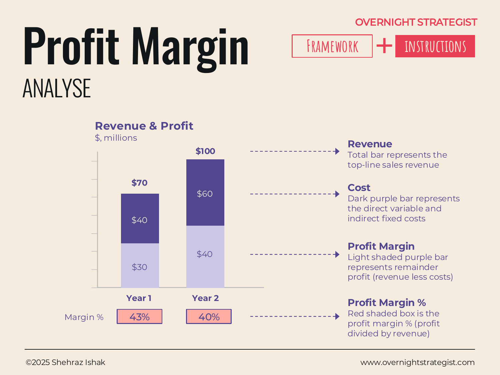

# Profit Margin

> A stacked bar chart that shows revenue, cost, and profit together in each period, with a margin percentage overlay — so you see not just how much profit was made, but how much of every revenue dollar survived as profit.

## What It Is

The Profit Margin framework visualises revenue, cost, and profit for each time period on a single bar chart. Each bar represents total revenue — divided into two segments: the lower (cost) portion and the upper (profit) portion — so the relative sizes of cost and profit within revenue are immediately visible. A separate annotation or overlay shows the margin percentage for each period: profit divided by revenue, expressed as a percentage. Comparing bars across periods shows whether the business is growing and whether it is growing efficiently.

## Why It Works

Revenue growth is easy to celebrate and hard to evaluate in isolation. A business can double its revenue while its margin halves, leaving it with more money in but proportionally less money out — or even, in the worst case, growing itself into a loss. The Profit Margin chart closes that gap by showing revenue, cost, and profit simultaneously. Because the bar segments are proportional, a compression in margin shows up as a visually shrinking profit band even when the total bar is growing — making deterioration visible before it hits the bottom line in a way that catches attention.

The margin percentage annotation turns the visual into a number that is comparable across periods and companies regardless of scale. Whether the business is doing $1m or $100m in revenue, a margin of 40% means the same thing: 40 cents of every revenue dollar is retained after costs.

## How To Use It

1. **Gather revenue, cost, and profit by period.** These are typically annual or quarterly totals. Profit here is the margin level you want to track — gross profit (revenue less direct costs), operating profit (gross less operating expenses), or net profit, depending on what decision you are trying to inform.
2. **Build the stacked bars.** For each period, draw a total-height bar at the revenue level. Fill the bottom portion in one colour for cost; fill the remainder (profit) in a second colour. The total height is always revenue; the split shows cost vs. profit.
3. **Add margin percentages.** Label each bar with the profit margin percentage (profit ÷ revenue × 100). This number is the primary analytical signal.
4. **Read the direction.** Is the profit band growing, shrinking, or stable as a share of the bar? Is the margin percentage going up or down across periods?
5. **Explain the trend.** A falling margin with rising revenue means costs are growing faster — identify whether that is COGS (a unit-economics problem) or operating expenses (a scaling problem). A flat margin with flat revenue is a plateau worth diagnosing.

## Worked Example

Acme Design's revenue and cost figures across three years:

| Year   | Revenue | Cost    | Profit  | Margin % |
|--------|---------|---------|---------|----------|
| Year 1 | $1.0m   | $600k   | $400k   | 40%      |
| Year 2 | $1.6m   | $1,040k | $560k   | 35%      |
| Year 3 | $2.2m   | $1,540k | $660k   | 30%      |

Revenue is growing strongly — up 120% over three years. Profit in absolute dollars is also growing, from $400k to $660k. Plotted as stacked bars, however, the margin band visually narrows with each period: the cost portion of each bar is claiming more space. The margin percentage annotation confirms the trend — 40%, 35%, 30% — a 10-percentage-point compression in two years.

This is the pattern of revenue-led growth eating into efficiency. For Acme, the diagnosis is a rising cost base that has not scaled proportionally: closer inspection shows live-cohort delivery costs (instructor time, production) growing faster than revenue as Acme has shifted toward higher-touch programmes. The margin chart doesn't tell Acme what to do about this, but it makes the problem undeniable and focuses the question: is the margin compression structural (higher-cost product mix) or operational (inefficiencies that can be addressed)?

## When To Use It

Use the Profit Margin chart in regular reporting when you want to communicate both the growth story and the efficiency story in a single view. It is most valuable when year-over-year or quarter-over-quarter comparison is the primary question — is the business becoming more or less efficient as it grows? For diagnosing *why* margin moved, add a **Waterfall** to decompose the change. For evaluating whether margin justifies the capital deployed to earn it, pair with **ROIC**.

## Things To Watch Out For

- The choice of margin level (gross, operating, or net) changes the story significantly. Be explicit about which cost lines are included and which are not.
- A chart showing improving revenue and absolute profit can obscure a declining margin percentage. Always include the margin-percentage annotation; don't rely on the bar shapes alone.
- One-time items (a large contract, a restructuring charge) can distort a single period and make a trend look worse or better than it is. Note material one-off items on the chart.
- Cost allocations between business lines or time periods can shift margins artificially. If comparing units within a business, ensure costs are allocated on a consistent basis.

## Related Frameworks

- [ROIC](./roic.md) — scales the profit lens to capital efficiency: how much profit per dollar of capital deployed, not just per dollar of revenue.
- [Cashflow](./cashflow.md) — the cash-movement view of the same business activity; cash profit and accounting profit differ when timing of payment matters.
- [Waterfall](./waterfall.md) — decomposes the change in profit from one period to the next into its contributing causes.
- [Actual v Target](./actual-v-target.md) — overlays planned versus actual margin for the same periods, adding the accountability dimension.
- [Unit Economics](./unit-economics.md) — the per-customer version of the margin question: how much profit does each customer relationship generate?
