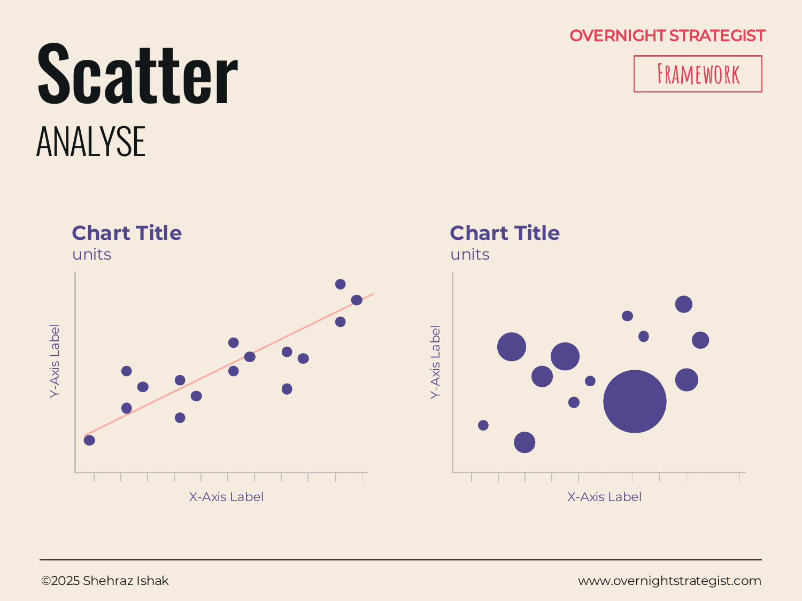

# Scatter

> A chart that plots individual data points across two axes to reveal whether — and how strongly — two variables relate to each other.

## What It Is

A Scatter chart is an Analyse-stage visual that places each observation as a dot at the intersection of its value on two axes: an x-axis (one variable) and a y-axis (another variable). With enough dots, the overall pattern reveals whether the two variables move together (correlation), move against each other (inverse correlation), or have no apparent relationship at all.

It comes in two main forms:

- **Scatter dot chart:** Each dot represents one observation (one customer, one market, one product). The two axes are the two variables. The pattern of dots — clustered, scattered, angled, or random — tells the story.
- **Bubble chart:** A three-variable extension. The x and y axes work the same way; the size of each dot encodes a third variable (e.g. market size, revenue, headcount). Used when you need to show *where* a company or product sits relative to competitors and also communicate its scale.

## Why It Works

Most analytical tools compare items one dimension at a time. A bar chart tells you who has the highest revenue; a different bar chart tells you who has the highest growth rate. But what you often actually want to know is *whether the two are related* — do high-revenue businesses also grow faster, or does growth actually plateau at scale?

A Scatter chart works because it **puts both dimensions on the page at the same time for every observation**, letting patterns emerge that would be invisible if you analyzed each variable in isolation. A tightly clustered set of dots around a diagonal line signals a strong relationship. A cloud of dots with no direction signals no relationship. An L-shape or curve signals a non-linear relationship.

Those patterns are analytically meaningful: if spend and conversion rate have no relationship in a scatter plot, then increasing spend is not the lever to pull. If there's a cluster of high performers that is visually separate from the rest, it may signal a qualitatively different model or segment. These insights require seeing both axes simultaneously.

The bubble chart adds the third variable for competitive and market positioning work: you can see whether a competitor is large and slow-growing, or small and fast, or large and fast — a crucial strategic input that two separate charts cannot give you.

## How To Use It

1. **Choose two variables.** Pick the two dimensions you want to test for a relationship. Typically one is a cause-candidate and one is an outcome-candidate — but the chart is not directional; it reveals correlation, not causation.
2. **Plot each observation as a dot.** Each entity (customer, product, market, rep) gets one dot. Label outliers if they're the story; avoid labeling every dot.
3. **Draw a trend line if one exists.** If the dots cluster around a line, add a regression or best-fit line to make the direction and strength of the relationship explicit. Do not add a trend line if the dots show no pattern.
4. **Divide into quadrants if useful.** Adding an x-axis midpoint and a y-axis midpoint creates four quadrants that can be labeled (e.g. high-growth/high-margin, high-growth/low-margin). This is particularly useful when the goal is to classify items into strategic buckets.
5. **For bubble charts, set bubble size consistently.** Make clear in the legend what the size encodes. Don't use more than one bubble-size variable — it becomes unreadable.

## Worked Example

Acme Design's sales team had 22 enterprise accounts. The team assumed that accounts with longer tenures would produce higher annual contract value (ACV) because they had expanded over time. A scatter plot with tenure (months) on the x-axis and ACV ($k) on the y-axis tested this assumption directly.

The result: there was no discernible upward slope. The dots scattered broadly across all tenure ranges. A 6-month-old account might generate $80k; a 30-month-old account might generate $45k. However, a cluster of seven accounts stood out — all in the upper-right quadrant, with both long tenure (24+ months) and high ACV ($120k+). When the account managers labeled those dots, all seven turned out to be accounts that had adopted Acme's Studio tier within the first 90 days of signing.

Tier adoption within the first 90 days was a far better predictor of ACV than tenure alone — a finding that changed the onboarding playbook entirely. The scatter chart produced this insight in a single view; no amount of tenure-sorted tables had surfaced it.

## When To Use It

Use a Scatter chart when the question is *is there a relationship between these two variables?* — and when you have enough observations (typically 15 or more) to make a pattern meaningful rather than just noise.

It is particularly useful for:
- Testing an assumed driver ("does more marketing spend lead to more sign-ups?")
- Competitive positioning (bubble chart: where does each competitor sit on price vs. market share?)
- Segmentation discovery (do clusters of customers naturally form when you plot two behavioral variables?)

For questions about how a distribution spreads within one variable (not two), use a **Distribution** chart instead. For a simpler ranking without a second dimension, use **Rank** or **Comparison**. For a structured four-quadrant categorization of strategies or priorities (rather than empirical data points), reach for the **Matrix** insight template.

## Things To Watch Out For

- **Correlation is not causation.** A scatter plot can show that two variables move together; it cannot show which causes which, or whether both are driven by a third factor. Be careful about the language you use to describe a correlation.
- **Overplotting.** When many observations share similar values, dots overlap and the chart becomes a dark blob. Use transparency, jitter (small random offsets), or summary binning to reveal density.
- **Sample size matters.** A scatter plot with eight points can produce a "pattern" that is pure randomness. State the n and be skeptical of tight-looking trends from small samples.
- **Misleading axis ranges.** If both axes don't start at the same scale, the visual slope of the trend line can be manipulated. Keep axes consistent and labeled.
- **Bubble size interpretation.** In a bubble chart, readers naturally compare bubble areas, but the eye perceives radius. If you encode a variable as bubble size, use area, not radius, as the encoding — otherwise a variable that is 4x larger appears to be 2x larger visually.

## Related Frameworks

- [Distribution](./distribution.md) — shows how a single variable spreads across its range; use when you have one dimension, not two.
- [Comparison](./comparison.md) — compares absolute values of discrete named categories; use when you don't have two continuous variables.
- [Rank](./rank.md) — shows ordered position on a single dimension; use when the ranking itself is the insight.
- [Heat Map](../insight/heat-map.md) — another way to show the relationship between two categorical dimensions, using color instead of dot position.
- [Positioning](../insight/positioning.md) — the strategic insight template built on the same two-axis logic as a scatter, used to map options or competitors onto quadrants.
