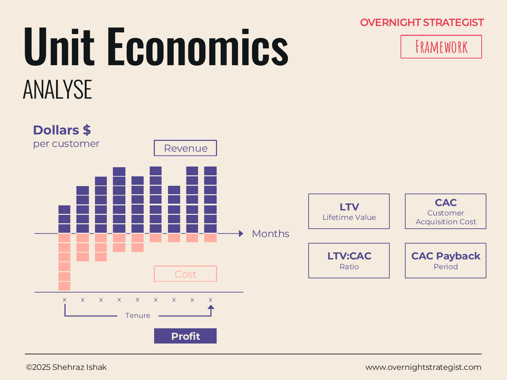

# Unit Economics

> A framework that examines the ongoing profit generated by a single customer over their lifetime — and compares it to the cost of acquiring them — to determine whether the business model works at the unit level before scaling.

## What It Is

Unit Economics is an Analyse-stage framework that zooms in from the business as a whole to the economics of **a single customer** (the "unit"). It answers the fundamental business model question: for every customer we acquire, do we make more from them than we spent to get them?

The framework produces four interconnected metrics, each building on the last:

- **LTV (Lifetime Value):** The sum of all monthly profit generated by one customer across the full duration of their relationship with the business. Not revenue — profit (revenue minus the ongoing costs to serve that customer per month). LTV tells you how much one customer is ultimately worth.
- **CAC (Customer Acquisition Cost):** The total upfront cost to acquire one new customer — marketing spend, sales salaries, trials, onboarding, and any other cost incurred before the customer starts paying. CAC tells you how much you spend to get one customer through the door.
- **LTV:CAC Ratio:** The ratio of LTV to CAC. A ratio above 1 means the business makes more from a customer than it costs to acquire them. A ratio of 3:1 or higher is often cited as the threshold for a healthy, scalable subscription business.
- **CAC Payback Period:** The number of months it takes for the cumulative monthly profit from a customer to fully repay the acquisition cost. A shorter payback period means faster cash recovery and less capital required to fund growth.

The framework is often visualized as a curve showing monthly profit per customer over time. In the early months (before and just after acquisition), the curve is negative — the business is in the hole for the CAC. As monthly profit accumulates, the curve crosses zero at the payback period. The total area under the curve, from zero to the end of the customer's tenure, is the LTV.

## Why It Works

A business can look profitable in aggregate while systematically destroying value at the unit level. If it costs $600 to acquire a customer who generates $40 of profit per month but churns after 12 months, that customer's LTV is $480 — and the business loses $120 on every single one. Scale that up and the top line grows while the losses compound. Without the unit economics view, the aggregate P&L can look fine for years before the math catches up.

Unit Economics works as a framework because it **strips away scale and forces the question the aggregate hides: does one customer pay for themselves?** By anchoring the analysis to a single unit, it eliminates size and volume as confounding factors. A $10M revenue business and a $100M revenue business can have identical unit economics — or one can be structurally sound and the other structurally broken. Only the per-unit view reveals which is which.

The LTV:CAC ratio is also a capital-efficiency test. A high ratio means the business creates value quickly and can self-fund growth. A low ratio means growth is expensive relative to its returns and requires sustained external capital — a vulnerability that increases with scale.

## How To Use It

1. **Define the unit.** In most contexts this is a single customer. For marketplaces or two-sided models, you may need to define it separately for each side.
2. **Calculate monthly profit per customer.** Monthly revenue from one customer (their subscription or average spend) minus the direct costs to serve them (hosting, support, content delivery, licensing). This is the monthly profit contribution.
3. **Project the tenure.** How long does a typical customer stay? Use average tenure from historical data, or calculate it as 1 / monthly churn rate (e.g. 3% monthly churn = average tenure of ~33 months).
4. **Calculate LTV.** Multiply the monthly profit contribution by the expected tenure. (For more precision, model it as a curve that accounts for expansion revenue, upgrades, or declining service costs over time.)
5. **Calculate CAC.** Total acquisition spend in a period divided by the number of new customers acquired in that period. Include all costs: paid media, content, sales team compensation, agency fees, promotions.
6. **Compute the ratio and payback period.** LTV ÷ CAC = ratio. CAC ÷ monthly profit contribution = payback period in months.
7. **Plot the curve.** Visualize the running cumulative profit per customer over time. Mark the point where it crosses zero (the payback period) and the final value at average tenure (the LTV).

## Worked Example

Acme Design's Individual subscription costs $19/month. The direct cost to serve one subscriber (hosting, support allocation, content licensing) is $4/month, giving a monthly profit contribution of **$15/customer/month**.

Historical data shows an average subscriber tenure of **18 months** (annual churn of roughly 55%, or about 4.6% monthly). This makes the LTV:

**LTV = $15 × 18 = $270**

The marketing and sales team spent $180,000 last quarter acquiring 600 new Individual subscribers. This gives a CAC:

**CAC = $180,000 ÷ 600 = $300**

The LTV:CAC ratio is:

**LTV:CAC = $270 ÷ $300 = 0.9:1**

A ratio below 1 means Acme is spending more to acquire each Individual subscriber than it will ever make from them. The payback period is:

**Payback = $300 ÷ $15 = 20 months**

But the average subscriber only stays 18 months — so the typical Individual subscriber leaves two months before Acme recoups the acquisition cost. The business is destroying value on every Individual subscriber it acquires. The fix is not more marketing; it's either reducing CAC, increasing ARPU (by nudging users toward Team plans), or improving retention to extend tenure past the 20-month payback threshold.

This finding was invisible in Acme's aggregate financials, where growing subscriber counts looked like success.

## When To Use It

Use Unit Economics whenever you're evaluating the viability or scalability of a business model that involves recurring customers — subscription services, SaaS, consumer memberships, marketplace models, or any business where upfront acquisition costs are recovered over an ongoing relationship.

It is the essential analysis before scaling: if the unit economics are broken at 1,000 customers, they will still be broken at 100,000 customers, just at a much greater cost. Run Unit Economics before committing to growth investment, before entering a new customer segment, and after any change to pricing, acquisition channels, or service costs.

For the broader capital deployment question, pair with **ROIC** (which operates at the total business level rather than the customer unit). For tracking whether improvements are working over time, pair with **Actual v Target**. For the full multi-year valuation case, pair with **Cashflow** analysis.

## Things To Watch Out For

- **Average tenure is not the same as median tenure.** In subscription businesses, churn is often front-loaded — many customers leave in the first 30–60 days, while a smaller cohort stays for years. An average tenure of 18 months might mask a pattern where 50% of customers churn by month 6. Segment cohorts and analyze survival curves before relying on a single average tenure figure.
- **CAC excludes the cost of failed experiments.** Many companies calculate CAC using only the spend on channels that converted, rather than total acquisition spend including failed campaigns. True CAC should include everything spent on acquisition activity in a period.
- **LTV models are only as good as the churn assumption.** A small change in monthly churn rate can dramatically change LTV. A business with 2% monthly churn has an average tenure of 50 months and an LTV of $750 at $15/month margin; at 4% monthly churn, tenure drops to 25 months and LTV drops to $375 — half the value. Test LTV under several churn scenarios.
- **Expansion revenue can transform the math.** If customers upgrade (moving from Individual to Team to Studio), the monthly profit contribution grows over time rather than staying flat. This makes a simple LTV = margin × tenure formula understate true lifetime value. Model it as a curve that accounts for expansion where data allows.
- **LTV:CAC benchmarks vary by business type.** The widely cited 3:1 benchmark comes from venture-backed SaaS companies with relatively predictable churn. For businesses with high seasonality, long sales cycles, or volatile churn, the right target ratio may be different. Use the benchmark as a starting point, not an absolute rule.

## Related Frameworks

- [Cashflow](./cashflow.md) — models the total value of a business or investment as a sum of discounted future cash flows; operates at the business level where Unit Economics operates at the customer level.
- [Profit Margin](./profit-margin.md) — shows the relationship between revenue, cost, and profit for the business in aggregate.
- [ROIC](./roic.md) — measures how efficiently the business converts invested capital into operating profit; the business-level counterpart to per-unit efficiency.
- [Waterfall](./waterfall.md) — decomposes the change in a total (such as ARR) into its contributing causes, useful for understanding what is driving LTV up or CAC down over time.
- [Actual v Target](./actual-v-target.md) — tracks whether LTV:CAC ratio improvements are hitting the goals set for them.
