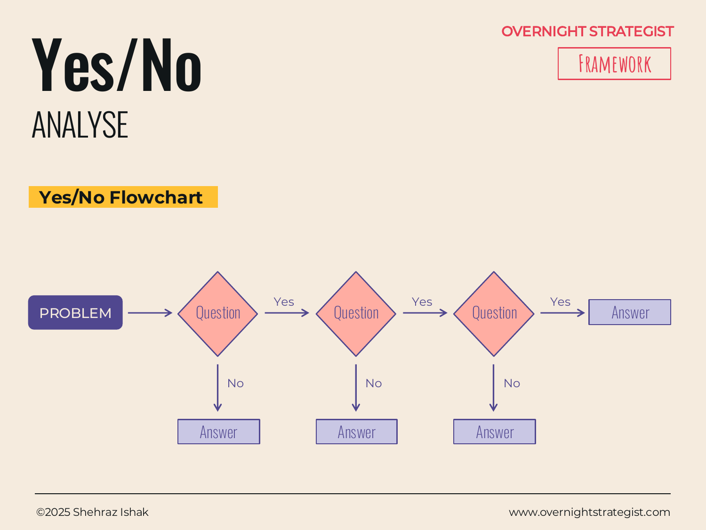

# Yes/No

> A binary logic tree that guides a user to an answer by routing them through a sequence of yes-or-no questions, each branch leading either to the next question or to a defined outcome.

## What It Is

The Yes/No framework is a flowchart where every node poses a single binary question — answerable only with "yes" or "no" — and each answer routes the user to either another question or a terminal outcome. Starting at a root question, the user follows the branch that matches their situation until the chain bottoms out at an end node: a diagnosis, a recommended action, a classification, or a conclusion. Simple versions only branch on the "yes" path; more complex versions branch on both, producing a full tree of outcomes. The framework is both an analysis tool (for diagnosing a situation) and a communication tool (for encoding expert logic in a form anyone can follow).

## Why It Works

Many problems that look complex are actually structured as a decision sequence: the answer to the first question determines which questions are even relevant. A Yes/No tree surfaces that structure explicitly. Without it, a team or user either applies every consideration to every situation (wasteful and confusing), or relies on an expert's intuition to route them to the right answer (which doesn't scale and can't be audited).

The binary constraint is the key design choice. A question that can be answered yes or no is unambiguous in a way that a question with five possible answers is not — it forces the question-setter to be precise, and it removes judgment calls from the path. Every question in the tree is a gate: you need only to pass through the relevant gates to reach the right outcome, and each gate is self-contained.

The framework also encodes institutional knowledge. A seasoned analyst's mental routing — "if this, then check that, but if not, then look at this other thing" — can be captured as a Yes/No tree and handed to a junior colleague or a customer who can then replicate the analyst's diagnostic process without training.

## How To Use It

1. **Define the purpose.** What decision or diagnosis should the tree produce? Be specific about the output — a yes/no recommendation, a category assignment, a next action. The end nodes are designed first.
2. **Identify the root question.** What is the single most discriminating question to ask first — the one that most efficiently splits the population of possible situations into groups that require fundamentally different paths?
3. **Build the branches.** For each "yes" and "no" answer to the root question, decide whether the user has reached a terminal outcome or needs another question. Continue until every branch reaches a defined end node.
4. **Test the logic.** Walk through several real-world cases. If the tree routes a known situation to the wrong outcome, find the node where the routing breaks and revise the question.
5. **Simplify.** A tree with more than five or six nodes becomes hard to follow on a single page. Group related questions where possible, or split the tree into sections (a master tree with subtrees for specific branches).

## Worked Example

Acme Design receives a high volume of customer support requests and wants to automate first-line routing so customers can self-diagnose before opening a ticket. The team builds a Yes/No flowchart for the most common issue: "I can't access my course."

**Root question:** Are you logged in to your Acme Design account?
- **No →** Go to acme.design/login. (End node: access issue resolved at login.)
- **Yes →** Next question.

**Next question:** Does the course appear in your dashboard?
- **No →** Next question.
- **Yes →** Next question.

**If not in dashboard — Next question:** Did you purchase this course in the last 24 hours?
- **Yes →** Your purchase is processing. Wait 2 hours and refresh. If still missing, contact support. (End node.)
- **No →** Your course may not be assigned to this account. Contact support with your order number. (End node.)

**If in dashboard — Next question:** Does clicking the course show an error message?
- **Yes →** Note the error code and contact support. (End node: escalate with context.)
- **No →** Clear your browser cache and try again. If still blocked, contact support. (End node.)

This four-question tree resolves the majority of access complaints at self-service, with clear escalation paths when it cannot. Customers do not need to understand how the platform works — they just answer what they see in front of them.

## When To Use It

Use the Yes/No framework in the Analyse stage when the diagnostic path is genuinely binary at each step — when every question has a clear yes or no, and the answer changes what you need to look at next. It is ideal for building diagnostic tools that non-experts will use, standardising a recurring decision or classification process, or turning an expert's tacit routing logic into something documented and repeatable.

If the questions along the path are not cleanly binary — if each node involves weighing several factors — reach for a **Decision Tree** instead, which accommodates probability-weighted multi-outcome branches. If you are diagnosing an unknown cause rather than routing to a known category, start with **5 Why's** or **5W+H** first, then use a Yes/No tree to encode the routing once the structure is understood.

## Things To Watch Out For

- Binary questions require precise wording. A question like "Is performance good?" cannot be answered yes or no in a useful way. "Is the conversion rate above 25%?" can. Vague questions produce unreliable routing.
- The tree assumes each situation falls cleanly into one branch. If a situation has both a "yes" and a "no" quality simultaneously (e.g., the user is partially logged in), the tree breaks. Design questions that are unambiguous for the population of situations it will encounter.
- Complex trees with many nodes become hard to maintain. If business rules change, every affected branch needs updating. Keep trees as shallow as possible, and document the reasoning behind each question so future maintainers understand why it is there.
- A Yes/No tree is only as good as its end nodes. If the terminal outcomes are vague ("contact us"), the tree provides no real value. Each end node should specify a clear, distinct action.

## Related Frameworks

- [5 Why's](./5-whys.md) — a root-cause chain for investigating *why* a problem occurred; Yes/No routes to categories, 5 Why's traces causes.
- [5W+H](./5w-h.md) — maps the full context of a problem across six dimensions; use as preparation before encoding diagnostic logic into a Yes/No tree.
- [Decision Tree](../decide/decision-tree.md) — the Decide-stage counterpart: handles multi-outcome branching with probability weighting; use when the path involves more than binary choices or uncertain outcomes.
- [Hypothesis](../split/hypothesis.md) — a structured assertion about what is true; a Yes/No tree is one way to test a set of nested hypotheses systematically.
