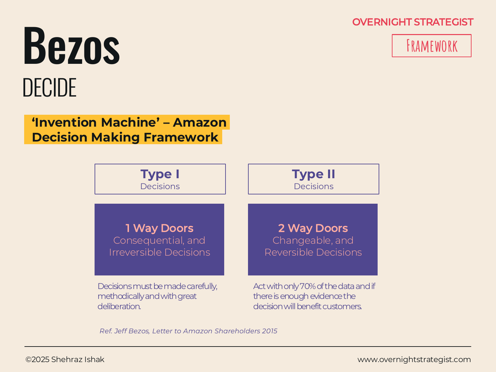

# Bezos

> A two-category split — irreversible Type I decisions versus reversible Type II decisions — that tells you how much process and deliberation any given decision actually deserves.

## What It Is

The Bezos framework sorts every decision into one of two types based on its reversibility:

- **Type I — One-Way Doors:** Consequential and irreversible (or very hard to reverse). Once you walk through, the door closes behind you. These decisions require careful, methodical deliberation — more data, more stakeholders, more time.
- **Type II — Two-Way Doors:** Reversible and changeable. You can walk through, look around, and walk back if you don't like what you see. These decisions can be made quickly, by a small team or a single empowered leader, with roughly 70% of the information you'd ideally want.

The framework's core claim is that the cost of applying Type I process to Type II decisions is very high — it slows organisations down, frustrates capable people, and produces bureaucratic overhead that compounds over time. Speed on Type II decisions is not recklessness; it's correct resource allocation.

## Why It Works

The default failure mode of growing organisations is process expansion: as companies get bigger, they apply the same approval layers and committee structures to everything, because that's what the organisation's immune system knows how to do. The result is that small, reversible decisions — what to test, how to word a feature, which layout to try — get routed through the same machinery as once-in-a-decade strategic choices. Speed collapses, talent gets frustrated, and the organisation's ability to iterate withers.

Bezos made this observation explicit in Amazon's 2015 shareholder letter, identifying it as the primary pathology of large-company decision-making. The framework works because it names the error precisely: the problem is not that companies are making Type I decisions too slowly (careful deliberation on irreversible, consequential choices is correct) but that they are making Type II decisions too slowly. By giving each category a name, the framework creates permission — and language — to push back on over-process: "This is a two-way door; let's just try it."

The 70% information threshold for Type II decisions is the operational heart of the framework. Waiting for certainty before a reversible decision means waiting past the point where the cost of delay exceeds the cost of being wrong. On reversible choices, being fast and being wrong is almost always cheaper than being slow and right.

## How To Use It

1. **Name the decision.** State it as a specific question, not a topic.
2. **Assess reversibility.** Ask: if we make this decision and it turns out to be wrong, what does it cost to undo? Can we undo it at all? Is the cost of reversal acceptable?
3. **Assess consequence.** Ask: if this decision is wrong and we can't reverse it, what is the magnitude of the harm? Does it affect customers, revenue, people, competitive position — and at what scale?
4. **Classify.** Type I = consequential *and* hard to reverse. Type II = either reversible, or low consequence if wrong.
5. **Apply the right process:**
   - **Type I:** Slow down. Gather more data, involve senior stakeholders, use structured decision tools (SPADE, Evaluation). Don't proceed until you have genuine conviction.
   - **Type II:** Move fast. Empower the closest capable owner. Act at ~70% information confidence. Set a clear review point so you can assess and adjust.

## Worked Example

Acme Design faces two decisions in the same week:

**Decision 1: Should Acme stop offering monthly subscriptions and move to annual-only?**

Reversibility check: If Acme drops monthly plans and subscribers react badly, re-introducing them means reversing a published pricing policy, potentially re-contracting with an email platform, resetting customer expectations, and managing a PR moment about the reversal. It can be done, but the cost — customer churn, trust erosion, engineering time — is meaningful. Consequence check: This affects every future customer acquisition and the revenue model for a $2M ARR business.

Classification: **Type I.** Acme should slow down: survey existing subscribers, model the ARR impact of losing monthly-paying customers who wouldn't convert to annual, benchmark against competitors, and involve the founding team and a few key customers before deciding. Rushing this costs more to undo than getting it right costs to wait.

**Decision 2: Should Acme rename the "Library" section of its app to "Courses"?**

Reversibility check: A label change in the app takes one sprint to ship and one sprint to revert. Consequence check: A confusing label is a minor friction point; changing it doesn't affect pricing, positioning, or customer contracts.

Classification: **Type II.** Acme's product lead can decide this alone, ship it in the next release, watch whether support tickets mentioning navigation confusion go up or down, and revert if needed. Running this through a leadership review would be wasteful.

The same week: one decision gets a leadership working group; the other gets an individual decision owner and a two-week feedback loop.

## When To Use It

Use Bezos as the *first* filter before deciding how to decide — it determines the process, not the answer. It's particularly useful in fast-moving product and operations contexts, and for managers trying to push decisions to the right level within an organisation.

It maps to **ABCD** at a higher resolution: ABCD's A and B categories roughly correspond to Type I; C and D roughly correspond to Type II. Use Bezos as the quick two-way split; use ABCD when you need finer-grained categorisation that also accounts for familiarity. For Type I decisions that clear the bar, reach for **SPADE** to structure the deliberation itself.

## Things To Watch Out For

- **Motivated classification.** When people want to move fast, there's a temptation to classify consequential decisions as Type II to avoid scrutiny. The check is the reversal cost, not the emotional desire to move quickly. If the cost of undoing the decision is high, it's Type I regardless of how confident the team feels.
- **Reversibility is a spectrum, not a binary.** Some decisions sit in the middle — they can technically be reversed, but only at a significant cost in time, money, or reputation. "Reversible in theory" is not the same as "two-way door in practice."
- **The 70% rule needs calibration.** On Type II decisions, acting at 70% information is a guideline, not a magic number. The threshold should scale with the actual cost of being wrong: a decision that's truly free to reverse can act at 50%; one where reversal is possible but painful warrants waiting for more signal.
- **Type II decisions still need owners.** Decentralising Type II decisions doesn't mean making them ownerless. Unclear ownership on reversible decisions produces "nobody decided" as a default, which is its own form of slow.

## Related Frameworks

- [ABCD](./abcd.md) — a four-category version of the same sorting logic, adding the dimension of familiarity (known vs. novel) alongside scope and impact.
- [SPADE](./spade.md) — the structured process to apply to Type I decisions once they're identified as such: high-stakes, requiring deliberation and stakeholder alignment.
- [Eisenhower](./eisenhower.md) — sorts tasks by urgency and importance; Bezos sorts decisions by reversibility and consequence. Use Eisenhower to triage workload; use Bezos to triage decision process.
