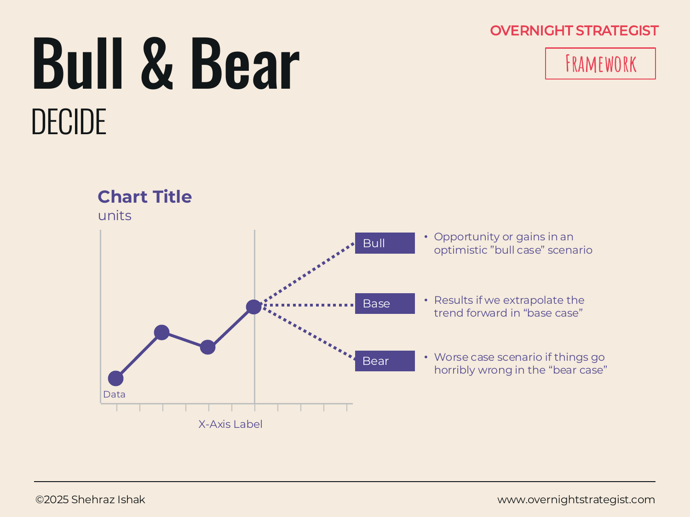

# Bull & Bear

> A three-scenario chart — optimistic Bull, neutral Base, and pessimistic Bear — that makes the upside and downside of a decision visible so decision-makers know exactly what they're betting on.

## What It Is

Bull & Bear is a scenario planning chart. It takes a key metric (revenue, subscriber count, margin — whatever the decision ultimately moves) and projects it forward under three named scenarios, plotted as three distinct lines on the same chart:

- **Bull case:** The optimistic scenario — things go better than expected. Growth accelerates, the product resonates, market tailwinds materialise.
- **Base case:** The neutral scenario — trend extrapolated forward. The future looks roughly like the recent past, with no material upside or downside surprises.
- **Bear case:** The pessimistic scenario — things go worse than expected. Execution stumbles, market conditions worsen, a competitor moves aggressively.

Each line demarcates actual performance (solid line, up to the present) and projected performance (dotted line, forward in time). To the right of the chart, each scenario is described in plain language, with optional probability estimates attached.

## Why It Works

Decisions made on a single-point forecast are fragile — not because the forecast is wrong (it usually is, in one direction or another) but because a single number implies a certainty that doesn't exist and gives decision-makers no way to think about what they'll do when reality departs from plan. Single-point forecasts also tend to migrate toward optimism: the plan that gets approved is usually the one that makes the investment look attractive.

Bull & Bear works because it forces explicit acknowledgment that the future has a distribution, not a single value. By naming both the upside and downside and projecting them visually on the same chart, it does three things. First, it makes the decision's risk profile visible: the gap between Bull and Bear is a direct read of how much uncertainty surrounds the choice. Second, it builds shared understanding among decision-makers — everyone is now deciding against the same range of futures, not their individually-imagined best case. Third, adding scenario probabilities turns a visual comparison into a lightweight expected-value check without requiring the full machinery of a Decision Tree.

The framework is borrowed from financial markets — "bull" for rising/optimistic, "bear" for falling/pessimistic — but works equally well for any forward-looking operational decision.

## How To Use It

1. **Choose the key metric.** Pick the one number that the decision most directly affects. Revenue, MRR, unit volume, market share — whichever is most load-bearing for the decision.
2. **Plot the actuals.** Draw the solid line from the historical start point to the present. This anchors the projection in real data.
3. **Project the Base case.** Extrapolate the current trend forward — no heroics, no disasters. This is the "if nothing changes" line.
4. **Project the Bull case.** Define the conditions for optimism and project the metric under those conditions. Be specific: "Bull case assumes 15% month-on-month subscriber growth following the mobile launch."
5. **Project the Bear case.** Define the conditions for pessimism. "Bear case assumes churn increases from 4% to 8% as a result of the pricing change, with no new acquisition growth."
6. **Add the key callout.** Annotate the chart with the single most important insight — typically the spread between Bull and Bear at the decision horizon, or the point at which the Bear case becomes unacceptable.
7. **Describe each scenario in text.** To the right of the chart, write a plain-language description of what each scenario means and what would have to be true for it to materialise. Optionally, add probability estimates (e.g. Bull 25%, Base 55%, Bear 20%).

## Worked Example

Acme Design is considering raising its monthly subscription price from $29 to $39, a 34% increase. Before deciding, the team builds a Bull & Bear on monthly subscriber count over the next 12 months.

**Actuals:** Acme has grown from 2,000 to 3,200 subscribers over the past 18 months, a roughly 3% monthly growth rate. This is the solid line.

**Base case (projected dotted line):** The price increase causes short-term churn of approximately 8% of existing subscribers (≈256 accounts), and the higher price point reduces new acquisition by 20% for 3 months before normalising. Subscriber count dips to ≈2,900 in month 2, then resumes growth at 2.5% monthly. Month 12: **3,500 subscribers, $136k MRR** (vs. $93k MRR today).

**Bull case:** The price increase signals premium quality. Churn is lower than expected (4%), and the higher perceived value actually *increases* conversion from trial. Month 12: **4,100 subscribers, $160k MRR.** Probability estimate: 30%.

**Bear case:** A significant competitor offers a price-matched alternative and actively targets Acme's subscriber base. Churn spikes to 18%, new acquisition drops 40% for 6 months. Month 12: **2,400 subscribers, $94k MRR** — roughly flat to today in revenue terms despite the price increase, with a meaningfully smaller base. Probability estimate: 20%.

**Key callout:** The Bear case results in a smaller subscriber base than today, meaning Acme would have raised prices and *lost* customers without a revenue gain. The decision hinges on whether the team believes the Bear scenario probability is below the point where expected value tips negative. At 20% Bear probability: EV ≈ (0.30 × $160k) + (0.50 × $136k) + (0.20 × $94k) = $48k + $68k + $18.8k = **$134.8k expected MRR** — still ahead of today's $93k. The price increase passes the expected-value test even at 20% Bear.

## When To Use It

Use Bull & Bear when communicating a forward-looking decision to stakeholders who need to understand the range of possible outcomes, not just the central estimate. It's particularly useful before a significant investment, a pricing change, or a strategic pivot — any decision where the question is not just "is the expected value positive" but "are we comfortable with the downside."

It pairs naturally with **Decision Tree** (which performs the same expected-value calculation more formally, with explicit probability branches) and with **Pros & Cons** (which captures qualitative trade-offs rather than quantitative scenarios). Where Decision Tree computes the math, Bull & Bear communicates the range — the two serve different audiences at different stages of the decision.

## Things To Watch Out For

- **The Bear case is too mild.** The most common failure is a Bear scenario that is merely "slightly worse than Base." A genuine Bear case asks: what happens if things go seriously wrong? If the pessimistic line looks almost the same as the base line, it's not a Bear case — it's a range sensitivity check on the same scenario.
- **Scenario descriptions are too vague.** "Things go worse than expected" is not a Bear case. Name the mechanism: which competitor, which customer behaviour change, which execution failure produces the Bear outcome. If you can't name it, you haven't modelled it.
- **The three scenarios anchor the decision artificially.** A Bull/Base/Bear structure can create a false sense that the future must fall into one of three tidy buckets. In reality, futures are messier. Treat the three lines as illustrative anchors for the distribution, not as the only paths available.
- **Probabilities are afterthoughts.** Adding probability estimates to each scenario *after* the projections are drawn invites motivated reasoning — the team adjusts probabilities to make the expected value work out. Set probability estimates before projecting the lines, or use them only as a rough sanity check rather than a formal calculation.

## Related Frameworks

- [Decision Tree](./decision-tree.md) — the formal probabilistic alternative: explicit probability branches, computed expected value. Use Decision Tree when precision is needed; Bull & Bear when communication is the primary goal.
- [Pros & Cons](./pros-and-cons.md) — the qualitative complement: names what's good and bad about each option rather than projecting metrics across scenarios.
- [Evaluation](./evaluation.md) — scores options against criteria when the comparison is about fit and attributes, not about projecting a single metric across scenarios.
