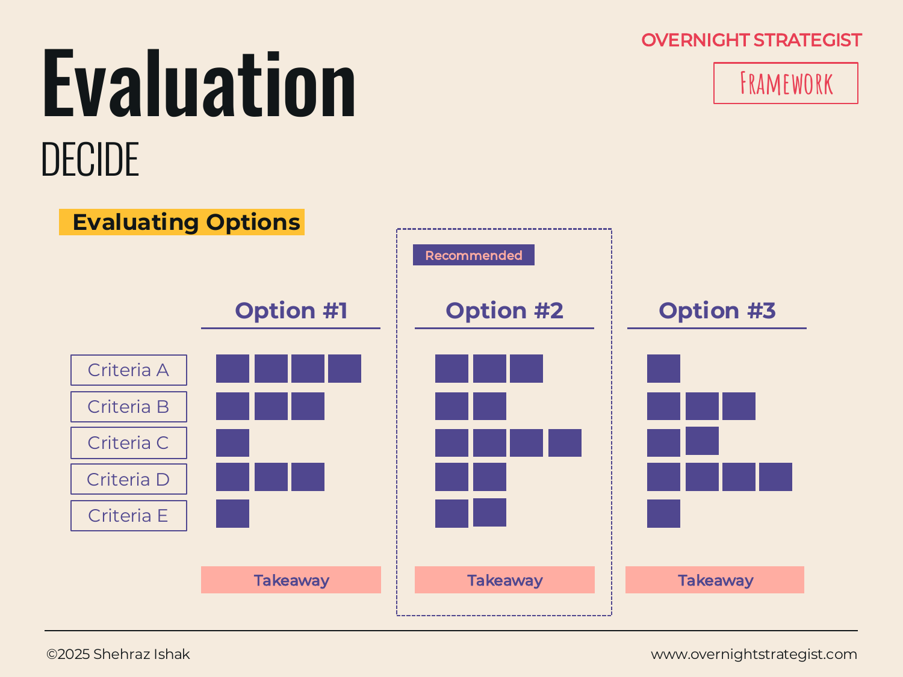

# Evaluation

> A scoring matrix that applies the same criteria to every option and produces a weighted total — turning a qualitative comparison into a number you can defend, and a recommendation you can explain.

## What It Is

The Evaluation framework is the weighted option evaluation model. You define a set of **Options** (the candidates), a set of **Criteria** (the dimensions that matter), and then rate each option against each criterion on a consistent scale. Optionally, you weight each criterion to reflect how much it matters relative to the others, then multiply each score by its weight and sum across criteria to produce a weighted total per option.

Each option also gets a **Takeaway** — a plain-language summary of where it excels and where it falls short. The option with the highest weighted score, combined with the takeaways, informs the **Recommended** choice. The recommendation is not automatic: the weighted score is a structured input to the decision, not the decision itself.

## Why It Works

When a group debates options without a shared scoring structure, two problems emerge. First, each person implicitly weights criteria differently — one stakeholder cares most about cost, another about scalability, another about implementation speed — and because those weights are never stated, the debate circles without converging. Second, people tend to argue for options holistically ("Option 2 just feels right") rather than separating the dimensions, which makes it impossible to identify *where* they actually disagree.

The Evaluation matrix fixes both problems. By making criteria and weights explicit before scoring begins, it forces alignment on what matters before the conversation about what's best. The scoring then surfaces real disagreements rather than holistic intuitions: if two people give Option 1 very different scores on "implementation risk," the matrix identifies exactly where the disagreement lives and what information would resolve it.

The framework is also useful precisely because it can be wrong. When the highest-scoring option isn't the one the decision-maker chooses, that gap is information — it means either the weights are wrong, an important criterion is missing, or there's a factor that can't be captured in a score. Making that tension explicit is often more valuable than the number itself.

## How To Use It

1. **Define the options.** Name the distinct alternatives — three is the typical minimum for the comparison to be meaningful. Options should be genuinely different, not minor variations of the same approach.
2. **Define the criteria.** Choose five to seven dimensions that actually differentiate the options in ways that matter to this decision. Criteria should be assessable: you should be able to say why one option scores higher than another on each one.
3. **Assign weights (optional but recommended).** Give each criterion a weight that reflects its relative importance. Weights should sum to 100%. Agree on weights before scoring to prevent post-hoc rationalisation.
4. **Score each option on each criterion.** Use a consistent scale (e.g., 1–5 or 1–10). Score independently if multiple people are involved, then compare and discuss gaps.
5. **Calculate weighted totals.** Multiply each score by its criterion weight and sum across criteria per option. The result is a comparable weighted score for each option.
6. **Write the Takeaways.** For each option, summarise where it performs strongly and where it falls short. This is the qualitative layer that interprets the numbers.
7. **Make the Recommendation.** Name the preferred option, state the rationale, and acknowledge the key trade-off being accepted.

## Worked Example

Acme Design is evaluating three vendors for a new LMS (learning management system) to replace its current platform. The decision will affect every subscriber, so it warrants a structured evaluation.

**Options:** (A) Teachable Pro, (B) Thinkific Plus, (C) Custom-built in-house

**Criteria and weights:**
| Criterion | Weight |
|---|---|
| Cost (total 3-year) | 25% |
| Time to launch | 20% |
| Customisation flexibility | 20% |
| Integration with existing tools | 15% |
| Learner experience quality | 20% |

**Scores (1–5):**
| Criterion | Teachable Pro | Thinkific Plus | Custom-built |
|---|---|---|---|
| Cost | 4 | 3 | 2 |
| Time to launch | 5 | 4 | 1 |
| Customisation | 2 | 3 | 5 |
| Integrations | 3 | 4 | 3 |
| Learner experience | 3 | 4 | 4 |

**Weighted totals:**
- Teachable Pro: (4×0.25) + (5×0.20) + (2×0.20) + (3×0.15) + (3×0.20) = 1.0 + 1.0 + 0.4 + 0.45 + 0.6 = **3.45**
- Thinkific Plus: (3×0.25) + (4×0.20) + (3×0.20) + (4×0.15) + (4×0.20) = 0.75 + 0.8 + 0.6 + 0.6 + 0.8 = **3.55**
- Custom-built: (2×0.25) + (1×0.20) + (5×0.20) + (3×0.15) + (4×0.20) = 0.5 + 0.2 + 1.0 + 0.45 + 0.8 = **2.95**

**Takeaways:**
- *Teachable Pro:* Strong on cost and speed; weak on customisation. Best if launch timeline is the primary constraint.
- *Thinkific Plus:* Balanced performer; best on integrations and learner experience. Slight cost premium over Teachable.
- *Custom-built:* Excellent customisation ceiling, but lowest score on cost and launch time — a two-year project that distracts the engineering team.

**Recommended:** Thinkific Plus (score: 3.55). Its balanced performance across criteria, and particularly its integration capability with Acme's existing CRM and email stack, makes it the best fit given the current operating constraints. The higher cost relative to Teachable is acceptable given the lower risk profile.

## When To Use It

Use Evaluation when options are close enough that a qualitative **Pros & Cons** comparison can't reliably discriminate, when multiple stakeholders need a shared structure for discussion, or when you need a defensible audit trail for the recommendation. It's also the right tool when you suspect different stakeholders are weighting criteria differently — the weight-alignment step surfaces that disagreement before it derails the decision.

Don't reach for it when one option is clearly dominant on the criteria that matter most — a simple **Pros & Cons** is sufficient and faster. For decisions where the uncertainty is primarily about *what will happen*, not *which attributes to prefer*, use **Decision Tree** instead.

## Things To Watch Out For

- **Criteria chosen to justify a preferred answer.** If the criteria are selected after the options are in mind, they can be tuned — consciously or not — to produce a predetermined winner. Define criteria before looking hard at options.
- **False precision.** A weighted total of 3.55 vs. 3.45 is not meaningfully different. When two options are within a narrow margin, treat the scores as a tie and use the Takeaways to make the call, not the number.
- **Criterion overlap.** If two criteria are correlated — say, "cost" and "time to implement" both proxy for "resource intensity" — the score double-counts the same factor and artificially inflates or deflates certain options. Audit criteria for independence.
- **Ignoring knock-out factors.** A criterion that's a hard requirement — something where a score below 2 disqualifies an option regardless of total score — should be called out explicitly rather than absorbed into the weighted average. One failing score on a critical criterion can be masked by strong performance elsewhere.

## Related Frameworks

- [Pros & Cons](./pros-and-cons.md) — the lighter, qualitative predecessor: start here, graduate to Evaluation when options are close and you need weighted scoring to discriminate.
- [Decision Tree](./decision-tree.md) — the probabilistic alternative when outcomes, not attributes, are the primary variable.
- [SPADE](./spade.md) — a governance framework for high-stakes decisions that need stakeholder alignment; pairs well with Evaluation as the analytical input to the SPADE Alternatives step.
