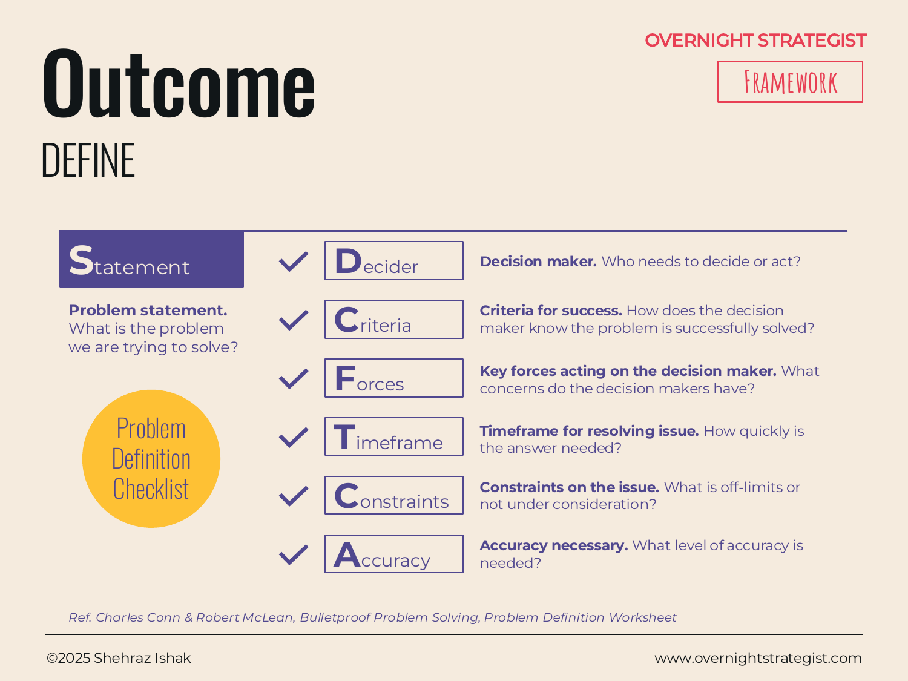

# Outcome

> A seven-field checklist that interrogates a problem from every angle — decision-maker, success criteria, forces, timeframe, constraints, accuracy, and problem statement — so nothing critical is assumed away before the work begins.

## What It Is

Outcome is the most rigorous of the three Define frameworks. Rather than asking you to frame a problem in a few sentences, it asks you to answer seven distinct questions about it:

1. **Decider** — Who needs to decide or act? Who is the decision-maker this work serves?
2. **Criteria** — How does the decision-maker know the problem is successfully solved? What does success look like?
3. **Forces** — What key concerns, pressures, or priorities weigh on the decision-maker?
4. **Timeframe** — How quickly is an answer needed?
5. **Constraints** — What is off-limits, not under consideration, or fixed?
6. **Accuracy** — What level of analytical precision is actually required?
7. **Statement** — What is the problem we are trying to solve?

The output is a complete Problem Definition Worksheet — a document that a team can align on before any analysis begins, and return to throughout the work to check scope creep.

## Why It Works

The failure mode in most strategy work is not bad analysis — it is analysis that answers the wrong question precisely. Teams get deep into data and slide-building before anyone has agreed on what a good answer would even look like, who has to act on it, or what is off the table. By the time these gaps surface, significant work has been done in the wrong direction.

Outcome works because it treats problem definition as an activity with testable components rather than a preamble to skip. Each field catches a different class of mistake:

- **Decider** catches situations where the team is solving for the wrong audience.
- **Criteria** catches vague success conditions that make it impossible to know when you're done.
- **Forces** ensures the solution will be acceptable to the people who have to live with it.
- **Timeframe** prevents gold-plating on problems that need a good-enough answer by Thursday.
- **Constraints** prevents wasted effort on options that were never on the table.
- **Accuracy** prevents analytical overkill — a rough estimate is often all a decision needs, and the field forces you to decide that explicitly.

The resulting Statement is not just a restatement of the problem; it is a claim that has survived seven filters.

## How To Use It

1. **Identify the Decider.** Name the person or role who will act on the answer. Not the person requesting the work — the person who must decide.
2. **Define the Criteria.** Write the specific, measurable outcomes that would signal success. These become the test for evaluating solutions later.
3. **Map the Forces.** List the key concerns, incentives, and pressures the decision-maker is navigating. What does she care about beyond the stated goal?
4. **Set the Timeframe.** State when an answer is needed and why that deadline is real. This calibrates the depth of analysis that is actually warranted.
5. **Declare the Constraints.** Name what is off-limits: budget ceilings, geographies, existing commitments, sacred cows. Better to name them now than to discover them when a recommendation is already written.
6. **Agree on Accuracy.** Decide how precise the analysis needs to be. Does the decision require $5k accuracy or $500k accuracy? A directional answer or a model?
7. **Write the Problem Statement.** Draft a statement that is outcome-focused, specific and measurable, clearly time-bound, and adequately scoped — wide enough to allow creative answers, narrow enough to guide them. Revise until it passes the Criteria, Constraints, and Timeframe tests you've already set.

A well-formed problem statement is outcomes-focused, specific and measurable, clearly time-bound, addresses the decision-maker's actual constraints and concerns, is scoped to allow creative answers rather than pre-selecting one, and is solved at the highest possible order — not a partial solve that defers the harder question.

## Worked Example

Acme Design's subscriber growth has stalled. Before diving into analysis, the team completes the Outcome worksheet:

- **Decider:** The CEO of Acme Design, who owns the product and growth strategy and must allocate Q3 budget.
- **Criteria:** Subscriber count returns to month-over-month growth of at least 5% by the end of Q3. Total subscriber base reaches 12,000 by year-end.
- **Forces:** The CEO is concerned about burn rate — any solution must be achievable within the existing marketing budget of $80k. She is also skeptical of channel experiments that won't show results within 90 days.
- **Timeframe:** A decision on the growth strategy is needed within three weeks so budget can be allocated before Q3 planning closes.
- **Constraints:** Building a new course catalogue or rebranding the platform are off the table — scope is limited to subscriber acquisition and early retention within the existing product and brand.
- **Accuracy:** The team needs directional confidence, not a precise model. An approach that's clearly better than the alternatives is sufficient; a $1k-vs-$3k cost-per-subscriber precision is not required.
- **Problem Statement:** How can Acme Design return to 5%+ monthly subscriber growth within the existing $80k marketing budget by the end of Q3, without changes to the course catalogue or brand?

Notice how the Constraints field eliminates course development from consideration before the analysis starts, and the Accuracy field tells the team they don't need to build a full attribution model. Both save significant work.

## When To Use It

Outcome is the right Define framework when the problem is high-stakes, contested, or genuinely ambiguous — when the decision-maker's constraints aren't obvious, when the scope could legitimately go in several directions, or when a team risks spending weeks analysing the wrong thing.

Use **SCQ** when the problem is well enough understood that the job is simply to state it clearly. Use **HTDQ** when the primary job is communicating the problem to stakeholders who need to feel its urgency. Reach for Outcome when the priority is rigour over speed — when the cost of working on the wrong problem is higher than the cost of spending an extra day on the definition.

## Things To Watch Out For

- The Criteria field is where most teams go vague. "Improve subscriber growth" is not a criterion; "5% month-over-month growth by Q3" is. Push for specificity — if you can't measure it, you can't know when you've solved the problem.
- Constraints are often underdeclared. People avoid naming constraints because doing so feels limiting. Name them anyway — discovering a constraint after a recommendation is written is far more limiting.
- The Decider is often not the person who commissioned the work. A project manager who requested the analysis is not the same as the VP who must decide. Knowing who actually decides changes which concerns belong in the Forces field.
- Filling out the checklist is not the same as defining the problem well. Each field needs honest answers, not placeholders that let the team proceed without real alignment. Test the Statement against each field before moving on.
- The worksheet can be a false sense of completeness. Seven filled boxes look like a finished definition even when the Statement is still vague. Read the Statement aloud — if you couldn't hand it to a smart analyst and have her start the right work, it isn't done.

## Related Frameworks

- [SCQ](./scq.md) — the lightweight Define frame: Situation, Complication, Question.
- [HTDQ](./htdq.md) — the narrative Define frame: Hero, Treasure, Dragon, Quest.
