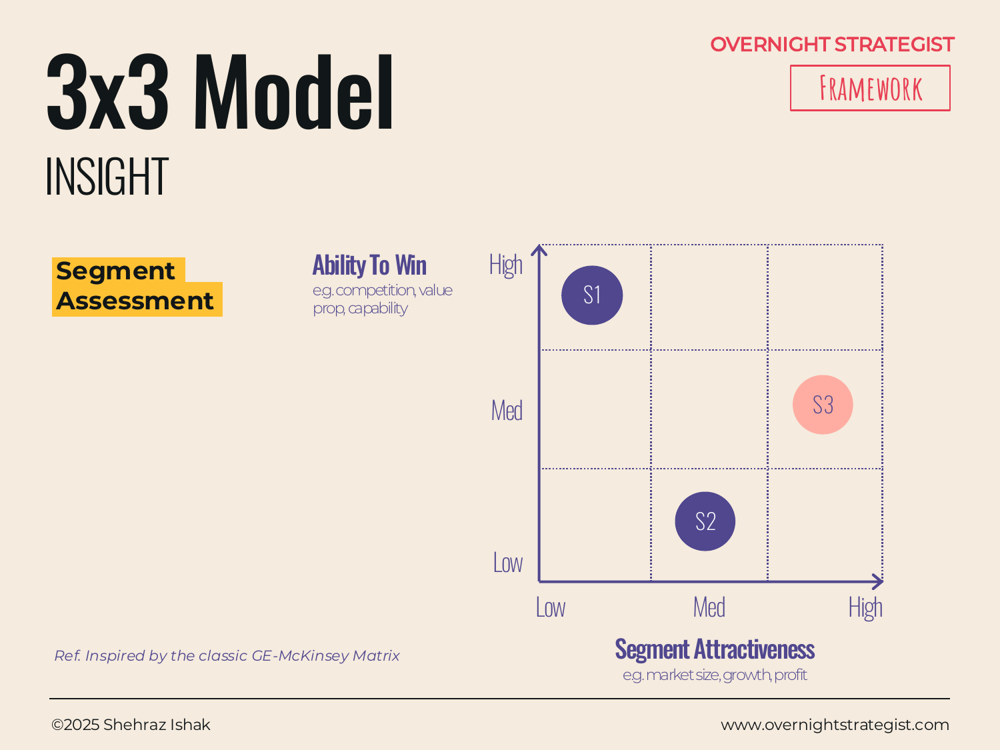

# 3x3 Model

> A nine-box grid that evaluates segments — or any set of strategic options — on two dimensions simultaneously, producing a visual ranking that makes prioritisation decisions tractable.

## What It Is

A 3×3 Model is a grid with three rows and three columns, creating nine cells. The horizontal axis represents one evaluative dimension (typically the attractiveness of a segment or opportunity — how large, how fast-growing, how profitable); the vertical axis represents a second, independent dimension (typically the organisation's ability to win in that segment — its competitive strength, capability readiness, or differentiation). Each axis is divided into three bands: Low, Medium, and High.

Each item being evaluated — a market segment, a product line, a strategic initiative — is plotted in one of the nine cells based on where it sits on both dimensions. The resulting positions suggest a prioritisation: items in the top-right cell (High attractiveness, High ability to win) are natural strategic priorities; items in the bottom-left cell (Low attractiveness, Low ability to win) are natural candidates for exit or deprioritisation.

## Why It Works

A simple 2×2 matrix — the standard tool for this kind of evaluation — forces a binary High/Low split on each axis. That binary is often too coarse: an opportunity can be moderate on both dimensions (neither clearly strong nor clearly weak) and the 2×2 has no cell for it. The 3×3 introduces a Medium band on each axis, which creates nine cells instead of four. That additional resolution makes the tool significantly more useful in practice, because many real strategic decisions live in the grey zone between "obvious yes" and "obvious no."

The two-axis structure also does something important: it prevents the common failure of evaluating options on one dimension only. A large segment with Low ability to win is not the same strategic priority as a smaller segment with High ability to win. The 3×3 makes that trade-off visible by forcing both dimensions to be assessed independently and then combined.

## How To Use It

1. **Define your two axes.** For segment prioritisation, the defaults are Segment Attractiveness (horizontal) and Ability To Win (vertical). Define what goes into each: Segment Attractiveness might be a composite of market size, growth rate, and margin potential; Ability To Win might be a composite of current market share, product-market fit, and competitive differentiation. Write these definitions down before plotting — they will be challenged.
2. **Define the three bands for each axis.** Decide what Low, Medium, and High mean specifically — don't leave them implicit. For Segment Attractiveness: Low = <$10M TAM, declining; Medium = $10–50M TAM, growing <10%; High = >$50M TAM, growing >10%. For Ability To Win: High = existing strong position and differentiated product; Medium = capable but not differentiated; Low = no current position, weak capability.
3. **Score each item on both axes.** For each segment (or option), score it Low/Medium/High on Attractiveness and Low/Medium/High on Ability To Win. Document the evidence or logic behind each score — the scoring conversation is often where the most valuable strategic disagreements surface.
4. **Plot each item in the grid.** Place each item in the cell that corresponds to its two scores.
5. **Read the grid for strategy.** The top-right cell (High/High) = invest and grow. The bottom-left (Low/Low) = exit or harvest. The diagonal from bottom-right to top-left requires judgment: high attractiveness but low ability to win means a significant investment or a partnership may be needed to compete; high ability to win but low attractiveness means you're strong in a shrinking market.
6. **Make the prioritisation explicit.** Use the grid to assign each segment a label (Invest, Selectively invest, Harvest, or Exit) and bring that categorisation forward into the Decide stage.

## Worked Example

Acme Design evaluates five potential growth segments as it plans its 2023 strategy:

**Segments under evaluation:** Individual Creators, Career Changers, Freelancers, In-House Design Teams (SMB), and Enterprise Design Teams.

**Axis definitions:**
- *Segment Attractiveness:* High = >$30M addressable revenue potential, >15% category growth; Medium = $10–30M, 5–15% growth; Low = <$10M or declining.
- *Ability To Win:* High = strong current product-market fit, differentiated content, existing reviews and word-of-mouth; Medium = partial fit, some capability gap; Low = significant product rebuild required, no current position.

**Scores:**

| Segment | Attractiveness | Ability To Win | Cell |
|---|---|---|---|
| Individual Creators | Medium | High | Top-centre |
| Career Changers | High | High | Top-right |
| Freelancers | High | Medium | Centre-right |
| In-House SMB Teams | Medium | Low | Bottom-centre |
| Enterprise Design Teams | High | Low | Bottom-right |

**Grid reading:**
- **Career Changers** (High/High) → Clear priority: invest in curriculum, certificate programme, and conversion. This is the core market.
- **Individual Creators** (Medium/High) → Selectively invest: this segment is well-served by the current product; maintain, but don't over-invest relative to Career Changers.
- **Freelancers** (High/Medium) → Invest conditionally: the segment is attractive, and Acme has some fit, but the product needs a module on client management and pricing to close the gap. Prioritise in H2.
- **In-House SMB Teams** (Medium/Low) → Low priority: moderate attractiveness and significant product gaps (admin dashboard, SSO). Hold.
- **Enterprise Design Teams** (High/Low) → Investigate before committing: the attractiveness is high but ability to win is Low — would require a 12-month product build. Revisit in 2024 planning.

The 3×3 converts five plausible strategic directions into a defensible prioritisation in a single view.

## When To Use It

Use a 3×3 Model when you have three or more options to evaluate — segments, product lines, geographies, or initiatives — and you need to prioritise them on two independent dimensions. It is most useful when a simple 2×2 is too coarse (too many options land in the same quadrant) and when a Heat Map across many attributes would be too complex to support clear prioritisation.

Use a **Matrix** (2×2) when you have four discrete options and a binary choice on each axis is actually sufficient — the 2×2 is simpler and faster to read. Use a **Segmentation** map when the communication goal is showing segment sizes and insights rather than evaluating which segments to target. Use a **Heat Map** when the evaluation requires more than two dimensions and you can tolerate a more complex, multi-attribute view.

## Things To Watch Out For

- Axis definitions must be decided before scoring, not after. Defining the axes post-hoc to make a preferred option land in the top-right is a common and corrupting practice. Write the definitions down and commit to them before any item is placed.
- The Medium band is both the power and the danger of a 3×3. Power: it captures the grey zone. Danger: when everything gets scored Medium on both axes because no one wants to make a definitive call, the grid provides no differentiation and therefore no strategic guidance. Force a distribution: if all five segments are Medium/Medium, the model is not doing its job.
- The grid shows relative position, not absolute potential. A High/High segment may still be a bad investment if the overall market is tiny. A Low/High segment (high ability to win, low attractiveness) may be worth maintaining even if it's not a growth priority. Use the grid to structure the conversation, not to replace it.
- The two axes must be genuinely independent. If Segment Attractiveness and Ability To Win are highly correlated in your market (the most attractive segments are always the ones you're best at), the 3×3 will not help you differentiate — and you should investigate why the correlation exists before using the model to make a prioritisation decision.

## Related Frameworks

- [Matrix](./matrix.md) — the 2×2 version; simpler, faster, and sufficient when binary splits are adequate.
- [Segmentation](./segmentation.md) — shows market or customer segment sizes and insights; build before the 3×3 to establish the segments you'll evaluate.
- [Positioning](./positioning.md) — maps where your product sits relative to competitors on two continuous axes; use to understand the competitive context within a segment you've prioritised.
- [Heat Map](./heat-map.md) — rates options across multiple attributes; use when more than two evaluative dimensions are needed and you can tolerate a more complex view.
- [Eisenhower](../decide/eisenhower.md) — a 2×2 prioritisation grid for tasks and decisions; the same structural logic applied to urgency vs. importance.
