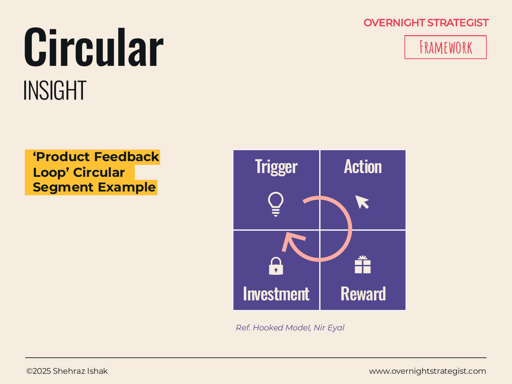

# Circular

> A loop diagram that shows a repeating cycle — where each step is triggered by the one before it, and the last step feeds back into the first.

## What It Is

A Circular diagram arranges steps around a ring or circle, connected by arrows that point in one direction around the loop. Each step represents an action, event, or state. The arrows communicate that the steps happen in sequence and that the final step loops back to the first, completing the cycle. The diagram has no natural start or end point visually — you can enter the loop anywhere — but typically one step is highlighted or labelled as the entry point.

The worked example in the framework uses the four-step "Hooked" product loop: Trigger → Action → Reward → Investment → (back to Trigger). This is a well-known model for habit-forming product design, but the Circular diagram is a general-purpose format for any self-reinforcing or repeating process.

## Why It Works

A linear diagram (like a Chevron or Timeline) implies that a process has a beginning and an end. A Circular diagram makes a different claim: this process has no end — it repeats, and each repetition builds on the last. That distinction matters enormously in strategy. A flywheel, a growth loop, a customer retention cycle, a product feedback loop — these are all processes whose value comes precisely from the fact that they don't stop. Showing them as a circle, rather than a line, communicates that ongoing quality immediately and without explanation.

The circular structure also communicates self-reinforcement. When the final step points back to the first, the reader understands that the more times the loop runs, the stronger it gets. That's the logic of a flywheel: each cycle builds momentum. A chevron can't show that; only a loop can.

## How To Use It

1. **Identify the steps in the cycle.** The cycle should be genuinely repeating — each step must lead to the next, and the last step must credibly lead back to the first. If the sequence doesn't loop, use a Chevron or Timeline instead.
2. **Limit the steps.** Three to six steps is the effective range. Fewer than three and it's not a cycle; more than six and the diagram becomes crowded and the logic hard to follow.
3. **Choose your entry point.** Label the step that serves as the conceptual starting point, or highlight the step where external action can intervene to accelerate the cycle.
4. **Name each step concisely.** One to three words per step. The diagram is visual — the prose around it carries the explanation.
5. **Add directional arrows.** Make the direction of travel around the loop unambiguous.
6. **Annotate the centre (optional).** Place the name of the cycle or the outcome it produces at the centre of the ring.

## Worked Example

Acme Design's retention team maps the learning habit loop it wants to build in students:

- **Trigger:** A student receives a push notification — "New brief posted: redesign an e-commerce checkout flow."
- **Action:** The student opens the app and starts the brief, watching the relevant lesson and downloading the project file.
- **Reward:** The student submits work and receives instructor feedback within 48 hours, plus peer reactions in the community forum. Completing the brief unlocks a badge toward their portfolio certificate.
- **Investment:** The student posts their project to the community, comments on two peers' work, and sets a reminder to pick up the next brief.
- **Back to Trigger:** Community activity and the reminder surface a new brief, pulling the student back in.

The loop shows Acme's retention team exactly where they can intervene: if students are dropping out, which step is breaking? Weak triggers (notification opt-out rate is high), low-action completion (the brief is too long), poor rewards (feedback takes a week), or low investment (no community participation) — each failure mode maps to a specific step in the cycle, which means the fix is also specific.

## When To Use It

Use a Circular diagram when the mechanism you are explaining is a self-reinforcing loop — when the value comes from the cycle running repeatedly, not just once. Growth loops, product habit loops, customer feedback cycles, and operational flywheels are the natural home for this format.

Use a **Chevron** when the process has a defined start and end and does not repeat. Use a **Timeline** when the focus is on when things happen rather than how they feed each other. Use a **Driver Tree** when the structure is about what inputs combine to produce an output, not about a repeating sequence.

## Things To Watch Out For

- Not every process is a genuine loop. If the last step doesn't actually lead back to the first without forcing it, the diagram misrepresents the mechanics. A circular diagram that is really a linear process deceives the audience.
- The diagram implies that all steps are roughly equal in size and importance. If one step is massively more complex or consequential than the others, the circle hides that — add an annotation or a separate breakdown of that step.
- Cycles suggest self-reinforcement, but not all cycles accelerate. Some are stable (same output every time), some are degenerating (each cycle produces less than the last). If your loop is a degenerating one, the diagram can imply an optimism that isn't warranted.
- More than six steps around a ring makes the diagram illegible at presentation scale. If you have more steps, look for which can be merged into a single phase.

## Related Frameworks

- [Journey](./journey.md) — the customer journey map; use when the focus is on the customer experience across phases, not on a repeating product loop.
- [Chevron](./chevron.md) — a linear phase diagram; use when the process has a defined beginning and end.
- [Driver Tree](./driver-tree.md) — shows what inputs combine to produce an outcome; use when the logic is additive rather than cyclical.
- [Hub n' Spoke](./hub-n-spoke.md) — radial structure for a central idea with multiple components; use when the components are parallel rather than sequential.
