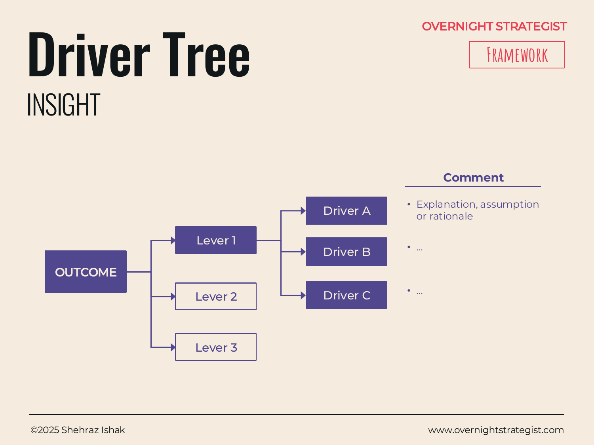

# Driver Tree

> A branching tree diagram that decomposes a headline outcome into its levers and sub-drivers — and then labels each branch with the rationale or action that will move it — making the causal logic of a strategy visible in one view.

## What It Is

The Insight-stage Driver Tree uses the same branching decomposition structure as the Split-stage Driver Tree, but its job is different: where the Split version is used analytically to explore and quantify what drives a metric, the Insight version is used to communicate the strategy — to show an audience which levers the organisation is pulling, why they were chosen, and how they add up to deliver the headline outcome.

The tree starts with an **Outcome** box on the left (the strategic goal). It branches right into **Levers** (the three to five major areas of change). Each lever branches further into **Drivers** (the specific actions within each lever). Beside each branch, a comment note explains the rationale, assumption, or expected impact of that branch.

## Why It Works

A strategic plan presented as a slide of bullet points leaves the audience to infer the logic themselves: "how do these things connect? which is most important? what is the theory of change?" A Driver Tree answers all three questions simultaneously by making the causal structure explicit and visual.

The branching format also reveals two things that are easy to hide in prose. First, it shows whether the levers are MECE — mutually exclusive and collectively exhaustive — or whether they overlap and leave gaps. Second, it makes the size of each contribution visible: if one lever has one driver and another has six, that asymmetry raises a legitimate question about whether the effort allocation matches the opportunity. Those are hard things to see in a bullet list and obvious things to see in a tree.

The comment layer beside each branch is what converts a decomposition into a strategy: it turns "Lever 1" into "Lever 1, and here is why we believe pulling this lever will move the outcome."

## How To Use It

1. **State the outcome.** Place the headline metric or strategic goal in a box on the far left. This is the thing the tree must deliver. Be specific (e.g. "50,000 active subscribers by December 2025," not "grow subscribers").
2. **Identify the levers.** Decompose the outcome into its three to five major causal areas. These should be MECE — no overlap, no gaps. Each becomes a second-level box connected to the outcome.
3. **Identify the drivers.** Under each lever, list two to three specific actions or metrics that constitute the lever in practice. These are the things that can be owned and moved.
4. **Write comment annotations.** Beside each lever and each driver, add a short note explaining the rationale, the assumption, or the expected contribution. This is the reasoning layer — why you believe this branch matters.
5. **Check the logic upward.** Every driver should add up to its lever; every lever should add up to the outcome. If a branch doesn't contribute visibly to the level above it, consider whether it belongs in the tree at all.

## Worked Example

Acme Design's strategy to reach 50,000 active subscribers:

**Outcome:** 50,000 active subscribers by December 2025 (currently 28,000)

**Lever 1 — Reduce Churn** (from 22% to 10% month-1 churn)
- Driver A: Onboarding redesign — comment: "Current exit data shows 68% of churners say they 'didn't know where to start'; a structured day-1 to day-7 flow directly addresses this."
- Driver B: Annual plan default — comment: "Annual subscribers churn at 4% vs. 22% for monthly; shifting 20% of new signups to annual reduces blended churn immediately."

**Lever 2 — Increase Acquisition** (from 1,200 to 3,000 new subs/month)
- Driver A: SEO content engine — comment: "Blog traffic is growing 40% YoY but converts only 8% of new subs; increasing article cadence to 4/week targets the highest-ROI channel."
- Driver B: Influencer partnerships — comment: "Three design influencers with 250k+ combined following will pilot a revenue-share model in Q2; target: 400 new subs/month by Q3."
- Driver C: Paid channel optimisation — comment: "Current paid CPA is $27; A/B test Facebook vs. YouTube ads in Q3 to find a sub-$20 CPA channel."

**Lever 3 — Expand Curriculum** (14 → 26 intermediate/advanced courses)
- Driver A: Commission 6 intermediate courses — comment: "31% completion rate on existing intermediate courses (vs. 74% beginner) confirms demand; supply is the constraint."
- Driver B: Three certificate tracks — comment: "Certificate subscribers spend 2.3x the hours of non-certificate subscribers; certification drives both engagement and retention."

The comment layer makes the difference: without it, the tree is a decomposition. With it, it is a strategy.

## When To Use It

Use the Insight Driver Tree when you want to show an audience not just what you are doing, but why those specific levers were chosen and how they add up to the goal. It is especially effective in board and investor presentations where the audience will probe the reasoning behind each bet.

It is related to, but distinct from, the Split-stage [Driver Tree](../split/driver-tree.md), which is used analytically during problem-structuring. The Insight Driver Tree comes after the analysis is done and communicates the strategic choices that resulted from it.

## Things To Watch Out For

- A tree with more than three levels of branching becomes unreadable on a single slide. Stop at Lever → Driver and save sub-driver detail for a follow-up page or appendix.
- Comment annotations that only restate the driver name ("Onboarding redesign will improve onboarding") add no reasoning. Comments should state the mechanism or the evidence — why this driver moves the lever.
- Levers that overlap (e.g. "Improve engagement" and "Reduce churn" when engagement is the mechanism of churn reduction) create a false sense of comprehensive coverage. Test for MECE rigorously.
- The tree implies that all levers contribute independently. If two levers actually interact (e.g. better content only reduces churn if onboarding is fixed first), note the dependency explicitly rather than letting the visual imply independence.

## Related Frameworks

- [Driver Tree](../split/driver-tree.md) — the analytical version used during the Split stage to decompose and quantify a metric; this Insight version communicates the resulting strategy.
- [Tabular](./tabular.md) — use when the priority is to present rated findings across multiple groups rather than the causal chain connecting them.
- [One Pager](./one-pager.md) — the Driver Tree's Levers map directly onto the Pillars layer of a One Pager.
- [Hub n' Spoke](./hub-n-spoke.md) — use when the components radiate equally from a central idea, without a strict causal hierarchy.
