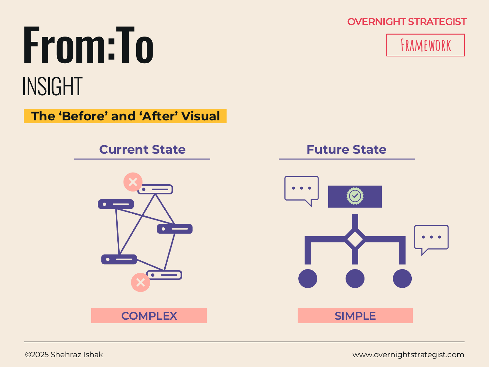

# From:To

> A side-by-side comparison of the current state and the target state — each described in specific terms — that makes the gap a strategy must close visible and gives the audience a concrete picture of what success looks like.

## What It Is

The From:To is an Insight-stage layout that presents two pictures side by side: the **Current State** on the left and the **Future State** on the right. Each side is described in concrete terms — using bullet points, diagrams, or simplified visuals — with the current state calling out the specific problems and pain points, and the future state calling out the specific benefits and improvements. A visual or textual connector between the two halves (often a label like "Strategy" or "These initiatives") makes explicit that the strategy is what bridges the gap.

The format ranges from simple (two columns of text bullets) to complex (two diagrams showing an architectural or process change before and after). The right level of complexity depends on how much structural change the strategy represents.

## Why It Works

Most stakeholder audiences have no trouble understanding a desired outcome when it is described in abstract terms ("we want a simpler, more efficient process"). The difficulty is that abstract descriptions don't create accountability — two people can agree on the abstract outcome while holding entirely different mental models of what it looks like in practice. The From:To resolves this by forcing both states to be described specifically and simultaneously.

When the current state is spelled out in concrete terms, two things happen. First, the audience that lives in the current state can confirm — or correct — the diagnosis. A poorly described current state reveals that the strategy author hasn't understood the problem. Second, naming the specific pain points of the current state creates the emotional case for change: the future state isn't just "better," it is the resolution of a described set of named frustrations.

The side-by-side layout creates a visual tension that prose does not. Seeing both states at the same time forces the question: "is the future state actually better, and by how much?" That question is productive — it encourages the audience to engage with the specifics of the strategy rather than nod at the vision.

## How To Use It

1. **Describe the current state honestly.** On the left side, list the specific characteristics of the current situation — not as abstract weaknesses but as named, observable conditions ("three separate tools with no shared data" rather than "fragmented technology"). Explicitly call out the pain points: what is slow, expensive, inconsistent, or frustrating about the current state?
2. **Describe the future state concretely.** On the right side, describe what the same dimensions look like after the strategy is executed. Match the structure of the left side so the contrast is direct. Call out the specific benefits: what becomes faster, cheaper, more consistent, or less frustrating?
3. **Keep the complexity matched.** If the current state is described in five bullet points, the future state should also be described in five bullet points addressing the same dimensions. Asymmetry suggests you understand the problem better than the solution.
4. **Bridge the gap explicitly.** Label the arrow or connector between the two sides with the key strategy or initiative name — "Onboarding redesign," "Platform consolidation," "New operating model." This prevents the audience from reading the two columns as independent and reminds them that the strategy is what transforms the left into the right.
5. **Optionally add diagrams.** For process or architecture changes, replace bullet points with simplified before-and-after diagrams. Keep them schematic — the goal is clarity, not technical completeness.

## Worked Example

Acme Design's From:To for the subscriber onboarding experience:

**Current State (problems and pain points):**
- New subscriber receives one generic welcome email on day 1 with links to all 180 courses — no guidance on where to start
- No structured learning path; subscriber must self-navigate an overwhelming library
- No engagement communication between day 1 and day 30 unless subscriber opens the app
- First prompt to engage is also the first prompt to cancel (monthly billing anniversary)
- Month-1 churn: 22%; exit survey: 68% of churners say they "didn't know where to start"

**Future State (benefits and improvements):**
- Day-1 email asks subscriber three questions (experience level, design area, weekly time available) and returns a personalised "start here" course recommendation
- Days 1–7: daily micro-prompts via email and in-app guiding first completion milestone
- Day 14: automated check-in email with progress report and next-course recommendation
- Day 28: pre-billing email with completion stats and invitation to join monthly live Q&A
- Projected month-1 churn: 10–12% (based on benchmarks from comparable redesigns)

Reading across the two columns, the strategy is precise: the current state has a known failure point (day 1 overwhelm with no follow-up), and the future state addresses it with a structured sequence of touchpoints timed to the subscriber's first 28 days. A stakeholder reviewing this can immediately test whether the future state actually resolves the problems named on the left.

## When To Use It

Use From:To when the strategy involves a meaningful structural change — to a process, an experience, a system, or an operating model — and the audience needs to see both the starting point and the destination to evaluate whether the change is worth pursuing. It is particularly powerful early in a presentation, where it gives the audience a vivid picture of the change before the strategy is detailed.

It is also the natural layout for any problem statement that has already been defined using **SCQ** or **HTDQ**: the SCQ's Complication becomes the Current State, and the resolved Question becomes the Future State.

Use **Continuum** instead when the change is better expressed as directional movement along defined dimensions rather than a structural description. Use **Chevron** or **Gantt** to show how the organisation gets from the current to the future state — the From:To tells you where you're going; those layouts tell you how.

## Things To Watch Out For

- A future state that doesn't directly address the pain points named in the current state is a strategy that doesn't solve the problem. Use the From:To as a coherence check: every pain point on the left should have a visible resolution on the right.
- Future states described in qualitative terms only ("better experience," "more agile team") cannot be held accountable. Include at least one or two specific, measurable targets on the right side.
- A current state that is described too kindly undercuts the case for change. If the current state doesn't feel like a problem, the audience will reasonably ask why the strategy is necessary.
- The From:To implies the transformation is achievable and straightforward. If the transition is complex or risky, the layout can create false optimism. Pair it with a **Chevron** or **Gantt** that shows the effort required to bridge the gap honestly.

## Related Frameworks

- [Continuum](./continuum.md) — shows the same current-to-future shift as directional movement along defined dimensions; use when positioning is the primary message rather than structural description.
- [Canvas](./canvas.md) — a Before Canvas and After Canvas pair can show a business model transformation; use From:To when the change is thematic rather than full business-model-level.
- [Chevron](./chevron.md) — shows the phases required to move from current to future state; the natural companion to From:To.
- [Horizon](./horizon.md) — shows the future state as an H3 destination reached through a sequence of horizon-level investments.
