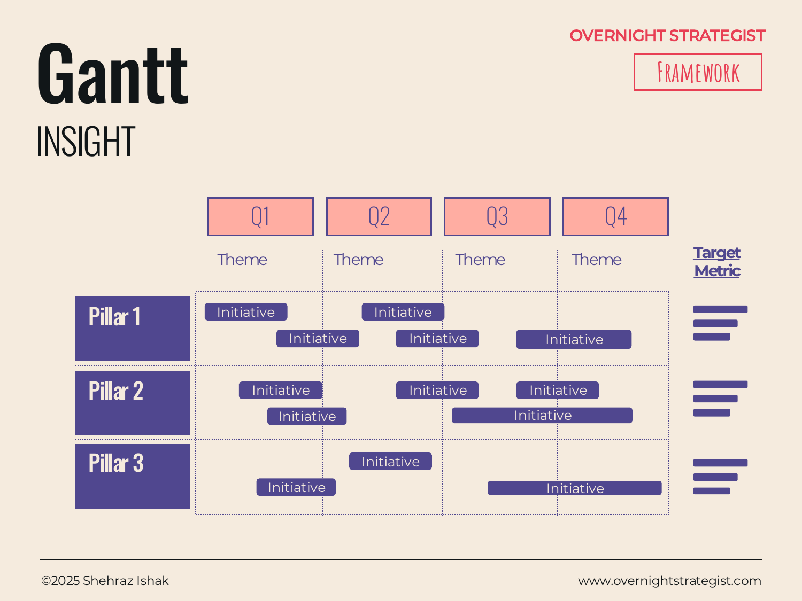

# Gantt

> A roadmap chart that places each strategic initiative on a time axis, grouped by pillar, so an audience can see what is happening, when it starts and ends, and how workstreams stack up across a planning period.

## What It Is

The Gantt is an Insight-stage layout that shows a strategy's implementation as a grid: time blocks (months or quarters) run across the top, strategic pillars run down the left as grouping rows, and each initiative within a pillar is shown as a horizontal bar spanning its start-to-end period. A theme label above each time block summarises the strategic character of that period. A target metric column on the right shows what each pillar must achieve by the end of the planning period.

At strategy level, a Gantt page typically shows quarters rather than weeks — it communicates "what we are doing and when" without becoming a project plan.

## Why It Works

A list of initiatives tells you what to do. A Chevron tells you the phase sequence. But neither answers the question a leadership team always asks: "Can we actually do all of this, and when?" The Gantt is the layout that reveals the answer, because it forces everything onto the same time axis. When you try to build it, you immediately see whether two major initiatives are competing for the same time, whether a dependency is backward, or whether the first quarter is impossibly overloaded.

The time axis also creates accountability in a way that a list cannot. Once a bar is placed on a Gantt, "Initiative A starts in Q2" is a public commitment — not a vague intention. This is why the Gantt is the most common layout in strategy execution documents: it converts decisions into commitments.

The grouping by strategic pillar connects the implementation view back to the strategy structure, so an audience can trace the path from their One Pager's pillars through to the specific work being done in each quarter.

## How To Use It

1. **Set the time axis.** Choose your time blocks — usually quarters for a one-year plan, or half-years for a two-to-three-year plan. Label each block, and add a theme beneath it: a short phrase characterising what that time period is principally about ("Foundation & Fix," "Build & Launch," "Scale & Optimise").
2. **List the strategic pillars.** These should match the pillars in your One Pager or strategy summary. Each pillar is a horizontal band in the Gantt.
3. **Place initiatives as bars.** Within each pillar, list the specific initiatives and draw a bar from start to end date. Leave brief gaps between sequential initiatives in the same pillar; bars can overlap within a pillar if the work is genuinely parallel.
4. **Add target metrics.** For each pillar, include the outcome metric it must hit by the end of the planning period. This ties implementation back to results.
5. **Add a theme per time block.** Read the initiatives that are active in each quarter and write a short headline that captures the strategic character of that period. The audience should be able to read just the themes and understand the strategy's arc.
6. **Sense-check the load.** Look at each time block and count how many bars are active simultaneously. If Q1 has fifteen bars, the plan is optimistic. Reschedule until the load per period is realistic.

## Worked Example

Acme Design's implementation roadmap for 2025, across two strategic pillars:

**Time axis themes:** Q1 — "Stabilise the Core" | Q2 — "Build for Growth" | Q3 — "Launch and Acquire" | Q4 — "Optimise and Scale"

**Pillar 1 — Retention (Target: <10% monthly churn by Q4)**
- Redesign onboarding email sequence ████ (Q1)
- Build in-app day-1 learning path ████ (Q1–Q2)
- Launch monthly live Q&A sessions ░░░░████████████ (Q2–Q4, ongoing)
- Introduce annual plan as default sign-up ████ (Q2)
- Commission 6 intermediate courses ████████████ (Q2–Q3)

**Pillar 2 — Acquisition (Target: 4,000 new subscribers/month by Q4)**
- SEO content calendar — 4 articles/week ████████████████████████████████████████ (Q1–Q4, ongoing)
- Influencer partnership pilot (3 creators) ████████ (Q2–Q3)
- Paid channel A/B test (Facebook vs. YouTube) ████████ (Q3)
- Scale winning paid channel ████████████ (Q4)

Reading the themes across the year: Q1 is defensive (fix churn before spending on acquisition). Q2 builds the capability that Q3's acquisition push depends on. Q4 optimises the full machine. The sequencing tells a coherent story.

## When To Use It

Use the Gantt as the implementation slide in any strategy document. It always follows the strategy overview (One Pager or Horizon) because it answers the operational follow-up: "How does this actually happen?"

Use **Chevron** instead when you need to communicate the phases of a single workstream in depth, without the overhead of a full cross-pillar implementation view. Use **Horizon** when the timeframe is multi-year and the communication priority is strategic themes rather than specific initiative timing.

## Things To Watch Out For

- A Gantt in a strategy presentation should show quarters, not weeks. Week-level detail belongs in a project plan, not a strategy deck — it will overwhelm the audience and imply a false precision.
- Bars with no end date ("ongoing") should be used sparingly. If everything is ongoing, the chart has no endings and no milestones, and accountability disappears.
- Watch for front-loading: if Q1 has significantly more bars than Q3 and Q4, the plan may be a wishlist that will inevitably slip rather than a sequenced commitment.
- The pillar structure of the Gantt must match the pillar structure of the strategy overview. If the One Pager has three pillars and the Gantt has five different ones, the document is internally inconsistent.

## Related Frameworks

- [Chevron](./chevron.md) — shows the phases of a single journey in depth; use for one workstream rather than the full cross-pillar implementation view.
- [Horizon](./horizon.md) — the high-altitude companion to the Gantt; shows which initiatives belong in each strategic horizon before the Gantt shows when they execute.
- [One Pager](./one-pager.md) — the Gantt is the operational implementation of a One Pager's pillars and initiatives.
- [Timeline](./timeline.md) — for historical milestones rather than forward-looking plans; the backward-looking counterpart to the Gantt.
