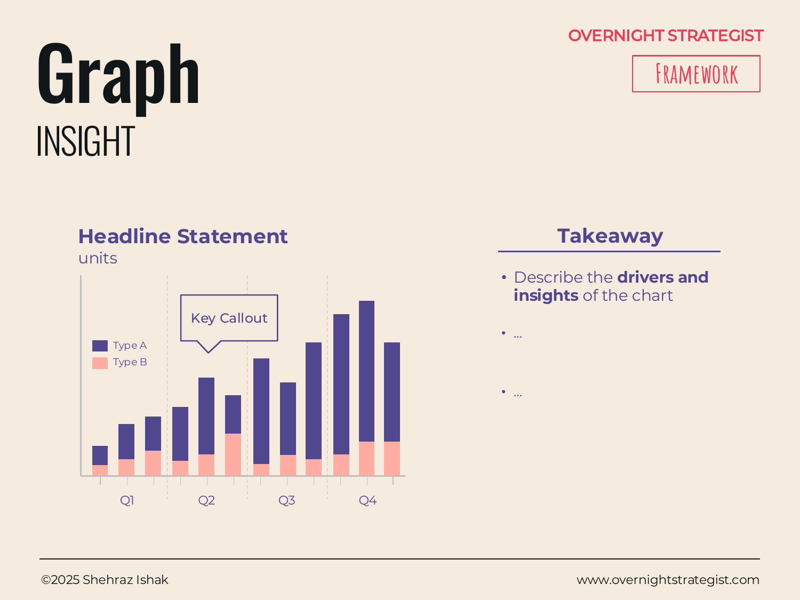

# Graph

> A data chart paired with a written takeaway — headline statement, callout of the key data point, and "so what" bullets — so the audience gets both the evidence and its interpretation on the same page.

## What It Is

The Graph is an Insight-stage layout that combines a visual chart with a structured written interpretation on the same slide. The chart occupies the left or upper portion of the page and can be any standard data visualisation — bar, line, scatter, waterfall — drawn from the Analyse stage. The right or lower portion carries the takeaway structure: a bold **headline statement** summarising the chart's main finding, a **key callout** flagging the single most important data point or inflection in the chart, and a brief **takeaway** section with two to four bullet points explaining the drivers and strategic implications of what the chart shows.

## Why It Works

A chart without an interpretation is ambiguous. Two people looking at the same rising line chart can draw opposite conclusions about whether the trend is cause for optimism or concern, depending on what benchmark they have in mind. And a written takeaway without the underlying data is an assertion that the audience either accepts or rejects without the means to evaluate it.

The Graph layout forces both to appear together. The chart provides the evidence; the takeaway provides the interpretation. The audience can check the interpretation against the data without leaving the page. This pairing also disciplines the author: if you cannot write a crisp headline statement for a chart, the chart may not have a clear finding — a signal that the analysis isn't finished yet.

The key callout plays a specific role: it directs the audience's eye to the single most important thing in the chart before they scan the rest of it. Without a callout, an audience with a complex chart will find different things interesting, and the presenter loses control of the conversation. With a callout, the presenter sequences the audience's attention.

## How To Use It

1. **Choose the right chart type.** Match the chart to the type of insight: a line chart for trends, a bar chart for comparisons, a waterfall for bridges, a scatter for correlations. Resist the temptation to use a complex chart type when a simpler one communicates the finding just as clearly.
2. **Simplify the chart.** Remove gridlines, legends, and data labels that don't contribute to the finding. The chart should be readable at presentation size in under five seconds.
3. **Write the headline statement.** One bold sentence that states the finding, not the topic. "Subscription growth accelerated in Q3" (finding) rather than "Q3 subscription trends" (topic). Place it above or beside the chart.
4. **Add the key callout.** Annotate the chart at the single most important data point, peak, trough, or inflection with a callout box or arrow. The callout should name the specific value and why it matters.
5. **Write the takeaway bullets.** Two to four bullet points that answer the "so what" questions the audience will have. These bullets should interpret, not describe — they say what the data means for the strategy, not what the numbers are.

## Worked Example

Acme Design's subscriber growth chart, presented at a strategy review:

**Headline statement:** "New subscriber growth stalled in Q3 while churn accelerated, compressing net growth to near zero."

**Chart:** A combined bar-and-line chart. Blue bars show new subscribers per month (Q1: 1,450; Q2: 1,380; Q3: 1,210; Q4 forecast: 1,100). An orange line shows monthly churn rate (Q1: 14%; Q2: 17%; Q3: 22%; Q4 forecast: 24%). Both trends move in the wrong direction simultaneously.

**Key callout:** Arrow pointing to the Q3 churn figure: "22% churn — highest since launch. 480 subscribers lost in September alone."

**Takeaway bullets:**
- New subscriber volumes are declining slowly (−17% Q1 to Q3), driven by rising paid CPA.
- Churn is accelerating sharply (+57% Q1 to Q3), primarily from month-1 cancellations.
- The combination means net subscriber additions fell from +1,240 in Q1 to +945 in Q3 despite flat marketing spend.
- Addressing churn is more urgent than fixing acquisition: a 5-percentage-point churn reduction produces more net subscribers than a 25% increase in new sign-ups.

The last bullet is the strategic insight — it could not be derived from the chart alone without the analysis behind it. The Graph layout makes it impossible to separate the chart from that conclusion.

## When To Use It

Use the Graph layout any time a data chart is central to the argument on a strategy slide. It is the most versatile Insight layout for quantitative evidence — it works for any chart type and any audience, because it makes the interpretation explicit rather than leaving it as an exercise for the viewer.

Use a **Tabular** layout instead when the evidence comes from multiple findings that each need a rating or impact assessment, and no single chart carries the argument. Use a **Tri-Column** when three parallel data points each support a separate sub-argument rather than one central finding.

## Things To Watch Out For

- A headline statement that restates the chart's axis labels ("Monthly subscriber counts by quarter") is a topic label, not a finding. Push until the headline takes a position: what does the chart prove?
- A key callout that highlights three or four data points simultaneously isn't a callout — it's a description of the whole chart. Callouts only work when they highlight exactly one thing.
- Takeaway bullets that describe the chart instead of interpreting it ("Q3 churn was 22%") duplicate information the audience can already see. Every bullet should answer "so what?" — what does this mean for a decision or action?
- A chart that requires more than five seconds to understand at presentation size is too complex. Simplify the chart or break it into two separate Graph pages.

## Related Frameworks

- [Tabular](./tabular.md) — for presenting multiple rated findings from different data sources; use when the evidence doesn't come from a single chart.
- [Tri-Column](./tri-column.md) — for presenting three parallel data-backed arguments on one page; use when each column has its own chart or data set.
- [Matrix](./matrix.md) — use when the insight comes from the relationship between two axes rather than a data series.
- [Heat Map](./heat-map.md) — use when the insight is a comparative rating pattern across many items rather than a data trend.
