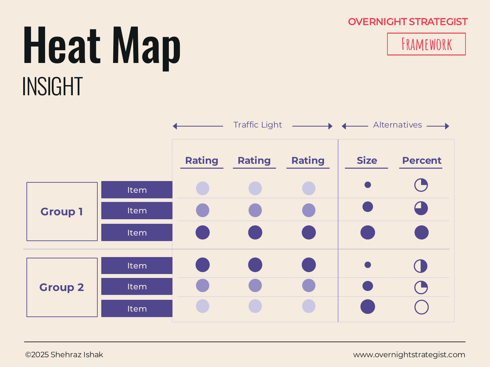

# Heat Map

> A colour-coded grid that rates a set of items or attributes from low to high — using traffic-light colours, size signals, or percentage indicators — so an audience can instantly see where performance is strong, where it is weak, and what demands the most attention.

## What It Is

The Heat Map is an Insight-stage layout that presents a list of items (organised into groups) with a visual rating for each one. The rating can be expressed in several ways: a traffic-light colour (red / amber / green, corresponding to low / medium / high), a size indicator (larger shape = higher rating), or a percentage bar (showing maturity or completion). Items are arranged in rows, grouped into two or three logical categories, and each row carries its rating signal in a dedicated column.

The defining feature is that the rating is communicated visually rather than numerically, so the audience can scan the full grid and identify patterns — clusters of red, isolated greens — without reading any individual cell in detail.

## Why It Works

When you have ten or more items to rate, a table of numbers or a list of text assessments forces the audience to do comparison work themselves — reading each cell, holding the number in memory, comparing it to the next one. A Heat Map offloads that work to the visual system, which processes colour and size almost instantaneously and in parallel across the whole grid. The audience sees the pattern before they read a word.

This matters because pattern is often the strategic message. "Our retention capabilities are uniformly weak" or "marketing execution is strong but marketing strategy is a gap" are pattern-level insights that are invisible in a numbered table and visible in a Heat Map in under three seconds.

The grouping structure adds another layer of meaning: by placing items into labelled groups, the layout signals that the items within a group share something in common, and the audience naturally asks whether the pattern within one group differs from the pattern in another. That comparison often generates the most actionable insight on the page.

## How To Use It

1. **Define the items to be rated.** List every capability, initiative, channel, or attribute you want to assess. This is the row list.
2. **Group them logically.** Organise the rows into two to four groups. Groups should share a meaningful common category (e.g. "Acquisition Channels," "Retention Levers," "Infrastructure Capabilities").
3. **Choose your rating method.** Select the visual signal that best fits the data and the audience:
   - Traffic light (green / amber / red) for qualitative high-medium-low assessments.
   - Size for variables that are naturally continuous (e.g. market opportunity, revenue potential).
   - Percentage bar for maturity or progress indicators (how far along a capability is from immature to fully developed).
4. **Rate each item.** Apply the rating honestly. If you cannot defend a rating with evidence or a clear rationale, mark it as unknown rather than defaulting to amber.
5. **Write group-level takeaways.** For each group, add a headline sentence summarising what the pattern within that group means. This converts a rating exercise into an insight.
6. **Highlight outliers.** Use a callout or note to flag any items that are unusually high or low relative to their group — these are typically the items that most demand a decision.

## Worked Example

Acme Design's marketing channel Heat Map, presented to evaluate where to focus 2025 investment:

**Group 1 — Acquisition Channels**

| Channel | Rating | Note |
|---|---|---|
| SEO / Organic blog | 🟢 High | 40% YoY traffic growth; 8% of new subs; headroom remains |
| Instagram content | 🟡 Medium | 28k followers; engagement declining; no direct conversion tracking |
| Paid search (Google) | 🔴 Low | CPA $27 and rising; below breakeven on LTV |
| Influencer referral | 🔴 Low | No structured programme; ad-hoc only |
| Email / referral | 🟢 High | 42k list; 38% open rate; highest conversion of any channel |

**Group 2 — Retention Levers**

| Lever | Rating | Note |
|---|---|---|
| Onboarding sequence | 🔴 Low | One welcome email; 22% month-1 churn |
| Course content (beginner) | 🟢 High | 74% completion rate; strong NPS |
| Course content (intermediate) | 🔴 Low | Only 3 intermediate courses; 31% completion |
| Community / live events | 🔴 Low | No structured community; no live programme |
| Annual plan conversion | 🟡 Medium | 9% on annual plan; not prominently offered |

Group 1 takeaway: Two strong channels (SEO, email) carry all the acquisition weight; paid search is a drain; influencer is untapped.
Group 2 takeaway: Content quality is the strength; the experience surrounding the content (onboarding, community) is the weakness.

The Heat Map makes the cross-group pattern visible: Acme's content is good but everything built around the content experience is weak. That's a coherent strategic diagnosis in a single view.

## When To Use It

Use the Heat Map when you have ten or more items to rate and the primary message is the pattern — where things cluster at the high and low ends — rather than the detail of any individual item. It is the natural layout for capability assessments, channel reviews, competitive feature benchmarks, and risk registers.

Use **Tabular** instead when the items need explanatory text alongside the rating, and the audience needs to read more than scan. Use **Matrix** when the primary message is how two specific dimensions combine to place options in four quadrants, rather than a rating of many items across one dimension.

## Things To Watch Out For

- Traffic lights lose credibility when ratings aren't grounded in evidence. State the basis for each rating — either in a note column or in an accompanying footnote — so the colour can be challenged and defended.
- If every item in a group is the same colour, the group rating isn't discriminating. Either the items all genuinely perform the same way (in which case one group-level rating replaces the individual rows), or the rating criteria are too coarse.
- Heat Maps with more than fifteen rows start to feel like audit reports rather than strategic insights. Limit rows to the items that are genuinely consequential for the decisions at hand.
- The choice between red/amber/green and size signals matters: traffic lights imply a binary "good vs. bad" judgment; size implies a continuous variable. Mismatching the signal to the data creates confusion.

## Related Frameworks

- [Tabular](./tabular.md) — similar grid structure but with explanatory text per row rather than a visual rating; use when the audience needs to read rather than scan.
- [Matrix](./matrix.md) — a 2×2 that plots two dimensions against each other to place items in quadrants; use when the insight comes from the intersection of two dimensions, not a single rating.
- [Capability Map](./capability-map.md) — a specialised Heat Map for organisational capabilities with a maturity rating; use the Capability Map when the subject matter is specifically organisational capabilities.
- [Continuum](./continuum.md) — rates dimensions as directional positions rather than high/low scores; use when the insight is about positioning on a spectrum, not performance strength.
