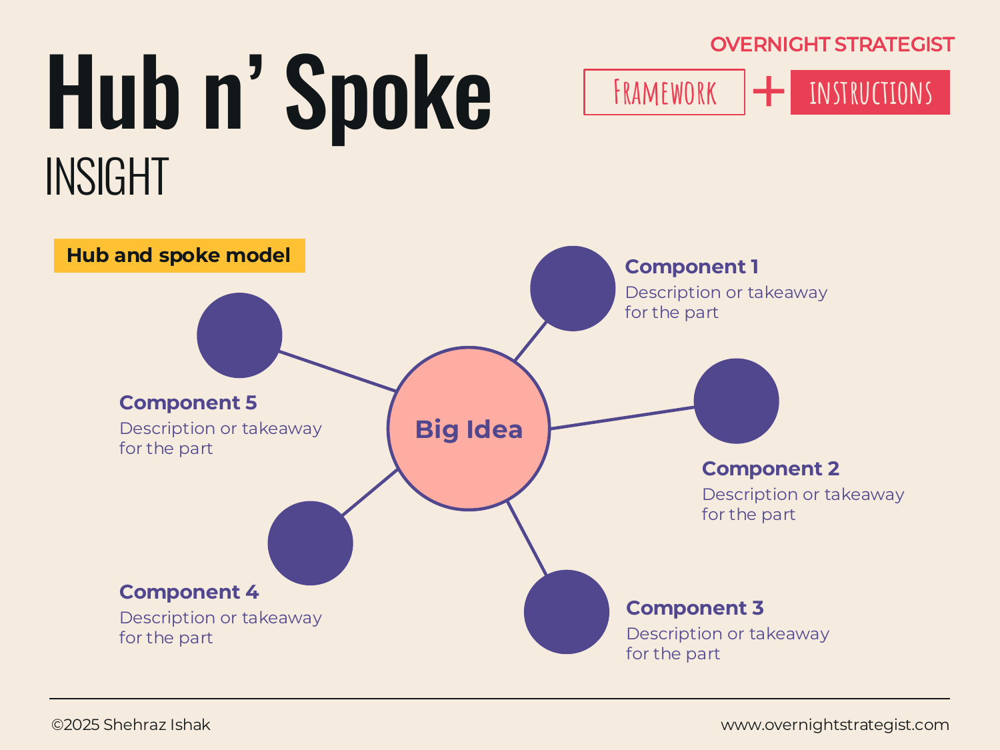

# Hub n' Spoke

> A radial diagram that places one central idea at the hub and connects it to surrounding components — communicating that the components are all expressions of, or inputs to, the same core concept.

## What It Is

A Hub n' Spoke diagram has one central element — the hub — and three to six (typically five) surrounding elements connected to it by lines or arrows — the spokes. The hub holds the big idea, the central outcome, or the unifying concept. Each spoke is a distinct component, dimension, or contributing element. Short labels or descriptions accompany each spoke to explain what it represents and its relationship to the hub.

The visual structure communicates equal weight among the spokes (they are all the same distance from the hub, all connected by the same type of line) while making the hub unambiguously central. The form says: these things all belong to the same idea, and the hub is what makes them cohere.

## Why It Works

Many strategy ideas have a central concept with multiple expressions, inputs, or supporting elements that are genuinely parallel — not sequential, not hierarchical, but co-equal parts of the same whole. A bulleted list presents those elements as a sequence and implies an ordering. A pyramid implies that some elements are more foundational than others. A chevron implies that the elements happen in a left-to-right order. The Hub n' Spoke is the correct structure when none of those implications are true — when the elements are parallel and the hub is what unifies them.

The radial geometry also has a practical effect in communication: it draws the eye to the centre first, then sends it outward to the spokes one by one. The hub is read before any spoke, which means the audience understands the central concept before they encounter its components. That sequence is the right order for comprehension — context before detail.

## How To Use It

1. **Name the hub.** Write the central concept in clear, compressed language. The hub should be a noun phrase or short statement, not a sentence — "Customer Experience," "Platform Strategy," "Subscription Growth Model."
2. **Identify three to five spokes.** Each spoke should be a distinct, nameable component that genuinely relates to the hub without overlapping the others. If two spokes sound like the same thing said differently, merge them.
3. **Write a short description for each spoke.** One or two sentences beneath or beside each spoke label explaining what this component is and its specific relationship to the hub.
4. **Check for parallel structure.** All spokes should be the same type of thing — all inputs, all outputs, all dimensions, all product features, all strategic pillars. Mixed types (some are outputs, some are enabling processes) indicate a segmentation problem in the logic.
5. **Label the diagram.** Give the overall diagram a title that makes explicit what the hub-and-spoke relationship is (e.g., "Five pillars of Acme's learner experience" or "Four components of the growth engine").

## Worked Example

Acme Design's leadership team is presenting its renewed product vision to the board. The central concept is the "Acme Learning Engine" — the system that drives subscriber acquisition and retention. They build a Hub n' Spoke with "Learning Engine" at the centre and five spokes:

**Hub: Learning Engine**
The integrated system that attracts, develops, and retains designers at every stage of their career.

**Spoke 1 — Expert Instructors**
A roster of practitioners with 10+ years of industry experience. Each course is built and presented by a working designer, not an educator — which means the content reflects what actually gets used on the job.

**Spoke 2 — Project-Based Curriculum**
Every module ends with a real brief, not a quiz. Students build a portfolio of work they can show to employers. The project is the product.

**Spoke 3 — Peer Community**
A structured community forum where students review each other's work, share resources, and form accountability partnerships. Community engagement is the strongest leading indicator of 12-month retention.

**Spoke 4 — Instructor Feedback**
Students receive personalised written feedback on each submitted project within 48 hours. This is the single most cited differentiator in NPS responses: "I actually had someone look at my work and tell me how to improve it."

**Spoke 5 — Portfolio Certificate**
On completing the core curriculum and six approved projects, students receive a certificate recognised by hiring managers at over 200 partner companies. The certificate is the carrot that motivates students through the hard middle of the course.

The diagram makes the logic of the product visually clear: these five elements are not independent features — they are a system. Remove any one of them and the others are weakened. The hub communicates that the five spokes cohere into a single "engine" rather than a list of product characteristics.

## When To Use It

Use a Hub n' Spoke when you have a central concept with three to five genuinely parallel, co-equal components — when you want the audience to understand both the components and the fact that they belong together. It is especially effective for presenting a product model, a brand system, a capability set, or a strategic framework where the central idea is as important as any single component.

Use a **Pyramid** instead when the relationship between components is hierarchical — some elements are foundational and others are built on top of them. Use a **Driver Tree** when the components feed into the hub as causal inputs (the hub is the output and the spokes are what drives it). Use a **Tri-Column** or **Image Column** when three parallel components need supporting evidence and you have more text to show per component than a spoke label can carry.

## Things To Watch Out For

- The spokes should be genuinely co-equal. If one spoke is much more important than the others, the equal-distance radial structure misrepresents the relationship. Either accept the flattening (the visual is a simplification) or use a Pyramid, which can signal difference in weight through tier placement.
- Five spokes is the practical maximum at presentation scale. More than five and the diagram becomes cluttered; the spoke labels can't be read without leaning forward. If you have six or seven components, consider whether two can be merged or whether a different layout serves better.
- The hub label must be substantive. "Strategy" or "Our Approach" as a hub is too vague — the audience gains nothing from the centre. Name the actual concept: "Subscriber Retention System," "Three-Platform Architecture," "Instructional Philosophy."
- A Hub n' Spoke with no descriptions on the spokes (just labels) is a taxonomy, not an insight. The descriptions are what make the diagram worth a slide — they answer "yes, but what does this component actually do?"

## Related Frameworks

- [Pyramid](./pyramid.md) — hierarchical structure where lower tiers enable upper tiers; use when the components are not co-equal but foundational-to-pinnacle.
- [Driver Tree](./driver-tree.md) — causal tree where components combine to produce an outcome; use when the spokes are inputs that drive the hub as output.
- [Circular](./circular.md) — sequential loop where each step feeds the next; use when the components happen in order rather than in parallel.
- [Tri-Column](./tri-column.md) — three parallel columns with supporting evidence; use when three co-equal components need text-heavy support rather than a radial layout.
