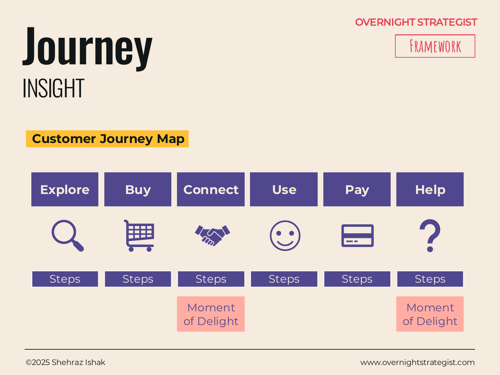

# Journey

> A customer journey map that traces the experience of buying and using a product from the customer's perspective, phase by phase and step by step, with explicit callouts for the moments that matter most.

## What It Is

A Journey diagram (customer journey map) arranges the customer experience as a sequence of phases laid out horizontally — Explore, Buy, Connect, Pay, Use, Help are the default phases, though they can be adapted to any product or service. Under each phase, a set of steps or actions describes what the customer actually does at that stage. Selected moments across the journey are highlighted as "Moments of Delight" — the steps that have an outsized impact on how the customer feels about the product overall.

The map is told entirely from the customer's perspective: what are they doing, what are they feeling, where do they struggle? It is not an internal process diagram.

## Why It Works

Strategy teams naturally describe their product from the inside out: here is what we built, here is how it works, here is how we price it. A customer journey map forces the reversal: here is what the customer is trying to accomplish, here is where we help them, and here is where we fail them. That perspective shift is the work.

The power of the journey map is that it makes invisible friction visible. Customers do not complain in the language of internal processes — they simply leave, or never convert, or never return. The journey map gives the team a shared vocabulary for where the experience breaks down. When the Explore phase has six steps and the Buy phase collapses to one, that asymmetry is a signal — and it's only visible when you've laid out all the phases side by side.

The "Moments of Delight" callout does something further: it acknowledges that not all steps are equal. A single moment of unexpected quality can anchor a customer's entire impression of a product. Naming those moments explicitly makes them design targets rather than happy accidents.

## How To Use It

1. **Define your phases.** Name the major stages of the customer's experience from first contact to ongoing use and support. Standard phases — Explore, Buy, Connect, Pay, Use, Help — work for most digital products; rename or add phases as needed.
2. **Deconstruct each phase into steps.** For each phase, list three to five specific actions the customer takes. Keep these in the customer's language: "compares pricing plans," "watches the intro video," "enters payment details."
3. **Validate with evidence.** Where possible, ground the steps in actual customer research (interviews, session recordings, support tickets) rather than internal assumptions.
4. **Mark the Moments of Delight.** Identify two to four steps that, when they go well, have a disproportionate positive impact on the customer's overall experience. Flag these explicitly.
5. **Optionally, add a sentiment layer.** Some teams add an emotion arc — a line above or below the steps showing whether the customer is feeling positive, neutral, or frustrated at each point. This layer makes pain points vivid.

## Worked Example

Acme Design maps the journey of a prospective student discovering and starting a course:

**Explore**
- Sees an Instagram ad featuring a student's before/after portfolio project.
- Visits Acme's website; browses the Figma course landing page.
- Watches a free 10-minute sample lesson.
- Reads three student reviews.

**Buy**
- Clicks "Enrol" on the course page.
- Reviews the $199 price and the 30-day money-back guarantee.
- Enters email and payment details; completes checkout.

**Connect**
- Receives a welcome email with the course schedule and community forum link.
- Logs into the learning platform for the first time.

**Pay** (handled at Buy for this product)

**Use**
- Watches the first module; downloads the project brief.
- Completes the first project; submits for instructor review. ← **Moment of Delight: first instructor feedback arrives within 36 hours, specific to their work.**
- Shares the project in the community forum; receives peer comments. ← **Moment of Delight: first meaningful peer interaction.**
- Completes three more modules over two weeks.

**Help**
- Emails support after a video fails to load on mobile.
- Resolution in under four hours; support includes a tip for the community forum.

The map reveals a friction point immediately: the Connect phase is under-designed. Students go from checkout to logging in with no guided onboarding — no "here's what to do first," no expectation-setting. The team adds a 3-step welcome checklist as the first thing a new student sees. The two Moments of Delight — fast feedback and peer connection — become explicit design targets with SLA commitments built around them.

## When To Use It

Use a Journey map when the strategic problem is experiential — when the question is how well your product serves customers at each stage of their relationship with it, and where you're losing them. It is especially valuable in the Insight stage when you're translating Analyse-stage data (e.g., drop-off rates, support ticket volume by topic) into a narrative a leadership team can act on.

Use a **Touchpoint** map instead when you need to layer in channel information — which device or channel the customer uses at each phase, and how their path varies by channel. The Journey map focuses on what; the Touchpoint map layers in where and how. Use a **Circular** diagram when the focus is on the repeating habit loop rather than the linear experience from first contact to ongoing use.

## Things To Watch Out For

- Journey maps are only as good as their evidence base. A journey map built entirely from internal assumptions is a map of what the team imagines the customer does, which can be very different from what they actually do. Build it from customer interviews, analytics data, and support logs, not from a whiteboard session among internal stakeholders.
- The map tends to make every phase look equal when some are far more consequential than others. The Moments of Delight callout helps, but consider also annotating which phases have the highest drop-off or the highest customer effort — those are your actual strategic priorities.
- Journey maps get stale. A map built for a product two years ago may not reflect how customers actually behave today, especially if the product has changed. Treat it as a living document, not a one-time artefact.
- Phases that look clean on the map can be messy in practice — customers don't move linearly, they loop back, skip steps, and enter at unexpected points. The map is a simplification; ensure the team doesn't mistake the simplified version for reality.

## Related Frameworks

- [Touchpoint](./touchpoint.md) — the channel-aware variant; layers which device or channel the customer uses at each phase.
- [Circular](./circular.md) — use when the mechanism is a repeating habit or retention loop rather than a linear acquisition-to-support experience.
- [Chevron](./chevron.md) — a simpler linear phase diagram for internal processes or implementation plans.
- [Timeline](./timeline.md) — use when the focus is on when events happen (dates, milestones) rather than what the customer does.
- [Segmentation](./segmentation.md) — pair with a journey map to show whether different customer segments experience meaningfully different journeys.
