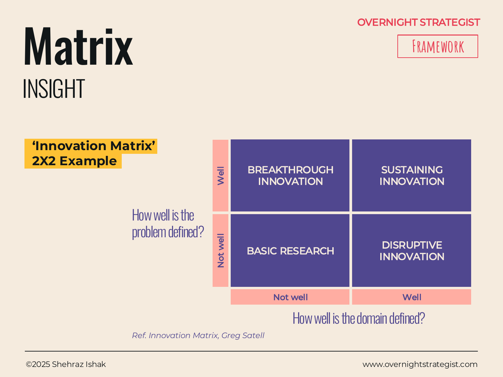

# Matrix

> A two-by-two grid that plots options, ideas, or entities against two key dimensions to reveal which quadrant each falls into — making trade-offs, priorities, and strategic choices visible in a single view.

## What It Is

The Matrix is an Insight-stage layout that organises options, ideas, initiatives, competitors, or any comparable set of items onto a 2×2 grid. One dimension runs along the horizontal axis (from low to high), another along the vertical axis (from low to high), and together they create four quadrants, each representing a distinct combination of high/low on both dimensions. Items are plotted as points or labelled zones within the relevant quadrant.

The Matrix is one of the most widely reused frameworks in strategic analysis precisely because almost any strategic choice can be framed as a function of two dimensions. Depending on the axes chosen, the same layout produces the BCG Growth-Share Matrix, the Eisenhower Priority Matrix, the Ansoff Growth Matrix, and the example shown here — Satell's Innovation Matrix.

## Why It Works

Most strategic choices involve navigating trade-offs between two competing goods: effort and impact, risk and return, market attractiveness and competitive strength. Prose discussions of these trade-offs tend to be sequential — first we discuss option A, then option B, then we compare — which means the audience never sees all the options in relation to each other simultaneously.

The 2×2 solves this by making the comparison spatial. When all options are plotted on the same grid at the same time, the audience can see the full landscape: which quadrant is crowded, which is empty, and where any given option sits relative to the others. The quadrant structure also does the prioritisation work for the author: items in the high-value quadrant speak for themselves, and items in the low-value quadrant explain their own deprioritisation.

The four-quadrant structure also generates a vocabulary. Rather than saying "option A is good on dimension 1 but weak on dimension 2," the author can say "option A is in the top-left quadrant — strong on impact but low on feasibility." This vocabulary makes the conversation more efficient and less subjective.

## How To Use It

1. **Choose two genuinely independent dimensions.** The horizontal and vertical axes should measure different things, not two ways of measuring the same thing (e.g. "impact" and "effort" are independent; "difficulty" and "complexity" may not be). The best axes reveal a real tension or trade-off.
2. **Name each axis and its direction.** Label both the axis and the high/low ends. Conventionally, high value runs to the right on the x-axis and upward on the y-axis, so the top-right quadrant is the most desirable.
3. **Define what each quadrant means.** Name or describe each of the four quadrants before you plot anything. This forces clarity about what you're looking for before confirmation bias can influence the plotting.
4. **Plot the items.** Place each item at the intersection of its ratings on the two axes. If items are clustered, spread them slightly to maintain legibility — exact position is rarely meaningful at strategy level.
5. **Name or shade the quadrants.** Label each quadrant with a short descriptor (e.g. "Invest," "Maintain," "Divest," "Avoid") to make the strategic implication of each zone explicit.
6. **Read the distribution.** The insight comes from the overall pattern: are most items clustering in one quadrant? Is there a gap in a quadrant you expected to be full? Are there surprising outliers?

## Worked Example

Acme Design's 2×2 initiative prioritisation matrix, axes: **Impact on Net Subscriber Growth** (horizontal, low → high) vs. **Effort to Implement** (vertical, low → high):

**Quadrant definitions:**
- Top-right (High Impact, High Effort): Strategic investments — pursue, resource properly.
- Top-left (Low Impact, High Effort): Avoid — cost exceeds benefit.
- Bottom-right (High Impact, Low Effort): Quick wins — prioritise first.
- Bottom-left (Low Impact, Low Effort): Fill-ins — only if bandwidth allows.

**Plotted initiatives:**
- "Redesign onboarding email sequence" → Bottom-right (High Impact, Low Effort) — Quick win.
- "Default sign-up flow to annual plan" → Bottom-right — Quick win.
- "Build influencer partnership programme" → Top-right (High Impact, High Effort) — Strategic investment.
- "Launch corporate B2B licensing product" → Top-right — Strategic investment.
- "Add Instagram Reels content" → Top-left (Low Impact, High Effort) — Deprioritise.
- "Update website FAQ page" → Bottom-left (Low Impact, Low Effort) — Fill-in if time allows.

The Matrix tells Acme to start with the two bottom-right quick wins (both can launch in four weeks), commit resources to the two top-right strategic investments, and explicitly drop the top-left initiative from the plan. No prose discussion of each option could communicate that trade-off structure as quickly.

## When To Use It

Use the Matrix whenever you need to compare options across two dimensions and want to make the resulting prioritisation or grouping visual. It is among the most versatile layouts in a strategy deck because the axes can be customised to almost any strategic question.

Common axis pairings: Impact vs. Effort (for prioritisation); Market Attractiveness vs. Competitive Strength (for portfolio decisions); Certainty of Problem vs. Certainty of Solution (Satell's Innovation Matrix, referenced in the diagram's example); Importance vs. Urgency (the Eisenhower variant, used in the Decide stage).

Use **Positioning** instead when the matrix is specifically about competitive placement of a brand or product against named competitors. Use **Continuum** when the insight is about directional movement along one dimension rather than placement in a two-dimensional space.

## Things To Watch Out For

- Axes that are correlated (e.g. "risk" and "uncertainty") will cluster all items diagonally and produce an uninformative chart. If items don't spread across all four quadrants, the axes may be measuring the same underlying variable.
- A Matrix that puts everything in the top-right "invest" quadrant either has axes that are set wrong (everyone rates high on both) or reflects wishful thinking. Force discrimination: if every initiative looks like a strategic priority, the axes aren't capturing the real constraints.
- The high/low split is a simplification — real data rarely falls into clean quadrants. Be transparent when an item genuinely sits on a boundary; forcing a binary placement can create false precision.
- A 2×2 inherently loses information about dimensions beyond the two axes. An initiative can look excellent in a two-dimensional matrix and still be problematic on a third dimension (e.g. regulatory risk, key-person dependency) not captured in the chart.

## Related Frameworks

- [Heat Map](./heat-map.md) — for rating many items on a single dimension rather than plotting them in two-dimensional space.
- [Continuum](./continuum.md) — for showing directional movement along a spectrum; use when the question is "which way are we going?" not "where do options fall in two-dimensional space?"
- [Positioning](./positioning.md) — a specific version of the Matrix used to plot a brand or product's competitive position against named rivals.
- [Canvas](./canvas.md) — for mapping the full building-block architecture of a business model; use when the question is "what are all the pieces?" rather than "how do options compare on two dimensions?"
