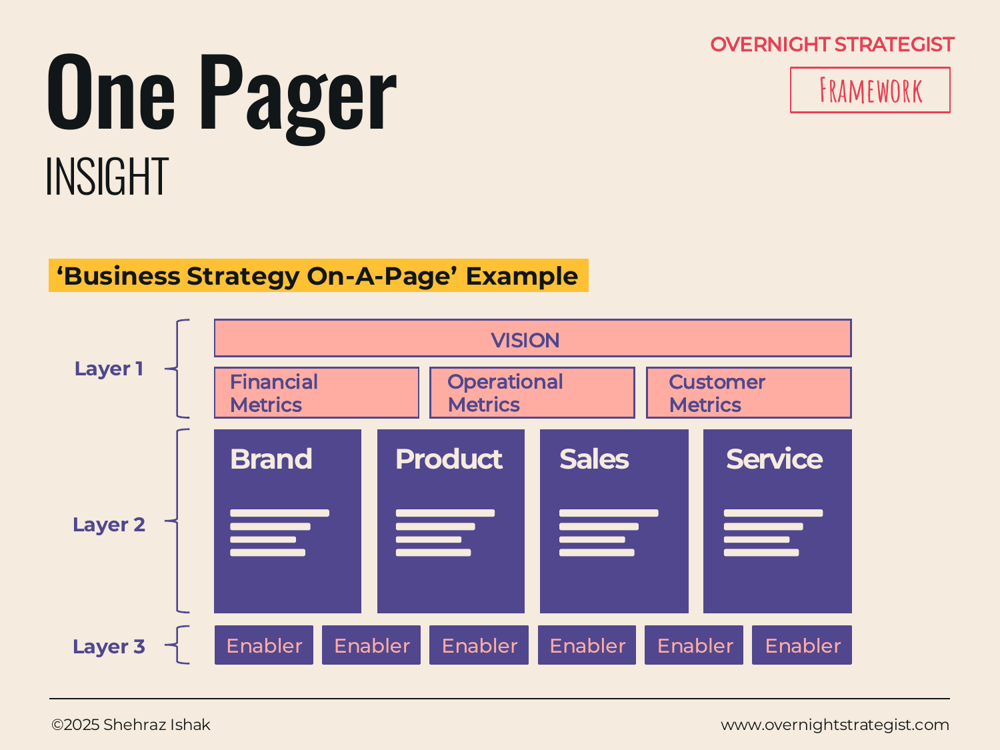

# One Pager

> A single-page visual that distils an entire strategy into its headline vision, its three to five strategic pillars, and the enabling capabilities that make it executable — so anyone can grasp the full picture at a glance.

## What It Is

The One Pager is a layered summary format for a complete strategy. It is structured in three horizontal layers stacked from top to bottom. The top layer (Layer 1) holds the headline: the vision and the key metrics or targets that define success. The middle layer (Layer 2) holds the strategic pillars — the three to five imperatives that must be delivered to realise the vision, each accompanied by the specific projects or initiatives that make it concrete. The bottom layer (Layer 3) holds the enablers — the technology, process, or people capabilities that the pillars depend on.

The One Pager works both as a slide within a full strategy document (where it anchors the narrative) and as a standalone quick-reference that a leader can share without the full deck.

## Why It Works

Most strategies are hard to communicate because there is no single place where the whole thing is visible at once. Teams carry parts of it — the vision people know the goal, the project people know the initiatives, the IT people know what technology is needed — but nobody can see how those parts connect. The One Pager solves this by forcing all three layers onto a single canvas and making the causal logic visible: vision flows down to pillars, pillars rest on enablers.

The layer structure also reveals whether the strategy is coherent. If a pillar can't be decomposed into concrete projects, it isn't a strategy yet — it's an aspiration. If an enabler doesn't connect upward to any pillar, it may be unnecessary overhead. By putting everything in one place, the One Pager exposes those gaps at a glance in a way that a 40-slide deck never does.

## How To Use It

1. **State the vision (Layer 1 centre).** Write a single aspirational sentence that defines where the organisation is going. Add the two or three headline metrics that will signal when you've arrived (e.g. revenue, subscriber count, market share).
2. **Define the pillars (Layer 2).** Choose three to five strategic imperatives — the broad areas of work that collectively deliver the vision. Name each pillar with a short, active phrase. Under each pillar, list the two to four specific key projects that execute it.
3. **Identify the enablers (Layer 3).** List the foundational capabilities — technology platforms, process improvements, data infrastructure, team capabilities — that the pillars depend on. Group them logically if possible.
4. **Check for coherence vertically.** Every pillar should connect upward to the vision and downward to at least one enabler. Every enabler should connect upward to at least one pillar.
5. **Use it at the front and back of a full strategy document.** At the front it previews the full structure; at the back it serves as a leave-behind summary.

## Worked Example

Acme Design's strategy for 2025:

**Layer 1 — Vision and Metrics**
Vision: "Become the go-to learning platform for working designers, reaching 50,000 active subscribers by December 2025."
Key metrics: 50k subscribers, <15% monthly churn, $3.2M ARR.

**Layer 2 — Strategic Pillars and Key Projects**
- **Grow Acquisition:** Launch influencer partnership programme; build SEO content engine; run 3 paid-channel experiments.
- **Improve Retention:** Redesign month-1 onboarding flow; introduce learning streaks and progress badges; launch monthly live Q&A sessions.
- **Expand Curriculum:** Add 12 new courses in motion graphics and UX; launch expert-taught certificate tracks.

**Layer 3 — Enablers**
- Learning management system upgrade (supports certificate tracks)
- CRM and email automation (supports retention workflows)
- Analytics dashboard (tracks per-pillar KPIs weekly)
- Instructor onboarding process (supports curriculum expansion)

A reader who sees only this page knows the destination, what the organisation is betting on, and what infrastructure makes it possible.

## When To Use It

Use the One Pager at the end of the Define and Insight stages, once the strategy is sufficiently developed to summarise. It's the natural home for the synthesis slide that opens or closes a board or executive presentation.

It is not a strategy-building tool — it is a communication tool. Build the strategy first using **Driver Tree**, **Chevron**, or **Gantt**, then distil it here. If the One Pager is filled in before the analysis is done, it usually over-promises on the pillar layer and under-specifies the enabler layer.

## Things To Watch Out For

- More than five pillars is a sign that choices haven't been made. A strategy with seven pillars is usually several strategies fighting for space on the same page.
- Enablers that are just restatements of the pillars ("great products" as an enabler for "Expand Curriculum") add no information. Enablers should name concrete capabilities: named systems, specific team skills, defined processes.
- The One Pager is a summary, not a substitute for the analysis. If it's the only document in the room, hard questions about evidence and sequencing will have no answers.
- Vision statements that are unmeasurable ("be the best platform for designers") make the metrics in Layer 1 feel arbitrary. A good vision implies its own success conditions.

## Related Frameworks

- [Canvas](./canvas.md) — similar all-on-one-page format but organised as equal-weight building blocks rather than a top-down causal hierarchy.
- [Tri-Column](./tri-column.md) — for presenting three parallel themes in depth; useful for filling in the detail beneath individual pillars.
- [Gantt](./gantt.md) — shows the same pillars and initiatives plotted against a time axis; the natural next page after the One Pager in a strategy document.
- [Chevron](./chevron.md) — shows pillar execution as a phase sequence; useful when the pillars must happen in order rather than in parallel.
