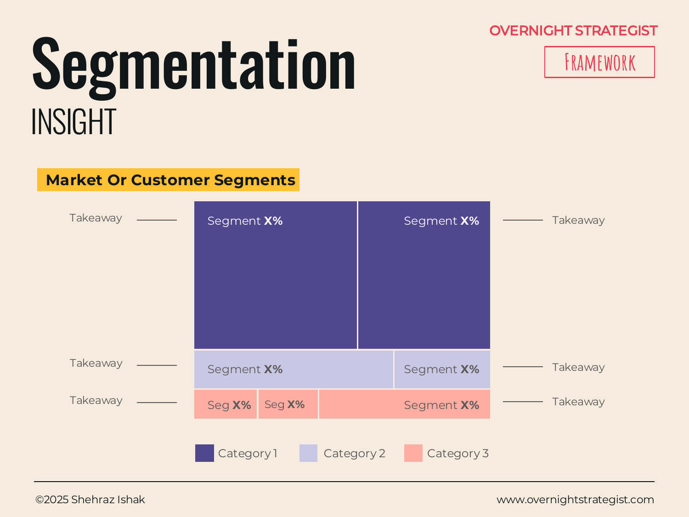

# Segmentation

> A market or customer segmentation map that shows how a market or customer base divides into macro categories and micro segments, with the relative size and a key insight for each.

## What It Is

A Segmentation map displays a market or customer population as a set of blocks, where the size of each block is proportional to its share of the whole. The top level divides the population into two to four major categories. Each category is then subdivided into micro-segments, each also sized by their share. Alongside each micro-segment, a short takeaway note describes its key characteristic, recent trend, or strategic implication — the "so what" for that slice of the market.

The combined picture answers three questions simultaneously: what are the major divisions in this market, how big is each piece, and what is the most important thing to know about each piece.

## Why It Works

A spreadsheet of segment data is hard to act on. When segment A is 32%, segment B is 18%, and segment C is 50%, it takes deliberate effort to hold those proportions in mind while also trying to understand what each segment actually is. A Segmentation map makes the proportions physical — the eye registers immediately that segment C is roughly half the picture, without arithmetic. That frees the audience's attention for the more important question: what does each segment mean for the strategy?

Segmentation also forces a discipline that is easy to skip: the obligation to divide the market before deciding where to compete. Many strategy documents jump from "here is our total market" to "here is our target" without ever making the intermediate step explicit. The map makes that intermediate step the main event — it shows how the market is structured before a targeting recommendation is made, which makes the recommendation much more defensible.

## How To Use It

1. **Define your population.** Decide what you are segmenting — a total addressable market, an existing customer base, or a specific geography or product category. Be explicit about the boundaries.
2. **Identify your macro categories.** Divide the population into two to four major groups based on the most strategically meaningful dividing line — channel, need, company size, use case, or demographic, depending on the context. Each becomes a large block.
3. **Subdivide into micro-segments.** Within each macro category, identify the distinct sub-groups. These should be internally similar (customers in the same micro-segment behave similarly) and externally different from other micro-segments.
4. **Size each segment.** Assign a percentage to each macro category and each micro-segment such that the micro-segment percentages within a category add up to the category total. Use market research, internal data, or well-sourced estimates.
5. **Write a short takeaway for each micro-segment.** One to two sentences per segment: the key characteristic, recent trend, or implication for the strategy. Avoid restating the size — the block already shows the size. State the insight.
6. **Highlight the segments you are targeting.** Once the full map is drawn, call out the two or three segments where the strategy focuses.

## Worked Example

Acme Design maps its total addressable market of online design learners in the English-speaking world, estimated at 4.2 million active seekers annually.

**Category 1 — Career Changers (45% / ~1.9M)**
People transitioning into design from another field; typically 25–40 years old; motivated by a job-ready outcome and a portfolio.
- *Sub-segment: Tech switchers (22%):* Coming from development, product management, or marketing. High willingness to pay; want Figma-specific skills. Most valuable segment.
- *Sub-segment: Non-tech professionals (15%):* Teachers, administrators, retail workers. High motivation but price-sensitive; need foundational content before advanced tools.
- *Sub-segment: Recent graduates (8%):* Design-adjacent degrees (communications, fine art) seeking practical software skills. Medium willingness to pay; respond strongly to portfolio outcomes.

**Category 2 — Working Designers Upskilling (32% / ~1.3M)**
Employed designers seeking to expand their tool set or deepen a specific skill; typically time-constrained; want targeted, module-level content.
- *Sub-segment: Freelancers (18%):* Highest willingness to pay per module; value speed and depth; often buy specific courses rather than subscriptions.
- *Sub-segment: In-house designers (14%):* Often have employer training budgets; strong candidates for the planned B2B offering.

**Category 3 — Hobbyists & Explorers (23% / ~0.97M)**
Curious learners with no strong vocational goal; low willingness to pay; high churn; often attracted by free content.
- *Sub-segment: Creative side-project seekers (13%):* Making content for personal projects, social media, small businesses. Respond to "make something beautiful" messaging.
- *Sub-segment: Passive browsers (10%):* Consuming free tutorials with no intention to purchase. High volume, low value; not a strategic target.

The map makes Acme's strategic priority clear: career changers (Category 1, especially tech switchers) and freelancers (Category 2) are the highest-value segments. Together they represent ~40% of the market but likely 70%+ of Acme's revenue potential given their willingness to pay and their clear, job-related motivation. Hobbyists are not a strategic target — they consume free content and churn.

## When To Use It

Use a Segmentation map at any point where the strategy requires choosing where to compete. It is most useful in the Insight stage before a targeting or positioning decision is made — after Analyse-stage data (size, growth rates, customer data) has been gathered, and before the Story or Decide stage where you commit to a direction.

It is also useful for presenting an existing customer base when the purpose is to show which segments are growing, which are stalling, and which deserve more or less investment.

Use a **Positioning** map instead when the question is where your product sits relative to competitors on customer-relevant dimensions. Use a **Matrix** when you need to evaluate segment options against two binary criteria. Use a **3×3 Model** when you want to rate segment attractiveness against ability to win across a nine-box grid.

## Things To Watch Out For

- Segment sizes that don't add up to 100% — or that don't add up even when the presenter claims they do — destroy credibility immediately. Double-check that every level of the map sums correctly.
- Segments should be mutually exclusive and collectively exhaustive (MECE). If a customer could plausibly appear in two segments, the segmentation logic is flawed. Rethink the dividing line.
- The takeaway note for each segment must say something beyond the size. "This segment is large" is not a takeaway. "This segment is the fastest-growing and has the highest NPS, but the lowest conversion rate from trial" is a takeaway — it tells the audience what to do with the information.
- Segmentation maps are frequently contested in the room. The most productive response to disagreement about segment definitions or sizes is to surface the data source. If the disagreement is about the data itself, the map has exposed an information gap that needs to be closed before a targeting decision can be made — which is a valuable output.

## Related Frameworks

- [Positioning](./positioning.md) — maps where your product and competitors sit on two customer-relevant dimensions; use after segmentation to decide where to compete within your chosen segments.
- [Matrix](./matrix.md) — evaluates four options on two binary criteria; use when the segment assessment can be structured as a 2×2.
- [3x3 Model](./3x3-model.md) — nine-box grid for rating segments on attractiveness and ability to win; use when you need a more nuanced evaluation than a 2×2.
- [Journey](./journey.md) — pair with segmentation to show whether different segments have meaningfully different customer journeys.
- [Heat Map](./heat-map.md) — use to rate segments across multiple attributes when the evaluation requires more than two dimensions.
