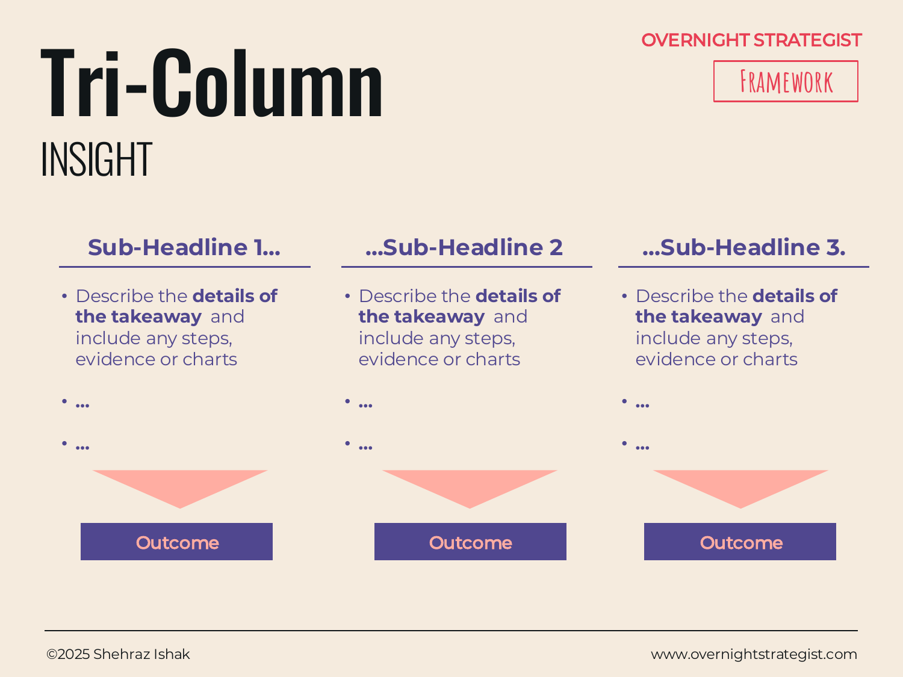

# Tri-Column

> A three-column page layout that presents three parallel themes side by side, each with a sub-headline, supporting evidence, and a "so what" implication — so the audience sees a complete, balanced argument in a single view.

## What It Is

The Tri-Column is an Insight-stage presentation layout built around three equally weighted vertical columns. Each column carries three layers of content stacked top to bottom: a **sub-headline** (the key takeaway for that column), **supporting detail** (bullet points, statistics, or an embedded chart that backs it up), and an **outcome** statement (the single-sentence "so what" implication for the audience). The three columns share a common main headline at the top of the page, and they can be read independently or in left-to-right sequence.

## Why It Works

Three is a number the human mind finds naturally manageable — enough to feel comprehensive, few enough to hold in working memory. A single column of evidence feels thin; four or more columns feel overwhelming. Three columns sit in the cognitive sweet spot where an audience can take in all the evidence and the implied argument in one view without losing track of where they are.

The layer structure within each column does additional work. The sub-headline tells a reader what to expect before they read the evidence. The supporting detail proves it. The outcome converts proof into action or implication. This sequence — tell, show, conclude — mirrors how a well-constructed argument works, and by repeating it three times across the page it makes the logic visible rather than buried in prose. A reader who only reads the three sub-headlines and three outcomes gets the full argument; the supporting detail is there for those who want to verify it.

## How To Use It

1. **Write the page's main headline.** This is the single overarching claim or question the three columns answer together. It should be a complete declarative sentence, not a topic label.
2. **Define three parallel themes.** These should be genuinely parallel — three causes of the same effect, three pillars of the same recommendation, three findings about the same topic. If the three can't be listed in a single grammatical breath ("The three reasons are..."), they probably aren't parallel.
3. **Write the sub-headline for each column.** Each sub-headline is a key takeaway (not a topic label) that supports the main headline. Optionally, the three sub-headlines can be sequenced left to right to form a logical chain.
4. **Fill in the supporting detail.** Two to four bullet points, or a small chart, that substantiate the sub-headline. Stats and specific examples are stronger than general assertions.
5. **Write the outcome.** A single sentence that answers: "Given this, the audience should therefore know, do, or believe..." Keep it crisp — one line maximum.

## Worked Example

Acme Design presents a slide to its board: "Three factors are driving the monthly churn increase."

**Column 1 — Onboarding**
Sub-headline: Month-1 dropout is the primary churn driver.
Detail: 22% of new subscribers cancel in month 1. Exit survey: 68% say "I didn't know where to start." The current welcome sequence is one generic email sent on day 1.
Outcome: A redesigned onboarding flow targeting the first 7 days could recover an estimated 8–10 percentage points of month-1 churn.

**Column 2 — Content Gaps**
Sub-headline: Mid-level designers find no clear next step after beginner courses.
Detail: Completion rate on beginner courses is 74%; completion rate on intermediate courses is 31%. The library has 14 beginner courses and 3 intermediate ones.
Outcome: Commissioning 6 intermediate courses in the next quarter directly addresses the drop-off at the critical "what's next" moment.

**Column 3 — Pricing**
Sub-headline: Monthly billing creates monthly cancellation opportunities.
Detail: Annual plan subscribers churn at 4% vs. 22% for monthly. Only 9% of subscribers are on the annual plan. The annual plan is not prominently offered at sign-up.
Outcome: Defaulting the sign-up flow to the annual plan — with a 30-day money-back guarantee — could shift 15–20% of new subscribers to the stickier billing cycle.

The board reads the three sub-headlines and three outcomes in under 30 seconds and has the argument. They then examine the evidence for any column they want to probe.

## When To Use It

Use the Tri-Column when you have exactly three parallel insights, findings, or recommendations to present and want each to carry equal visual weight. It is one of the most versatile layouts in a strategy deck precisely because so many strategic arguments naturally decompose into three parts: three causes, three pillars, three market segments, three recommended actions.

Use **Tabular** instead when your findings group into more than three themes, or when comparative ratings across items are more important than narrative depth per column. Use **Image Column** when each column is better anchored by a visual diagram or icon rather than text bullets.

## Things To Watch Out For

- If one column requires noticeably more supporting evidence than the others, the three may not be truly parallel — one theme is doing more work. Either restructure or give it its own page.
- Tri-Column is tempting to use for any content, but it fails when the three columns are not genuinely parallel — when the audience would reasonably ask "why are these three things on the same page?" Check: can you state the common thread in a single sentence?
- Sub-headlines that restate the topic label ("Onboarding" vs. "Month-1 dropout is the primary churn driver") waste the most legible real estate on the page. Always write the takeaway, not the topic.
- Outcomes that hedge ("we might consider possibly...") undermine the point. The outcome lane is for decisive implications, not qualifications.

## Related Frameworks

- [Tabular](./tabular.md) — better when findings span more than three groups or when a comparative rating column is needed.
- [Image Column](./image-column.md) — variation of Tri-Column where each column is anchored by a visual diagram rather than text bullets.
- [One Pager](./one-pager.md) — the Tri-Column structure naturally maps onto the three-pillar layer of a One Pager.
- [Chevron](./chevron.md) — use instead when the three themes must be understood as sequential phases rather than parallel themes.
