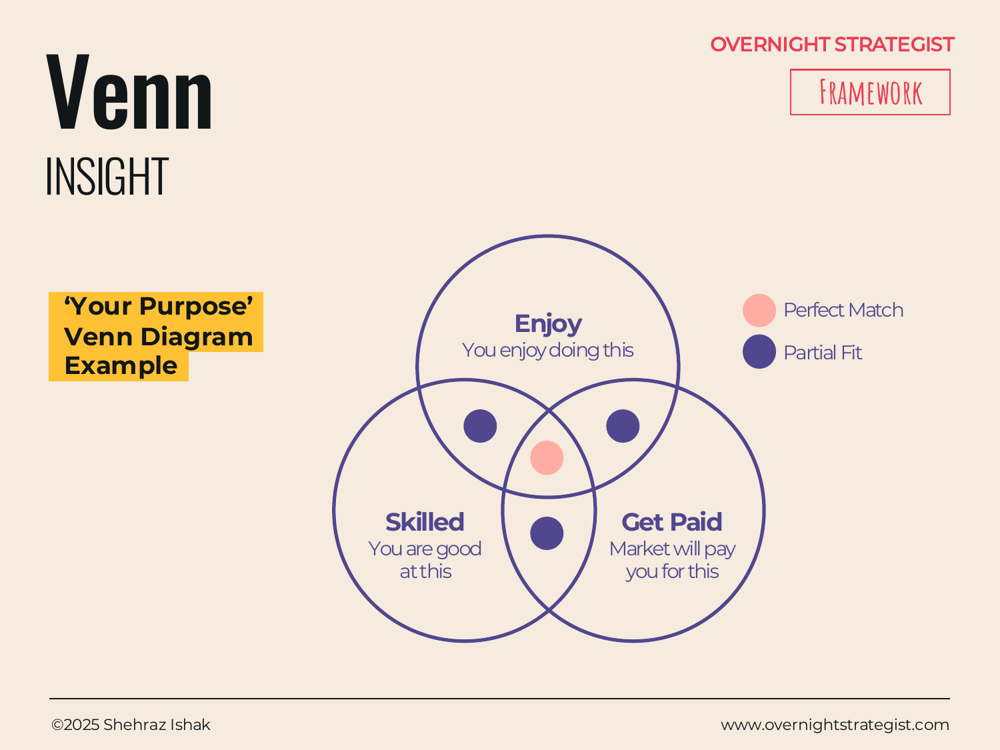

# Venn

> An overlap diagram that makes relationships between two to four groups visible — showing where they are distinct and, crucially, where they intersect.

## What It Is

A Venn diagram arranges two to four circles so that they partially overlap. Each circle represents a distinct group, category, or set of attributes. The non-overlapping portions show what belongs to only that group. The overlapping regions — the intersections — show what is shared between groups. The intersection of all circles, if it exists, is typically the focal point: the sweet spot, the synthesis, or the defining tension.

## Why It Works

Most strategy problems involve things that are related but not identical: two customer needs that partially conflict, three capabilities that sometimes reinforce each other, four segments with shared characteristics. A list or table forces you to treat these as separate rows, hiding the relationship. A Venn makes the relationship the main visual event.

Its power is directional: the diagram doesn't just show what overlaps — it frames *what only the overlap makes possible*. The intersection is where the interesting answer usually lives, and placing it physically at the centre of the visual signals its importance without a single word of explanation. That's why Venn is frequently used to define positioning and purpose: the question "what is the thing that sits at the intersection of what we do well, what customers need, and what the market will pay for?" answers itself the moment you draw the circles.

## How To Use It

1. **Name your groups.** Identify the two to four categories, sets, or attributes you want to compare. Each becomes a circle.
2. **Draw the circles with deliberate overlap.** The size of the overlap area signals the degree of relationship — make it meaningful rather than decorative.
3. **Label each region.** Name the non-overlapping zones (what is unique to each group) and the intersection zones (what is shared). The central intersection, where all circles meet, usually carries the headline insight.
4. **Add a callout.** Highlight the intersection that matters most — this is the answer you want the audience to take away.
5. **Keep it to three or four circles maximum.** Beyond four, the diagram becomes a puzzle rather than a communication tool.

## Worked Example

Acme Design is repositioning its product and needs to identify where to focus. The team draws a three-circle Venn:

- **Circle 1 — What Acme Does Well:** self-paced video instruction, strong Illustrator and Figma curricula, community forums.
- **Circle 2 — What Customers Need:** job-ready skills, accountability and feedback, flexible scheduling.
- **Circle 3 — What The Market Will Pay For:** certifications, project-based portfolios, instructor-led critique.

Overlaps:
- Acme + Customers (but not paid): self-paced flexibility — customers value it, Acme delivers it, but the market treats it as a commodity (many free alternatives).
- Customers + Market (but not Acme): live critique and feedback — customers want it and will pay for it, but Acme doesn't offer it.
- Acme + Market (but not customers): exhaustive software tutorials — Acme has deep content here and can monetise it, but customers don't feel a strong enough need to seek it out.
- **Central intersection:** structured, project-based Figma and Illustrator courses that lead to a portfolio certificate — this is what Acme can deliver, customers actively want, and the market reliably pays for.

The Venn surfaces the strategic priority immediately: invest in portfolio-based, certificate-bearing courses around Acme's strongest tools, and de-emphasise the standalone tutorial library.

## When To Use It

Reach for a Venn when the core insight is about overlap — when you need to show that something exists at the intersection of two or more things, and that intersection is the point. It is particularly useful for positioning and purpose questions ("what is the thing only we can do for customers who need it?"), for showing where two strategies align or conflict, and for visualising trade-offs between competing objectives.

Use a **Matrix** instead when you have four options defined by two binary dimensions — the 2×2 is cleaner than a Venn for that structure. Use a **Positioning** map instead when the question is about where a brand sits relative to competitors on two continuous axes. Use **Segmentation** when you need to show the size and composition of distinct groups rather than their relationships.

## Things To Watch Out For

- Overlap drawn arbitrarily undermines the diagram. If the circles overlap because it looks balanced, not because the intersection is real, the diagram misleads. Make sure every overlap zone has a genuine, nameable meaning.
- Three circles can show a true three-way intersection; two-circle Venns cannot. If you draw two circles, you have no central zone — check that the two-circle format still serves the insight.
- A Venn answers "where do these things overlap?" but not "which overlap matters most?" or "how large is each group?" Pair it with a brief callout or a one-line annotation to direct the audience to the intersection you want them to act on.
- The diagram is often mistakenly used to show that everything overlaps with everything. If all your circles are nearly one big blob, the insight is trivial — you probably need a different layout.

## Related Frameworks

- [Matrix](./matrix.md) — plots four options on two binary dimensions; cleaner than Venn for 2×2 trade-off decisions.
- [Positioning](./positioning.md) — maps a brand or product on two continuous axes relative to competitors.
- [From:To](./from-to.md) — shows current-state vs. future-state when the insight is about direction of change, not overlap.
- [Segmentation](./segmentation.md) — shows the size and composition of customer or market segments.
