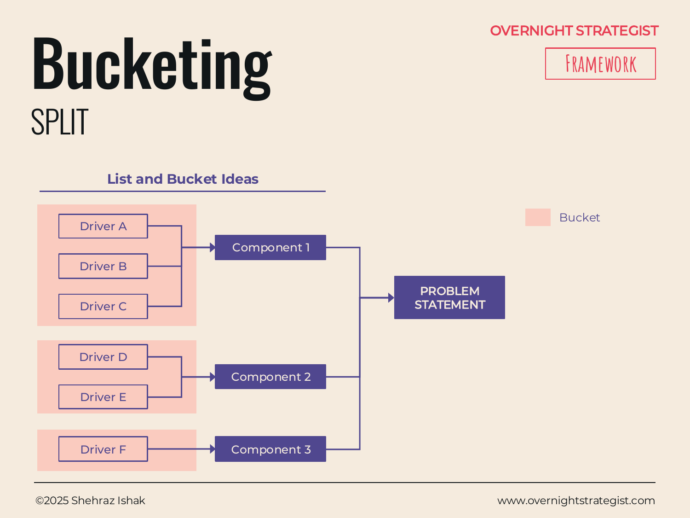

# Bucketing

> A bottom-up grouping method that starts with a raw list of factors, ideas, or drivers and organizes them into logical clusters — so a messy brainstorm becomes a structured problem map.

## What It Is

Bucketing is the Split-stage framework for working bottom-up. Rather than starting with the problem and systematically breaking it down (as the Driver Tree does), Bucketing starts with a list of individual items — drivers, ideas, causes, potential levers, observations — and groups them into logical buckets based on shared characteristics. Those buckets become the top-level branches of the problem structure.

The process has three steps: list the component parts or factors, create logical groupings by clustering items that share a common characteristic, and then optionally refine the problem statement based on what the groupings reveal. The result is structurally identical to a Driver Tree — a branched problem map — but arrived at from the bottom up rather than the top down.

## Why It Works

A Driver Tree works well when the structure of the problem is reasonably clear from the outset — when you can name the major dimensions without first thinking through all the details. But many real problems aren't like that. You have a vague sense of what's going wrong, a scattered set of data points, or a team full of partial views that need reconciling. Trying to force a Driver Tree structure on a messy situation often produces branches that are artificially tidy and miss important drivers that don't fit neatly into the top-down frame.

Bucketing works because it lets structure emerge from content. By listing everything first and grouping afterward, the clusters reveal the natural dimensions of the problem — dimensions you might not have anticipated from the top. The grouping act also makes hidden patterns visible: if seven of your twelve listed drivers relate to customer awareness and only two relate to pricing, that imbalance in the list is meaningful and the buckets surface it.

The discipline the framework adds is in the clustering criteria: buckets should be based on logical similarity, not just topical proximity. Drivers belong in the same bucket because they work through the same mechanism or are driven by the same cause — not simply because they sound related.

## How To Use It

1. **List the component parts.** Brainstorm all the factors, causes, ideas, or drivers you can identify. Don't filter at this stage — the goal is completeness, not structure. Write each one down separately.
2. **Create logical groupings.** Look for items that share a common characteristic — they work through the same mechanism, are driven by the same underlying cause, or belong to the same decision domain. Cluster these into buckets.
3. **Name each bucket.** The name should capture what the items in it have in common at the level of mechanism or category, not just topic.
4. **Check the buckets form good branches.** The buckets should function as the main branches of a driver tree: together they should cover all the important dimensions of the problem, and individually they should be as distinct from each other as possible. Revise if there's heavy overlap or obvious gaps.
5. **Optionally refine the problem statement.** Once the buckets are clear, they sometimes reveal that the original problem statement was too broad, too narrow, or aimed at the wrong level. Update it if needed.

## Worked Example

Acme Design's leadership suspects there are many reasons subscribers are leaving. The team brainstorms a list of possible factors:

- Course content is outdated
- No reminder emails at renewal
- Price feels high relative to alternatives
- Courses take too long to complete
- Poor mobile experience
- No community or peer interaction
- Paid ads are reaching the wrong audience
- No free trial to reduce sign-up friction
- Organic search traffic has declined
- Course completion rates are below 30%
- Competitors launched new courses in Q2
- Referral programme was discontinued

The team groups these into buckets:

**Bucket 1 — Product & Content Experience:** Course content is outdated; Courses take too long to complete; Poor mobile experience; Course completion rates are below 30%; No community or peer interaction.

**Bucket 2 — Acquisition & Awareness:** Paid ads are reaching the wrong audience; Organic search traffic has declined; No free trial to reduce sign-up friction.

**Bucket 3 — Retention & Renewal:** No reminder emails at renewal; Referral programme was discontinued; Competitors launched new courses in Q2.

**Bucket 4 — Pricing & Value Perception:** Price feels high relative to alternatives.

The buckets reveal that product experience is the largest category by item count — suggesting it may be the most fertile area for investigation, or that the team has more visibility into that dimension. Pricing, by contrast, has only one item, which may mean it's genuinely a smaller factor or simply less well-understood. Both are useful signals.

## When To Use It

Reach for Bucketing when your starting point is a pool of ideas, observations, or drivers rather than a clear top-level structure. It works particularly well in workshops or team sessions where multiple people contribute partial views — the listing step externalizes individual knowledge, and the grouping step builds shared structure.

Use a **Driver Tree** instead when the major dimensions of the problem are already clear and the job is disciplined, systematic decomposition rather than emergence from a brainstorm. The two frameworks are complements, not competitors: Bucketing is often the right first pass when the problem is fuzzy, with the Driver Tree used to formalize and extend the resulting structure. After either one, **Hypothesis** converts the branches into testable propositions that guide the Analyse stage.

## Things To Watch Out For

- **Buckets based on topic rather than mechanism** produce a structure that looks organized but doesn't actually help you find root causes. "Marketing things" and "product things" are topics; "acquisition levers" and "retention levers" are mechanisms. The difference matters when you're trying to identify which branch to investigate.
- **The list is biased toward what the team already knows.** The brainstorm surfaces familiar drivers more readily than unfamiliar ones. After grouping, look explicitly for blank spaces — categories that probably exist but have no items. That's where you might have a blind spot.
- **Small buckets (one or two items) may not be genuine top-level branches.** They might belong inside another bucket, or they might be genuinely important but under-examined areas. Treat them as a signal to dig, not as a reason to create a thin branch.
- **Refining the problem statement after bucketing is optional but often valuable.** If the buckets reveal the problem is fundamentally about product experience, and the original problem statement is framed around marketing spend, that tension is worth surfacing before the analysis begins rather than after.

## Related Frameworks

- [Driver Tree](./driver-tree.md) — the top-down alternative: start with the problem, systematically branch into components and drivers.
- [Hypothesis](./hypothesis.md) — the next step: convert buckets into testable propositions for the Analyse stage.
