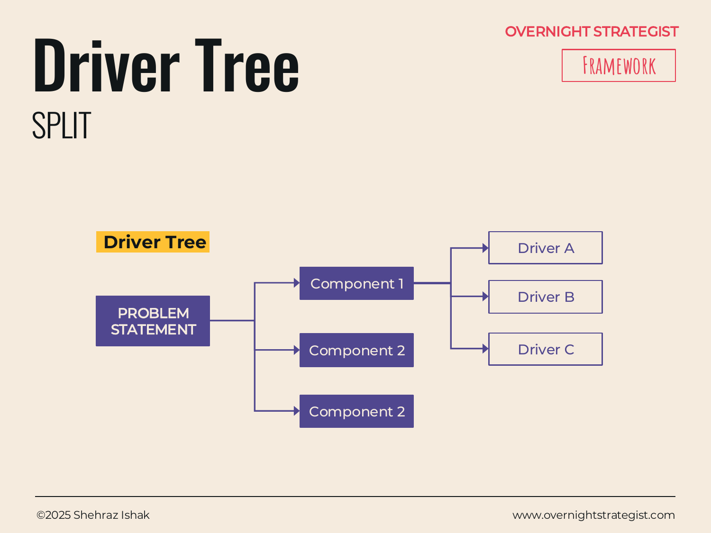

# Driver Tree

> A branching diagram that decomposes a problem into its component parts and then into the drivers of each component — so every potential lever is visible before you choose which ones to pull.

## What It Is

A Driver Tree is a structured decomposition of a problem. It starts with the problem statement at the root, branches into a small number of distinct components (the major sub-problems or dimensions that together make up the whole), and then branches again into the drivers of each component — the specific factors that cause that component to be high or low, better or worse. The result is a tree: the root is the problem, the trunk branches are the components, and the leaves are the drivers you can potentially act on or investigate.

The tree is typically built two to four levels deep. Deeper than four levels tends to produce unmanageable complexity; shallower than two tends to stay too abstract to guide real analysis.

## Why It Works

The risk in tackling a complex problem without a decomposition is that the team investigates whatever comes to mind first — which is usually the most visible issue, the most recent concern, or whatever the loudest stakeholder mentioned in the last meeting. That kind of intuitive selection tends to miss systematic causes and conflates symptoms with root drivers.

A Driver Tree works because it forces **exhaustive, non-overlapping coverage** of the problem space before any analysis begins. By mapping out all the components and their drivers first, you can see the full landscape — and choose the highest-leverage branches to investigate rather than defaulting to the obvious ones. The discipline of building the tree also surfaces components the team hadn't considered, and makes explicit the assumption that these branches together *fully account* for the problem.

This is the Split-stage expression of MECE thinking (Mutually Exclusive, Collectively Exhaustive): each branch should cover a distinct part of the problem, and the branches together should cover all of it.

## How To Use It

1. **Restate the problem.** Write the problem statement at the root. This anchors everything that follows.
2. **Identify the component parts.** Break the problem into its major sub-dimensions — the distinct areas that together make up the whole. Aim for two to four components. Make each one distinct: minimize overlap between branches. For a subscriber growth problem, the components might be *new subscriber acquisition* and *subscriber retention* — two genuinely separate levers.
3. **Break each component into its drivers.** For each component, list the factors that drive it up or down. These are the specific, actionable inputs: for *new subscriber acquisition*, drivers might be *paid advertising*, *organic content*, and *word of mouth*. For *organic content*, sub-drivers might be *blog posts* and *social media posts*.
4. **Continue decomposing until actionable.** Push each branch down until the leaves are specific enough to investigate or act on. Two to four levels is typically sufficient.
5. **Check coverage.** Look at the tree as a whole — does it account for the full problem? Are there drivers missing? Are any branches overlapping substantially?
6. **Prioritise branches for investigation.** Not every branch needs deep analysis. Use judgment (and hypotheses) to identify the two or three branches most likely to contain the root cause or the biggest opportunity.

## Worked Example

Acme Design's subscriber count has been declining. After defining the problem with SCQ, the team builds a Driver Tree:

**Root:** How can Acme Design return to >1,000 new subscribers per month?

**Component 1 — New Subscriber Acquisition**
- Driver A: Paid advertising (Facebook campaigns, YouTube pre-roll)
- Driver B: Organic content (design blog, social media posts)
- Driver C: Word of mouth (referral programme, community sharing)

**Component 2 — Subscriber Retention**
- Driver A: Course completion rate (are subscribers finishing courses?)
- Driver B: Perceived value (are subscribers finding the courses worth the price?)
- Driver C: Offboarding experience (what happens at renewal?)

By mapping the full tree, the team can see that both acquisition and retention matter — and that a subscriber-count problem could be entirely an acquisition problem, entirely a retention/churn problem, or both. The Waterfall analysis (in the Analyse stage) later reveals that churn is the dominant driver, not acquisition. Without the Driver Tree mapping out both branches first, the team might have spent Q3 budget on paid ads while the churn problem continued unaddressed.

## When To Use It

Use a Driver Tree immediately after you have a well-formed problem statement — it is the primary Split-stage tool for structured decomposition. Reach for it when the problem is complex enough that different teams or workstreams need to investigate different branches in parallel, or when you genuinely don't know yet which dimension of the problem is most important.

**Bucketing** is a looser cousin: it starts with a brainstormed list of factors rather than a structured top-down branching. Use Bucketing when you have a pool of ideas or hypotheses that need organizing, rather than a problem that needs disciplined decomposition. **Hypothesis** goes further by converting branches into testable propositions — use it after the Driver Tree when you're ready to commit to specific lines of investigation.

The insight-stage **Driver Tree** entry covers the same visual format used as a communication artifact — showing how a metric or outcome is driven by its inputs. The Split-stage version here is a problem-decomposition tool, used before analysis begins.

## Things To Watch Out For

- **Branches that overlap** are the most common flaw. If "marketing" and "social media" are both branches, social media posts appear in both — every driver in the overlap zone will be double-counted in the analysis. Push until the branches are genuinely separate.
- **Stopping too early** leaves the tree too abstract. "Marketing" is a component, not a driver. Keep branching until you reach something specific enough to measure or change.
- **The tree is only as good as the problem statement.** A vague root produces a tree that can justify almost any branch. Run Outcome or SCQ first.
- **Completeness is a judgment call.** The goal is exhaustive coverage of the significant drivers, not a complete accounting of every possible factor. Highly marginal drivers can be grouped into an "other" branch or omitted — but be honest about what you're setting aside.
- **The tree can become a delay tactic.** Some teams build Driver Trees to feel rigorous while avoiding hard choices. The tree should narrow your focus within a week, not expand it indefinitely.

## Related Frameworks

- [Bucketing](./bucketing.md) — the bottom-up alternative: list drivers first, then group them into components.
- [Hypothesis](./hypothesis.md) — the next step: convert tree branches into testable propositions.
- [Driver Tree (Insight)](../insight/driver-tree.md) — the same branching format used as a communication visual rather than a problem-decomposition tool.
