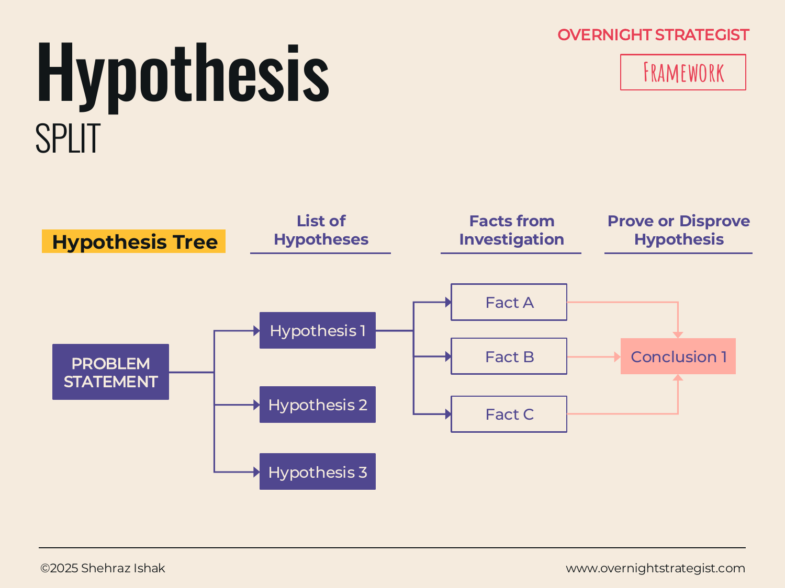

# Hypothesis

> A method that converts a problem's branches into explicit, testable propositions — so analysis is directed at confirming or disconfirming specific claims rather than exploring open-endedly.

## What It Is

The Hypothesis framework transforms the output of a Driver Tree or Bucketing exercise into a set of provisional answers to the problem. Each major branch becomes a hypothesis — a concrete claim about what is causing the problem or what solution will work. You then gather evidence through analysis to prove or disprove each hypothesis. Proven hypotheses become the basis of your narrative and recommendations; disproven ones are set aside.

The structure is a Hypothesis Tree: the problem statement at the root, a set of discrete hypotheses as branches, and the facts gathered through investigation as the leaves that either support or refute each branch.

## Why It Works

Open-ended analysis — "go investigate and see what you find" — tends to produce findings that confirm whatever the analyst expected to find, because our intuition shapes which data we seek and how we interpret ambiguous results. Starting with explicit hypotheses reverses this dynamic: the hypothesis commits you to a specific claim before you look at the evidence, which makes it harder to rationalize your way to a pre-formed conclusion.

The key structural discipline is that hypotheses must be **falsifiable** — stated as claims that evidence could actually disprove. "Marketing might be a factor" is not a hypothesis; it can't be proven wrong. "Paid advertising accounts for less than 20% of new subscriber acquisition" is a hypothesis; one data point can settle it. The falsifiability requirement forces the team to be specific about what they believe and what would change their minds.

Hypothesis-driven problem solving also makes the work faster. Instead of analyzing everything, you analyze what would confirm or deny the claims you've already committed to. Work that doesn't speak to any hypothesis can be deprioritized. This is particularly valuable when time is short and the problem has many possible causes.

## How To Use It

1. **Start with a set of likely reasons for the problem.** Based on your Driver Tree or Bucketing, formulate a hypothesis for each major branch. State each one as a testable claim: *"The primary cause of subscriber decline is [X]"* or *"The most effective lever for growth is [Y]."* Limit yourself to a manageable number — three to six hypotheses is typically right for a complex problem.
2. **Make each hypothesis falsifiable.** For every hypothesis, ask: what evidence would prove this wrong? If you can't answer that, the hypothesis isn't specific enough.
3. **Perform analysis to test each hypothesis.** Run the analyses — quantitative and qualitative — that will produce evidence bearing on each claim. This is the Analyse stage. For each hypothesis, track what you find.
4. **Classify each hypothesis.** Based on the evidence, each hypothesis is either proven, disproven, or inconclusive (which typically means more evidence is needed or the hypothesis needs to be restated more specifically).
5. **Build your narrative from proven hypotheses.** Proven hypotheses become your findings and recommendations. Disproven hypotheses are dropped from the narrative but should be documented — knowing what *isn't* causing the problem is valuable context.

## Worked Example

After completing a Driver Tree, the Acme Design team has identified two main branches: acquisition and retention. They form three hypotheses to investigate:

**Hypothesis 1:** The primary driver of subscriber decline is churn, not a drop in new subscriber acquisition.

**Hypothesis 2:** Churn is driven by low course completion rates — subscribers cancel when they don't finish the courses they paid for.

**Hypothesis 3:** Paid advertising is delivering sufficient volume but reaching the wrong audience, producing high-cost, low-retention subscribers.

The team then runs analysis:

- **H1 — Proven.** A Waterfall analysis of the past three months shows that new subscriber acquisition has held steady at roughly 900 per month, while churn has risen from 7% to 14%. The net subscriber count is falling because of exits, not because of reduced entries.
- **H2 — Partially proven.** Course completion data shows a 28% average completion rate, down from 41% six months ago — but qualitative interviews suggest the primary driver is not disengagement; it's a poor mobile experience that makes it hard to watch lessons on the go. The mechanism is different from the hypothesis, but the direction is confirmed: completion is a real problem.
- **H3 — Disproven.** Cohort analysis shows that subscribers acquired through paid channels have retention rates nearly identical to those from organic channels. Paid advertising is not producing a lower-quality subscriber.

With H3 disproven, the team stops investigating the paid acquisition mix and redirects that work toward the mobile experience. The analysis is faster because the hypothesis made the decision to stop easy: not a retreat, but a disciplined update.

## When To Use It

Use Hypothesis after you have a structured decomposition of the problem — after a Driver Tree or Bucketing exercise has revealed the major branches. The Hypothesis framework converts those branches into a work plan for the Analyse stage: each hypothesis tells the team what to investigate and what evidence would settle it.

It is especially valuable when the problem has multiple plausible causes that need to be triaged — when you need to know which branches to investigate deeply and which to set aside quickly. It is less useful when the problem is simple and obvious enough that one or two lines of analysis will settle it without a formal hypothesis structure.

Hypothesis-driven problem solving is also the right posture for time-constrained engagements: by committing to specific claims upfront, you avoid the open-ended analysis spiral that expands to fill whatever time is available.

## Things To Watch Out For

- **Hypotheses stated as questions rather than claims** can't be proven or disproven. "Is churn the main driver?" is a research question, not a hypothesis. Restate it: "Churn accounts for more than 70% of the net subscriber loss." Now it has a threshold that evidence can either meet or miss.
- **Confirming without seeking disconfirming evidence** is the most dangerous failure mode. It is natural to gather data that supports what you believe and to interpret ambiguous results favorably. Actively look for evidence that would disconfirm each hypothesis.
- **Too many hypotheses** produces a work plan that is no more focused than open-ended analysis. Three to six is a reasonable number. If you have ten, you need to prioritize — which three are most likely to matter? Start there.
- **Disproven hypotheses still have value.** The fact that a hypothesis was disproven tells you where the problem is not, which narrows the search space. Document disproved hypotheses in your analysis record even if they don't appear in the final narrative.
- **A hypothesis can be too broad to be testable.** "The problem is marketing" is technically falsifiable — but barely. Push for specificity about the mechanism, the magnitude, or the timeframe so the evidence required is actually obtainable.

## Related Frameworks

- [Driver Tree](./driver-tree.md) — the top-down decomposition tool that generates the branches the Hypothesis framework converts into testable claims.
- [Bucketing](./bucketing.md) — the bottom-up alternative for generating the structural map that hypotheses are then built from.
