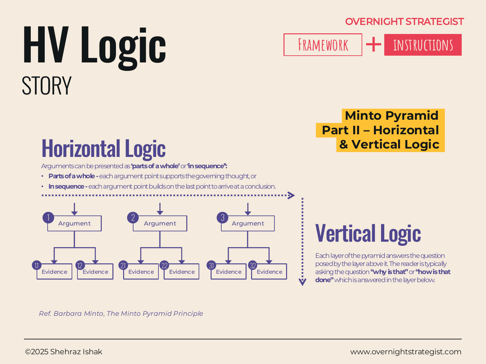

# HV Logic

> Two complementary tests — one running down the pyramid, one running across each level — that confirm your argument structure actually holds before you present it.

## What It Is

HV Logic is the quality-check layer of the Minto Pyramid. After you've built a pyramid (governing thought → arguments → evidence), HV Logic gives you two tests to run on the structure before communicating it.

**Vertical Logic** runs down any branch of the pyramid. Each level must answer the question posed by the level above it — specifically the question "why is that?" or "how is that done?" If the level below does not genuinely answer that question, the structure is broken.

**Horizontal Logic** runs across any single level of the pyramid. Items at the same level must be related to one another in a coherent way: either they are *parts of a whole* (each independently supports the claim above, and together they fully support it) or they are *in sequence* (each builds on the last to arrive at a conclusion). If neither pattern applies, the items do not belong on the same level.

## Why It Works

A pyramid can look complete and still be wrong. You can have a governing thought and three arguments and nine evidence points arranged in a tidy hierarchy — and the logic can still not hold. HV Logic catches the two most common structural failures:

- **Vertical break:** A level says something true, but it doesn't answer the question that the level above raises. The connection is asserted but not real.
- **Horizontal break:** Items at the same level are actually different kinds of things — some are reasons, some are examples, some are sub-topics — and they don't add up to anything coherent.

Running both checks forces you to ask whether each level *earns* its place in the structure. It converts "I have three points" into "I have three logically connected claims that together prove my governing thought." That's the difference between an organised list and an argument.

## How To Use It

**Vertical Logic Check:**

1. Start at the governing thought. Ask: "Why is this true?" or "How would we do this?"
2. The arguments at Level 2 must answer that question. If they don't — if they describe the situation rather than answer the question — rewrite them.
3. Move down to each argument. Ask the same question. The evidence at Level 3 must answer it.
4. If any level fails to answer the question posed by the level above, either revise the claim at that level or move the item to the right level.

**Horizontal Logic Check:**

1. At each level, ask whether the items are *parts of a whole* or *in sequence*.
2. Parts of a whole: each item independently supports the claim above. All items together completely cover it. No item overlaps with another. (This is the MECE test applied horizontally.)
3. In sequence: item 1 is the premise, item 2 follows from it, item 3 follows from that, and the final item arrives at the claim above. This is deductive structure.
4. If the items don't fit either pattern — if you can reorder them arbitrarily and the meaning doesn't change, or if they cover different topics rather than supporting the same claim — the level needs restructuring.

## Worked Example

Acme Design is preparing a recommendation to add a live instructor-led tier. The strategy lead drafts this pyramid:

**Governing Thought:** Acme should launch a live tier by Q3.

**Level 2:**
1. Demand is validated.
2. We spoke to 12 instructors.
3. The unit economics work.

Running the **vertical check**: the governing thought raises "Why should we launch?" Arguments 1 and 3 answer it — they give reasons. But argument 2 ("We spoke to 12 instructors") is a fact about the research process, not a reason to launch. It fails the vertical test. The real claim buried in it is "supply is feasible" — that's the argument. "We spoke to 12 instructors" becomes evidence under it.

Running the **horizontal check** on the corrected Level 2 (demand validated / supply feasible / unit economics work): these are parts of a whole — three independent conditions for a successful launch, no overlap, together they cover the key grounds for the decision. The horizontal logic holds.

Revised pyramid:
- Governing thought: Acme should launch a live tier by Q3.
  - Argument 1: Demand is validated. (Evidence: exit surveys, waitlist data, competitive pricing.)
  - Argument 2: Supply is feasible. (Evidence: instructor conversations, existing infrastructure.)
  - Argument 3: Unit economics work. (Evidence: margin model, break-even threshold.)

## When To Use It

Run HV Logic every time you finish building a pyramid and before you build the slides or write the document. It takes five minutes and catches the structural problems that otherwise surface mid-presentation as confused questions or flat-out disagreement.

It is especially valuable when:
- The pyramid was built under time pressure (structure may have been assumed, not checked).
- The argument is genuinely complex with four or more Level 2 items.
- The audience is analytical and will probe the logic directly.

HV Logic does not replace substance — it checks structure. A pyramid can pass both tests and still rest on weak evidence. Use it alongside, not instead of, a rigorous review of the underlying facts.

## Things To Watch Out For

- The vertical check is easy to pass superficially: it feels like Level 3 answers "why?" when it is actually just restating Level 2 in more detail. Ask whether Level 3 proves the claim or merely elaborates it. Elaboration is not proof.
- Deductive (sequential) horizontal logic is harder to write than inductive (parts-of-a-whole) logic and is more fragile: if one premise is wrong, the whole chain breaks. Use it only when the relationship is genuinely causal or conditional, not just a sequence of related observations.
- Items that survive both tests might still be the wrong items — HV Logic checks whether the structure is coherent, not whether the governing thought is correct or the evidence is credible.
- Teams sometimes use HV Logic to defend a pre-formed view by reverse-engineering arguments that fit. The check is meant to reveal flaws, not to paper over them.

## Related Frameworks

- [Minto Pyramid](./minto-pyramid.md) — the three-level structure that HV Logic tests.
- [MECE](./mece.md) — the mutual-exclusivity and collective-exhaustiveness principle that underpins the horizontal logic check.
- [SCQA](./scqa.md) — the narrative sequence that frames the governing thought before it is delivered.
