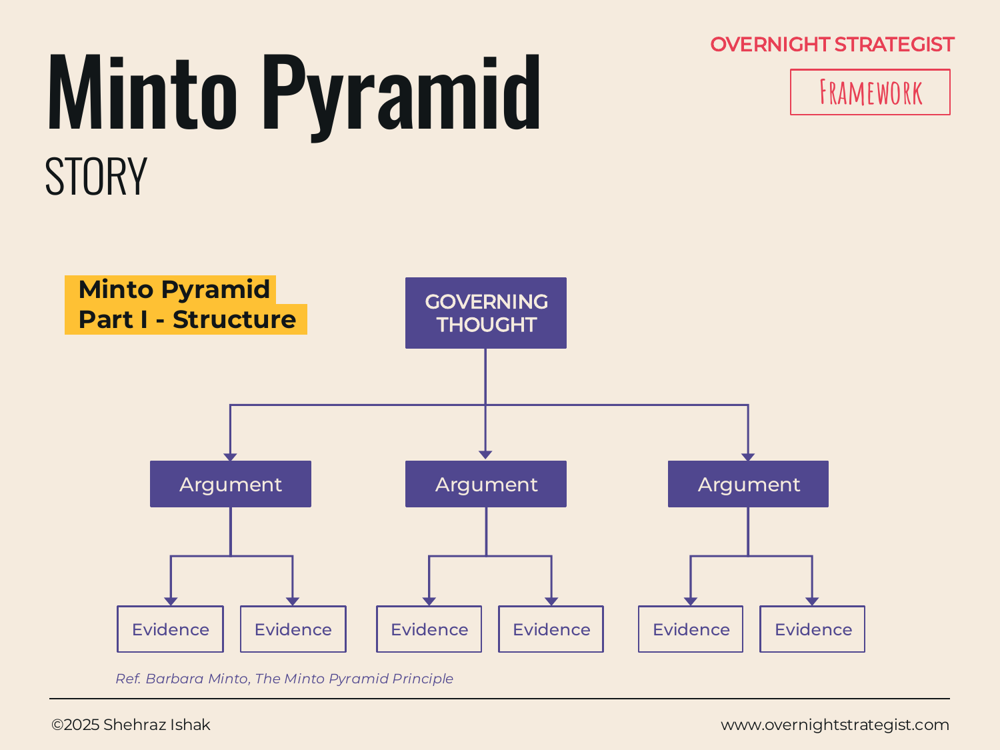

# Minto Pyramid

> A three-level structure for organising any argument — answer first, reasons second, evidence third — so the audience always knows where they stand.

## What It Is

The Minto Pyramid is a communication structure that organises any written or spoken argument into three levels. At the top sits the **Governing Thought** — the single overarching message, the answer to the question the audience is asking. Below it sit the **Arguments** — the main reasons or pillars that support the governing thought, typically two to four of them. Below each argument sit the **Evidence** items — the data, facts, or logical steps that prove that argument is true.

The pyramid is always read top-down: answer, then reasons, then proof. The governing thought is never buried at the end.

## Why It Works

Most people structure communication the way they did their thinking: background first, then analysis, then conclusion last. This feels natural to the speaker but punishing to the audience, who must hold all the detail in their heads before they know what it adds up to. Worse, if the audience disagrees early on, they spend the rest of the presentation arguing internally rather than listening.

The Pyramid inverts this. By leading with the governing thought, it tells the audience immediately what you believe and what you are about to prove. Every piece of evidence that follows either confirms or challenges a claim they already understand, so comprehension and retention both improve. The listener's mind is organised, not overloaded.

The three-level structure also enforces a discipline on the presenter: you cannot lead with your conclusion until you know what it is, and you cannot list your arguments until you know they genuinely support it. Building the pyramid forces the thinking to be done before the communication starts.

## How To Use It

1. **Identify the governing thought.** This is the single headline answer to the audience's primary question. It should be one sentence that, if they remember nothing else, is the thing you need them to know.
2. **List the main arguments.** These are the two to four reasons why the governing thought is true. Each one should be a complete, self-contained claim — not a topic heading. Use MECE logic (see [MECE](./mece.md)) to make sure they are distinct and collectively sufficient.
3. **Attach supporting evidence to each argument.** Under each argument, add the facts, data, analysis, or logical steps that prove it. These are Level 3.
4. **Check the logic holds vertically and horizontally.** Working down any branch, each lower level should answer "why is that?" or "how do you know?" Working across a level, the items together should fully support the level above. See [HV Logic](./hv-logic.md) for the checks.
5. **Lead with the governing thought when you communicate.** Write or present top-down: governing thought → arguments → evidence. Never defer the answer.

## Worked Example

Acme Design's leadership needs to decide whether to invest in a live instructor-led tier on top of the existing self-paced subscription. The strategy lead structures the recommendation as a Minto Pyramid:

**Governing Thought:** Acme Design should launch a live instructor-led tier at $149/month by Q3, which will increase average revenue per user by 40% and reduce annual churn from 28% to 18%.

**Argument 1:** Demand for live instruction is validated and large.
- Exit survey data shows 41% of churned subscribers cited "lack of accountability" as their primary reason for leaving.
- A waitlist experiment in March drew 620 sign-ups within two weeks with no paid promotion.
- Comparable platforms (Domestika Pro, Skillshare Teams) charge $120–$180 for live access and report 2× the retention of self-paced tiers.

**Argument 2:** Acme's existing instructor relationships make supply feasible.
- 6 of Acme's top 10 instructors already run live cohorts on other platforms; three have expressed interest in exclusivity.
- A pilot cohort of 30 students can be run in Q2 using existing Zoom infrastructure with no additional software cost.

**Argument 3:** The unit economics work at moderate scale.
- At 500 live subscribers, the tier generates $74.5k/month against an estimated $28k in instructor fees and platform costs — a 62% gross margin.
- Break-even requires only 180 subscribers, achievable within the first full quarter based on waitlist size.

The recommendation lands immediately. Anyone who disagrees with an argument knows exactly which one to challenge, and anyone who agrees can stop reading at the governing thought.

## When To Use It

The Minto Pyramid is the default structure for any strategy communication where the audience's time is limited and their skepticism is real: board recommendations, executive updates, investor decks, consulting deliverables. It is the answer to "how do I structure this?" in nearly every Story-stage situation.

Use it any time you have a complex set of supporting analysis that needs to be communicated as a single coherent argument rather than as a report of what you found. If you have not yet completed the analysis, the pyramid reveals what is missing: a governing thought you cannot yet state is a sign the analysis is not done.

## Things To Watch Out For

- A governing thought that is actually a topic ("This presentation covers our growth options") is not a governing thought. It must be a claim: one specific answer to a specific question.
- Arguments that describe activities rather than conclusions ("We conducted customer interviews") are not arguments. Each must be a claim that independently supports the governing thought.
- More than four arguments at Level 2 is usually a sign that the structure is not fully pyramidal — some items belong under a higher-level argument, not alongside it.
- Answer-first can feel presumptuous in cultures where direct statements of conclusion before consultation are considered disrespectful. Know your audience before leading hard with the governing thought.
- The pyramid shapes what evidence gets included. If you find evidence that contradicts an argument, the pyramid is wrong — don't hide the contrary finding to protect the structure.

## Related Frameworks

- [HV Logic](./hv-logic.md) — the two logical tests (horizontal and vertical) that verify the pyramid holds together.
- [MECE](./mece.md) — the principle that arguments at the same level must be mutually exclusive and collectively exhaustive.
- [SCQA](./scqa.md) — the narrative wrapper that contextualises the governing thought before delivering it.
- [Pyramid](../insight/pyramid.md) — the visual layout for presenting a pyramidal argument as a slide.
- [SCQ](../define/scq.md) — the Define-stage frame that produces the question the governing thought answers.
