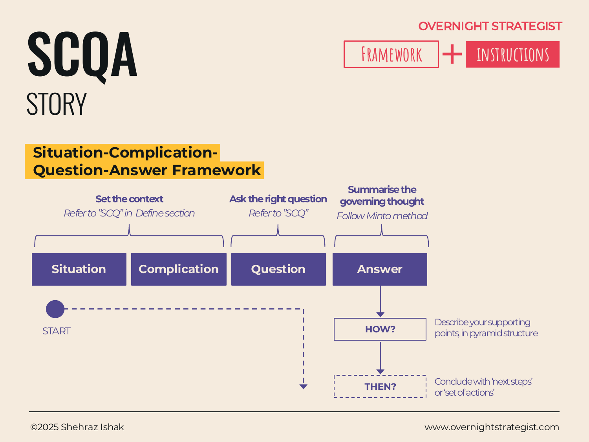

# SCQA

> A four-beat narrative structure — Situation, Complication, Question, Answer — that opens a strategy communication with the problem before delivering the recommendation, so the audience arrives at your conclusion feeling they demanded it.

## What It Is

SCQA is the Story-stage wrapper for a structured argument. It is the narrative sequence that precedes the Minto Pyramid, setting up the context and the stakes before the governing thought is delivered. The four beats are:

**Situation:** The stable, agreed-upon context — what is true right now that the audience already knows or would nod along to.

**Complication:** The disruption — what has changed, or what problem has emerged, that makes the situation no longer acceptable. This is the reason the communication is happening at all.

**Question:** The logical question that the complication raises — the one your audience would naturally ask if you told them about the complication. "So what should we do?" or "How do we fix this?"

**Answer:** The governing thought — the direct, headline response to the question. This is the same as the governing thought in the Minto Pyramid. The arguments and evidence that follow are the Pyramid.

SCQA extends the Define-stage [SCQ](../define/scq.md) by adding the Answer and embedding it in a presentation structure. Where SCQ is used to define a problem, SCQA is used to communicate the full recommendation.

## Why It Works

A recommendation delivered without context is a conclusion without a case. The audience hasn't been primed to feel the need for it, and they meet it with skepticism or confusion. SCQA works by earning the governing thought: you establish the world as it is (Situation), introduce the problem (Complication), let the audience feel the question that naturally follows (Question), and only then deliver the answer (Answer). By the time the Answer arrives, the audience has already asked the question internally — the recommendation feels less like it is being imposed and more like it is being acknowledged.

The Question beat is the hinge. A well-framed question focuses the audience's attention on exactly the thing your answer addresses. It also limits scope: your governing thought needs to answer *this* question, not every question. That constraint is what makes the argument tight.

SCQA is also efficient for the presenter. Once the question is agreed, every piece of content in the communication either answers it or supports an answer to it. Anything that doesn't fit the question doesn't belong in the presentation.

## How To Use It

1. **Write the Situation.** One to three sentences of stable context. This is what your audience already knows and accepts — facts, not disputed claims. Keep it short; its job is to establish common ground, not to inform.
2. **Write the Complication.** The disruption that makes the situation urgent. It should be specific and concrete: what happened, what changed, or what constraint has emerged. The Complication is why you are in the room.
3. **Derive the Question.** Ask: given this situation and this complication, what is the natural next question? It should feel inevitable — if you told someone the Situation and Complication on the street, the Question is what they would ask. Keep it open enough to admit your governing thought as an answer without presupposing it.
4. **State the Answer (Governing Thought).** The direct answer to the Question. This is your headline recommendation in one sentence — not a topic, not a summary, but a claim. Everything in the Minto Pyramid that follows must support this claim.
5. **Build out the Pyramid.** The arguments and evidence under the governing thought follow the Minto Pyramid structure. SCQA is the opening; the Pyramid is the body.
6. **Conclude with next steps.** After the Pyramid, close with the specific actions required: who does what by when.

## Worked Example

Acme Design needs to present a recommendation to the leadership team about the declining subscriber trend. The strategy lead structures the opening as SCQA:

**Situation:** Acme Design launched a subscription platform for graphic-design courses in 2022 and grew to 12,400 subscribers by the end of 2023, with consistent month-on-month growth driven by organic search and word of mouth.

**Complication:** Since January 2024, net subscriber growth has turned negative — subscriber numbers have fallen from 12,400 to 11,200 over five months, a decline of roughly 240 subscribers per month. Exit survey data shows that churn has nearly doubled, from 4% to 7.5% monthly, while new subscriber acquisition has remained flat.

**Question:** How do we reverse the subscriber decline and return to sustainable growth?

**Answer:** Acme Design should launch a live instructor-led tier at $149/month by Q3, which will address the primary churn driver (lack of accountability), increase average revenue per user by 40%, and return net subscriber growth to positive within two quarters.

The Minto Pyramid then delivers the three supporting arguments: validated demand, feasible supply, and positive unit economics.

The opening takes about sixty seconds to deliver. By the time the Answer lands, the audience has already felt the weight of the decline and asked the question internally — the recommendation arrives as an answer to their concern, not a demand for their approval.

## When To Use It

SCQA is the default opening structure for any strategy communication where the audience needs to understand the problem before evaluating the solution: board updates, executive recommendations, investor presentations, consulting deliverables.

Use SCQA — rather than diving straight into the pyramid — when the audience is not already steeped in the context (they haven't been living the problem day to day), or when the complication is genuinely surprising and needs to be named before the answer will make sense.

If the audience already knows the Situation and Complication in detail, you can compress or skip them — experienced practitioners sometimes open with the Question directly and move to the Answer. The full SCQA is most valuable when you cannot assume shared context.

## Things To Watch Out For

- A Situation that loads in contested claims or disputed interpretations of the data undermines trust before the Answer is delivered. The Situation must be genuinely stable and agreed — save the contested ground for the Complication or the Arguments.
- A Complication with no urgency ("our situation could be improved") produces an Answer no one feels compelled to act on. The Complication must explain why this matters now and why inaction carries a cost.
- The Question must be open enough to admit your governing thought as an answer — if the Question already implies the answer ("How do we launch the new tier?"), you have skipped the problem definition and the audience cannot evaluate alternatives.
- SCQA is a narrative structure, not a substitute for rigorous analysis. A beautifully constructed SCQA built on a shallow pyramid is still a weak argument — it will fail under scrutiny even if it lands smoothly in the room.

## Related Frameworks

- [SCQ](../define/scq.md) — the Define-stage problem-definition frame; SCQA extends it by adding the Answer and embedding it in a presentation structure.
- [Minto Pyramid](./minto-pyramid.md) — the three-level argument structure that SCQA introduces and contextualises.
- [HV Logic](./hv-logic.md) — the checks that verify the pyramid behind the Answer holds together.
- [MECE](./mece.md) — the argument-quality standard applied to the pyramid's Level 2.
